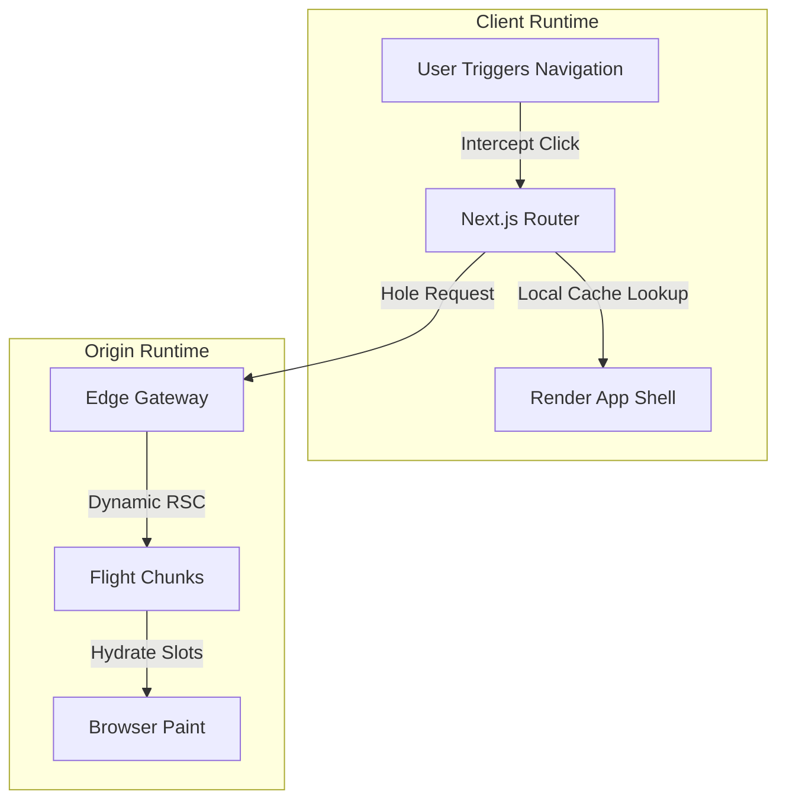
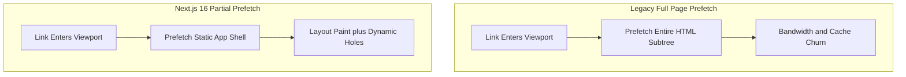

# Deep Tech Researcher: Visual Systems Architecture & Trend Intelligence

Most technical blogs fail because they either describe outdated versions of software, regurgitate superficial documentation tutorials, or present wall-of-text abstractions without visual clarity.

This skill equips the agent to act as a **Principal Systems Architect & Technical Investigative Journalist**, executing a rigorous 5-phase research and visual blueprinting protocol before writing any article.

---

## 📡 The 5 Intelligence Feeds (Phase 1)

Never draft a topic based on memory or assumptions. Always query five live intelligence feeds:

1. **Live Stack Verification**:
   - Query live package registries and official release notes (`search_web` or npm).
   - Guarantee accurate version numbers (e.g. Next.js 16.3 Active LTS, React 19.x, TypeScript 7).
2. **Popular Platform Signals**:
   - Mine what senior engineers and architects are reading on **ByteByteGo**, **The Pragmatic Engineer**, **Architecture Notes**, **Hacker News Top Stories**, and **GitHub Trending**.
3. **Primary Framework RFCs & Canary Commits**:
   - Check `reactjs/rfcs`, `vercel/next.js` canary PRs, `rust-lang/rfcs`, and `tc39/proposals`.
4. **Academic & Systems Preprints**:
   - Use `literature-search-arxiv`, `literature-search-openalex`, and `literature-search-europepmc` for foundational computer science proofs (SSA form, CRDTs, LSM-tree compaction, memory latency).
5. **Real-World Incident Post-Mortems**:
   - Review disclosures from Cloudflare, AWS, Discord, Uber, and Meta to connect architectural theories to real multi-million-dollar outages.

---

## ⚖️ Socratic Dialectical Framing (Phase 2)

A topic is only viable if it passes the **Tripartite Dialectic Test**:
* **The Thesis**: What is the feature and what does it promise? (e.g. 0ms perceived navigation via App Shell caching).
* **The Antithesis**: What is the hidden operational tax, memory footprint, cache invalidation challenge, or failure mode?
* **The Synthesis**: In what production topologies is it indispensable, and where is it an anti-pattern?

---

## 📊 The ByteByteGo Visual Architecture Standard (Phase 3)

Every major engineering essay must include at least two rich visual diagrams adhering to Alex Xu's ByteByteGo principles:

### 1. Step-by-Step Numbered Request Flow
Trace the exact packet lifecycle across physical boundaries:

### 2. Side-by-Side Trade-off Topology
Contrast legacy vs next-generation architectures:

### 3. Wire Protocol / Packet Anatomy
Dissect raw headers, frame boundaries, or serialized bytecode tokens.

---

## 🛡️ Mermaid v10 Parser Safety Rules

To guarantee 100% error-free rendering in Mermaid v10:
* **Node Labels**: Always use square brackets with quotes: `NodeID["Clean Label"]`. Never put quotes inside curly braces (`Node{"..."}` causes lexer failure).
* **Direction**: Always `flowchart TD`. Never `graph TD`, `graph LR`, or `flowchart LR`.
* **Edge Labels**: Keep edge text clean: `-->|Cache Hit|` instead of `-->|Cache Hit: 0 Allocations|`. No digits in edge labels.
* **Subgraph IDs**: Format as `subgraph SG1_Name ["Descriptive Name (Extra Info)"]`. Avoid colons inside the title string.
* **Alphanumeric IDs**: Node identifiers must start with an alphabet character (use `ZeroVDOM` rather than `0VDOM`).

---

## 🚀 Execution Handoff

Once this skill finishes the **Topic Dossier**, **Numbered Visual Diagrams**, and **Primary Scholarly Citations**, pass the blueprint to the `narrative-tech-storyteller` skill to execute the literary prose, cold open hook, and dramatic pacing. Finally, run `npm run build` to verify static compilation and interactive citations.
