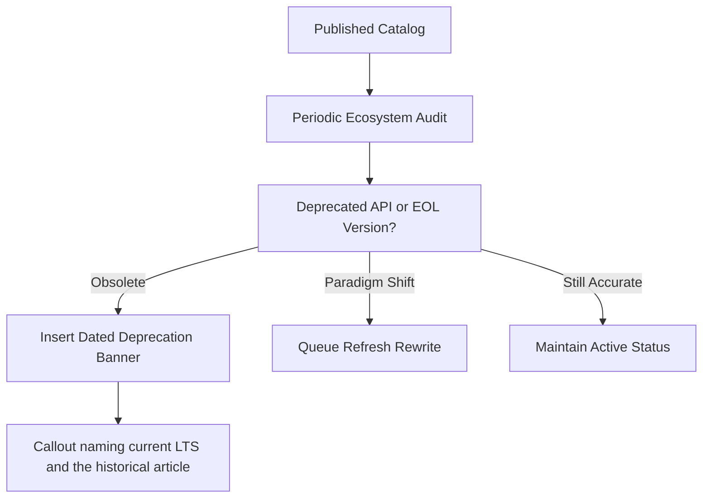

# Evergreen Lifecycle & Analytics Monitor: Catalog Longevity

A technical blog of over 400 articles inevitably suffers from **framework rot**: APIs get deprecated, breaking changes land in major releases (e.g. Next.js 14 EOL vs Next.js 16.3 Active LTS), and two drafts of the same architecture start competing in search.

This skill is the **Catalog Health Inspector**. It runs **after** publication, not as a substitute for Gates 1–3.

---

## Catalog Lifecycle Operations



---

## Required Audit Vectors

1. **Live LTS check**: Verify npm / GitHub releases. As of September 2026, Next.js 16.3 is Active LTS, 15 is Maintenance LTS (EOL 21 Oct 2026), 14 is EOL (26 Oct 2025).
2. **Self-contradiction scan**: Two posts must not teach opposite defaults as present-tense truth (the Next.js 14 `force-cache` vs 15 `no-store` trap).
3. **Duplicate slug scan**: `posts.json` must contain unique slugs. Duplicates double RSS and sidebar rows.
4. **Near-duplicate topics**: Overlapping slugs (Percolator, lock-free CAS, hybrid search, SSE) get a catalog note pointing at the canonical sibling. Do not 404 the old URL.
5. **Cover uniqueness**: Prefer `blog/assets/covers/<slug>.jpg`. Sharing `default.png` across hundreds of posts collapses Open Graph uniqueness.
6. **Diagram drift**: Re-run `npm run pipeline`. Fail on `flowchart LR` / `graph LR` / `graph TD` / `Node{"..."}`.
7. **Citation heading**: Canonical `## References & Further Reading` so `scripts/build-blog.js` can emit `id="ref-N"`.

---

## Banner Protocol

Never silently rewrite a historical claim. Insert a dated GitHub-style alert:

```markdown
> [!NOTE]
> **Update (September 2026)**: Next.js **16.3 is Active LTS**. Next.js 15 is Maintenance LTS until 21 October 2026. Next.js 14 reached EOL on 26 October 2025.
```

Queue a full rewrite only when the thesis is now false (not merely old).
