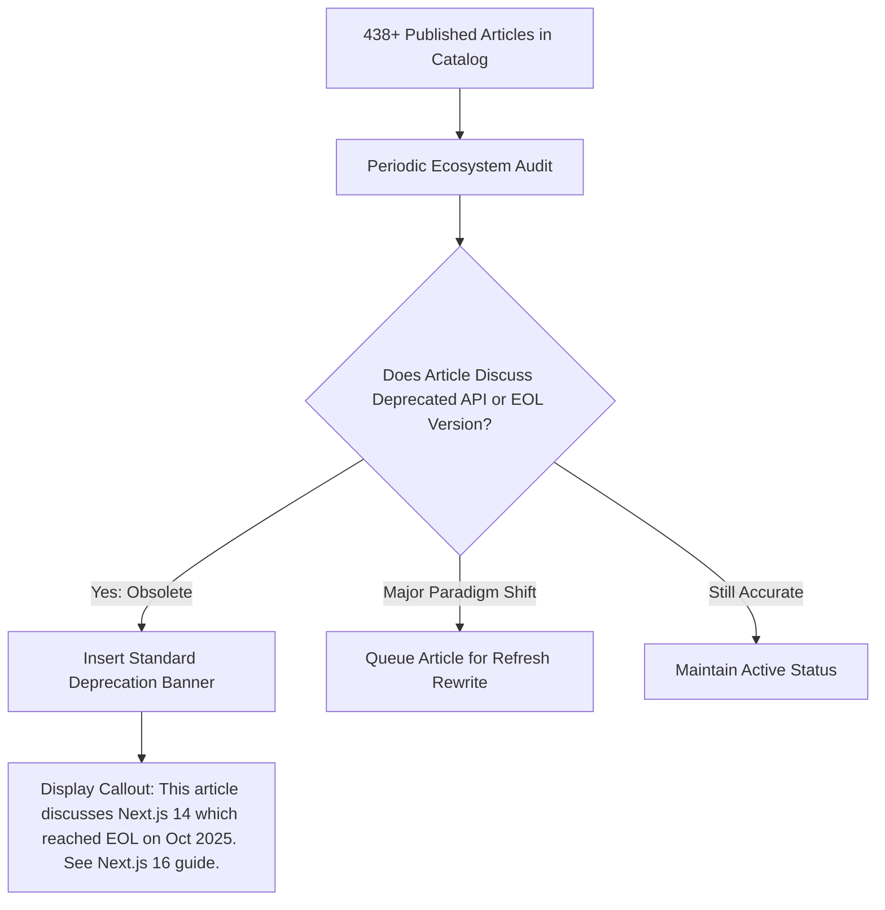

# Evergreen Lifecycle & Analytics Monitor: Catalog Longevity

A technical blog of over 400 articles inevitably suffers from **framework rot**: APIs get deprecated, breaking changes land in major releases (e.g. Next.js 14 EOL vs Next.js 16), and benchmarks shift.

This skill acts as the **Catalog Health Inspector**, monitoring older articles and reader feedback to ensure the entire archive remains credible, up-to-date, or clearly annotated.

---

## 🔄 Catalog Lifecycle Operations

