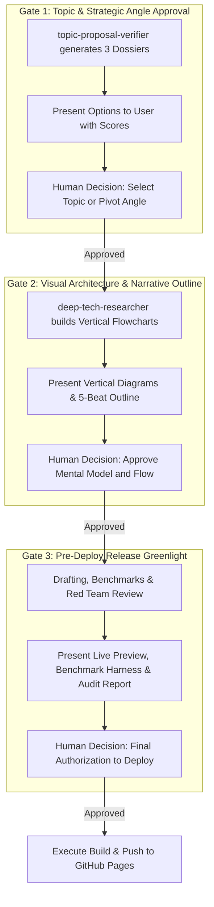

# Human Editorial Gatekeeper: The Human-in-the-Loop Director

An autonomous agent fleet must never function as an unchecked rogue publisher. The blog is the personal reputation, voice, and architectural authority of **Akmal Khan**. 

This skill enforces a non-negotiable **3-Gate Human-in-the-Loop Protocol** ensuring the human Editor-in-Chief retains complete strategic control over what gets researched, what gets drawn, and what goes live.

---

## 🛑 The 3 Mandatory Human Checkpoints

---

## 📋 The Gatekeeper Dossier Formats

### Gate 1 Format (Topic Selection):
* Present 3 candidate dossiers with:
  1. Title variants (dialectical, non-clickbait).
  2. Scoring breakdown (Novelty, Scope, Feasibility, Authority).
  3. Core architectural tension (Thesis vs Antithesis).
  4. Primary RFC/Source reference links.
* **Halt and wait for user's explicit selection.**

### Gate 2 Format (Visual & Outline Approval):
* Present the proposed **Vertical-First diagrams** (Figure 1 and Figure 2 in readable top-down format).
* Present the 5-beat narrative arc and proposed code benchmarks.
* **Halt and wait for user confirmation or diagram adjustments.**

### Gate 3 Format (Pre-Deploy Greenlight):
* Present the completed article title, cover image, benchmark numbers, and Staff Red Team clearance verdict.
* **Halt and wait for final authorization to push to main.**
