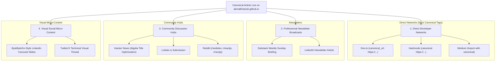

# Multi-Platform Syndication Manager: The Amplification Engine

Publishing solely to your personal domain limits discovery; publishing naively to third-party platforms without canonical tags destroys your domain's Google search authority.

This skill executes a **Downstream Syndication Workflow** referencing `PUBLICATION_TARGETS.json` to distribute canonical articles safely across the global engineering ecosystem.

---

## 🌐 The 4 Syndication Channels



---

## 🔒 The Canonical SEO Protection Invariant

Never copy-paste an article to Dev.to, Hashnode, or Medium without verifying the canonical URL header:
```yaml
---
title: "The Exact Article Title"
canonical_url: "https://akmalkhaniub.github.io/blog/slug.html"
published: true
---
```
This instructs Google, Bing, and DuckDuckGo that your personal portfolio domain is the original intellectual owner, preventing duplicate content penalization.
