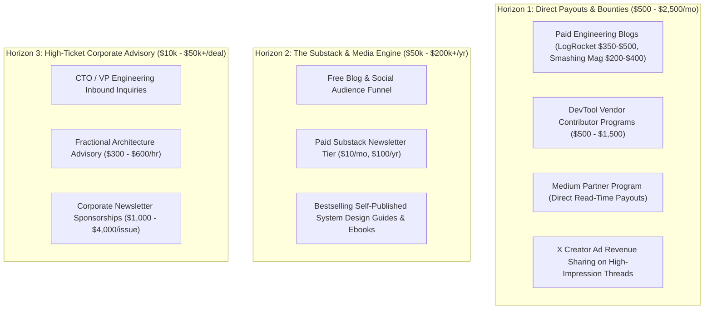

# Multi-Platform Syndication Manager: The Global Amplification & Monetization Engine

A world-class engineering essay should not just exist on your personal website. When properly distributed, a single deep dive acts as a **multi-thousand-dollar asset** across paid editorial desks, subscription newsletters, and high-ticket consulting funnels.

This skill executes downstream distribution guided by `PUBLICATION_TARGETS.json`.

---

## 💰 The 3 Monetization Horizons

---

## 📦 Syndication Package Generation (`SYNDICATION.md`)

For every published article, this skill generates `blog/posts/<slug>.syndication.md` (the `blog/articles/` tree is not part of this repo) containing:

1. **Paid Editorial Pitch Template**:
   - Ready-to-email pitch for editors at **LogRocket**, **Smashing Magazine**, or **web.dev** with an executive summary, outline, and target audience.
2. **X / Twitter Visual Thread**:
   - A 6-to-8 tweet narrative thread with high-contrast vertical diagram cards and a concluding backlink.
3. **LinkedIn ByteByteGo-Style Carousel**:
   - Slide-by-slide text and diagram breakdown designed for executive and hiring manager engagement.
4. **Dev.to & Hashnode Markdown**:
   - Pre-formatted markdown with verified YAML frontmatter including `canonical_url`.
5. **Hacker News & Lobste.rs Anchor Package**:
   - Clean, provocative, non-clickbait submission titles and the authoritative first-comment discussion starter.
6. **Substack Executive Briefing**:
   - A 5-minute Sunday morning digest format linking back to the complete canonical post.
