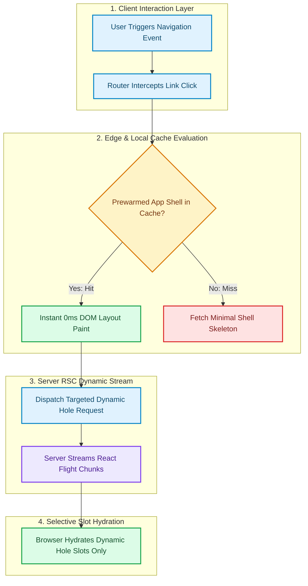

# Visual & Cover Art Creator: The Graphic & Diagram Engine

In modern engineering communication, diagrams are not afterthoughts—they are the primary cognitive anchors. A broken diagram syntax error destroys professional credibility, and a horizontally squashed diagram forces readers to zoom in to read unreadable text.

This skill governs the **visual aesthetics, cover art generation, and diagram syntax integrity** across the publication.

---

## 📱 The Balanced 2-Column Spine Standard (`flowchart TD`)

> [!IMPORTANT]
> **The Problem with 100% Horizontal (`flowchart LR`)**:
> Horizontal sprawling trees force the browser SVG renderer to scale down width to fit the 800px column, shrinking typography to illegible 8px micro-text and forcing readers to zoom in.
>
> **The Problem with 100% Single-Column Vertical**:
> A rigid, single-file vertical line creates an unnaturally tall, awkward "totem pole" that wastes horizontal space.
>
> **The Golden ByteByteGo Standard: Balanced 2-Column Spine**:
> 1. **Top-Down Macro Flow (`TD`)**: The overall system timeline and lifecycle always progress vertically.
> 2. **Max 2 Parallel Columns**: Whenever comparing two systems, partitions, branches, or actors (e.g. *Minority Partition vs Majority Partition*, *Client A vs Client B*, or *Memory Guard vs Storage Guard*), place them **side-by-side in 2 symmetrical parallel columns**.
> 3. **Minimum Readable Node Width**: By limiting concurrency to **2 columns**, each branch maintains $\approx 350\text{px}$ width—safely fitting inside 780px–800px containers with **zero SVG downscaling** and full 14px–16px readable typography.
> 4. **Never exceed 2 parallel columns** (3 or 4 columns will trigger browser downscaling).

### Vertical Template Example:

---

## 🎨 The ByteByteGo Vibrant 5-Color System (`classDef`)

Never produce dry, monochrome gray diagrams. Every diagram must use this high-contrast semantic palette:

| Semantic Role | Palette Tokens | Mermaid \`classDef\` Syntax |
| :--- | :--- | :--- |
| **Healthy / Active / Success** | Mint Green (\`#dcfce7\` / \`#16a34a\`) | \`classDef green fill:#dcfce7,stroke:#16a34a,stroke-width:2px,color:#14532d;\` |
| **Failure / Zombie / Drop** | Coral Red (\`#fee2e2\` / \`#dc2626\`) | \`classDef red fill:#fee2e2,stroke:#dc2626,stroke-width:2px,color:#7f1d1d;\` |
| **Client / Gateway / Router** | Sky Blue (\`#e0f2fe\` / \`#0284c7\`) | \`classDef blue fill:#e0f2fe,stroke:#0284c7,stroke-width:2px,color:#0c4a6e;\` |
| **Decision / Quorum / Flap** | Warm Amber (\`#fef3c7\` / \`#d97706\`) | \`classDef yellow fill:#fef3c7,stroke:#d97706,stroke-width:2px,color:#78350f;\` |
| **Database / Ledger / Token** | Royal Purple (\`#ede9fe\` / \`#7c3aed\`) | \`classDef purple fill:#ede9fe,stroke:#7c3aed,stroke-width:2px,color:#4c1d95;\` |

### Compact Vertical Layout Rule:
* Consolidate redundant node clusters (e.g. write \`Followers["Nodes 2, 3, 4, 5"]\` instead of 4 separate boxes).
* Keep subgraph padding tight and node titles concise (2–4 words) to maximize visual density and prevent vertical ballooning.

---

## 🎨 16:9 Cover Art Standards

Every article must feature a custom 16:9 cover image saved to `blog/assets/covers/<slug>.jpg`:
* **Aesthetic**: Minimalist, dark-slate background (`#0a0f1d`), neon cyan/emerald/purple accents, isometric systems engineering blueprints, circuit traces, clean geometric nodes.
* **Banned Elements**: Zero photorealistic human faces, zero random floating robots, zero generic corporate stock handshakes, zero garbled text overlays.
* **Aspect Ratio**: Strictly 16:9 (1920x1080 or 1200x675).

---

## 🛡️ Mermaid v10 Parser Hardening Rules

To prevent tokenizer crashes in Mermaid v10:

1. **Strict Node Identifiers**:
   * Always write: `NodeID["Descriptive Title"]`
   * **BANNED**: `NodeID{"..."}` (quotes inside curly braces cause immediate lexer syntax errors).
   * **BANNED**: Node IDs starting with a digit (write `ZeroVDOM` instead of `0VDOM`).

2. **Edge Label Sanitization**:
   * Keep edge predicates clean: `-->|Cache Hit| Node`
   * **BANNED**: Colons or numbers in edge strings (e.g., `-->|Cache Hit: 0 Allocations|` will break the parser).

3. **Subgraph Syntax**:
   * Format: `subgraph SG1_Name ["Descriptive Name (Details)"]`
   * **BANNED**: Colons inside the title string (`["Name: Details"]` can trigger lexer failures in certain modes).
