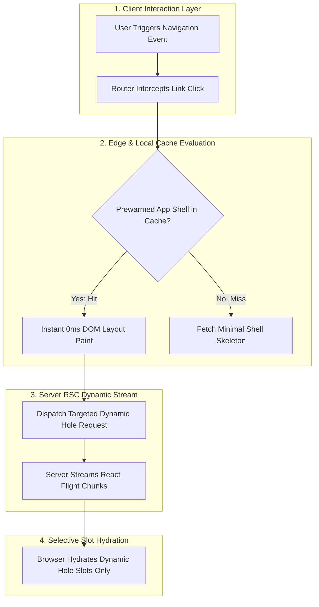

# Visual & Cover Art Creator: The Graphic & Diagram Engine

In modern engineering communication, diagrams are not afterthoughts—they are the primary cognitive anchors. A broken diagram syntax error destroys professional credibility, and a horizontally squashed diagram forces readers to zoom in to read unreadable text.

This skill governs the **visual aesthetics, cover art generation, and diagram syntax integrity** across the publication.

---

## 📱 The Strict Vertical-First Diagram Rule (`flowchart TD`)

> [!IMPORTANT]
> **BANNED: Wide Horizontal Layouts (`flowchart LR`)**.
> Horizontal diagrams cause the browser to scale down the SVG to fit container width, shrinking text into illegible micro-font and forcing readers to zoom in.
> 
> **MANDATORY: Strict Vertical-First Layouts (`flowchart TD`)**.
> All architectural request journeys, state transitions, compilation pipelines, and data-flow sequences MUST flow from **Top to Down (`TD`)**. This allows nodes to maintain full 14px-16px readable typography, preserves comfortable padding, and flows naturally with vertical page scrolling.

### Vertical Template Example:

---

## 🎨 16:9 Cover Art Standards

Every article must feature a custom 16:9 cover image saved to `blog/assets/covers/<slug>.jpg`:
* **Aesthetic**: Minimalist, dark-slate background (`#0a0f1d`), neon cyan/emerald/purple accents, isometric systems engineering blueprints, circuit traces, clean geometric nodes.
* **Banned Elements**: Zero photorealistic human faces, zero random floating robots, zero generic corporate stock handshakes, zero garbled text overlays.
* **Aspect Ratio**: Strictly 16:9 (1920x1080 or 1200x675).

---

## 🛡️ Mermaid v10 Parser Hardening Rules

To prevent tokenizer crashes in Mermaid v10:

1. **Strict Node Identifiers**:
   * Always write: `NodeID["Descriptive Title"]`
   * **BANNED**: `NodeID{"..."}` (quotes inside curly braces cause immediate lexer syntax errors).
   * **BANNED**: Node IDs starting with a digit (write `ZeroVDOM` instead of `0VDOM`).

2. **Edge Label Sanitization**:
   * Keep edge predicates clean: `-->|Cache Hit| Node`
   * **BANNED**: Colons or numbers in edge strings (e.g., `-->|Cache Hit: 0 Allocations|` will break the parser).

3. **Subgraph Syntax**:
   * Format: `subgraph SG1_Name ["Descriptive Name (Details)"]`
   * **BANNED**: Colons inside the title string (`["Name: Details"]` can trigger lexer failures in certain modes).
