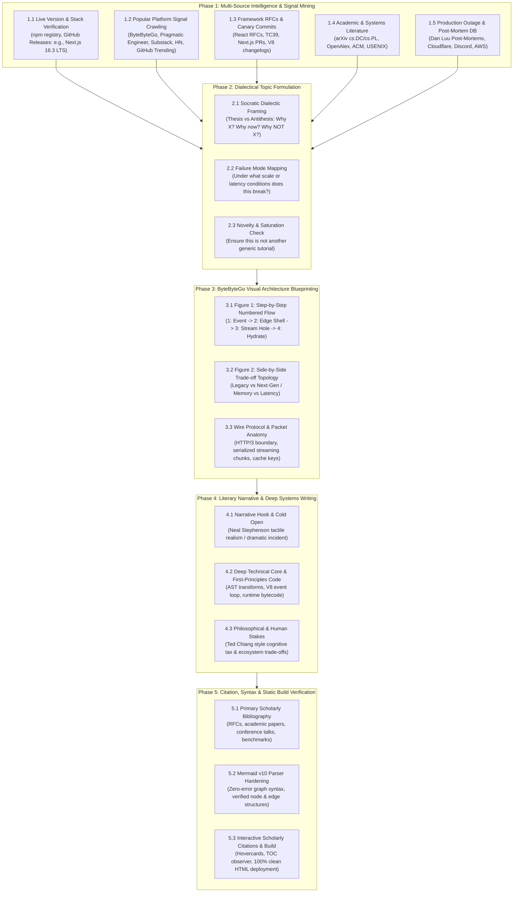

# Deep Tech Research & ByteByteGo Visual Architecture Framework
**Publication Standard & Strategic Operations Manual**  
**Effective Date:** September 7, 2026  
**Author:** Akmal Khan Engineering Publication  
**Status:** Active Canonical Specification

---

## 1. Executive Summary & Repository Organization

This framework codifies the end-to-end intelligence gathering, dialectical topic formulation, ByteByteGo visual architecture design, and literary systems narrative used to produce flagship articles for the [Akmal Khan Tech Blog](https://akmalkhaniub.github.io).

### Repository Architecture & `.agents` Location
To clarify project structure:
* **The `.agents/` directory** is an integral, committed part of the blog repository:
  ```
  akmalkhaniub.github.io/
  ├── .agents/
  │   └── skills/
  │       ├── narrative-tech-storyteller/   # Literary craft, pacing, tone
  │       └── deep-tech-researcher/         # Multi-feed mining, ByteByteGo visuals
  ├── blog/
  │   ├── posts/                            # Source Markdown files
  │   ├── assets/covers/                    # 16:9 custom article covers
  │   ├── posts.json                        # Metadata registry
  │   └── article.js                        # Client interactions (Mermaid, zoom, TOC)
  ├── scripts/
  │   └── build-blog.js                     # Static generator (pre-rendering + TOC)
  └── DEEP_TECH_RESEARCH_AND_VISUAL_BLOG_FRAMEWORK_2026-09-07.md
  ```
All skills stored inside `.agents/skills/` are tracked directly by Git on branch `main`.

---

## 2. The 5-Phase Master Workflow

Every flagship blog article must progress through five distinct phases before publication. No step may be omitted or bypassed.



---

## 3. Detailed Phase Breakdown

### Phase 1: Real-Time Intelligence & Signal Mining (5 Simultaneous Feeds)
We run five simultaneous checks so no topic is founded on outdated assumptions or echo-chamber opinions:
1. **Live Stack Verification**: Query live package registries (e.g., `npm view <pkg> version`) and official changelogs to guarantee current version accuracy. (Example: Next.js 16.3 Active LTS vs Next.js 15 Maintenance LTS vs Next.js 14 EOL).
2. **Popular Platform Signal Crawling**: Track what senior practitioners are debating on **ByteByteGo**, **The Pragmatic Engineer**, **Architecture Notes**, **Substack**, **Hacker News (Algolia API)**, and **GitHub Trending**.
3. **Primary Framework RFCs & Canaries**: Read active design discussions in `reactjs/rfcs`, `vercel/next.js` Canary PRs, `tc39/proposals`, and `rust-lang/rfcs`.
4. **Academic Systems Literature**: Search **arXiv** (`cs.DC`, `cs.PL`, `cs.OS`), **OpenAlex**, and **Europe PMC** for foundational proofs (e.g., SSA form, CRDT convergence, LSM-tree compaction mathematics).
5. **Production Incident Post-Mortems**: Mine real-world disclosures (Cloudflare, AWS, Discord, Uber, Dan Luu post-mortem compendium) to ground theoretical concepts in catastrophic multi-million-dollar outages.

---

### Phase 2: Socratic Dialectical Framing
Every article must pass the **Tripartite Dialectic Test**:
* **The Thesis**: Why does this feature exist? What problem does it claim to solve? (e.g., Next.js 16 Partial Prefetching gives instant 0ms App Shell rendering).
* **The Antithesis**: Why *not* this feature? What hidden operational cost, memory overhead, edge-cache fragmentation, or debugging complexity does it introduce?
* **The Synthesis**: In what production topologies does this feature shine, and under what constraints does it fail catastrophically?

---

### Phase 3: The "ByteByteGo" Visual Architecture Standard
Visuals are not decorative illustrations; they are the primary mental model. Every flagship post must incorporate at least two high-density diagrams adhering to the **5 ByteByteGo Principles**:

| Principle | ByteByteGo Standard | Implementation in Our Blog |
| :--- | :--- | :--- |
| **1. Numbered Data Flows** | Arrows labeled `1.`, `2.`, `3.`, `4.` showing exact packet journey. | Client Click $\to$ Edge Shell Cache $\to$ 0ms Local DOM Paint $\to$ Stream Dynamic Holes $\to$ Selective Hydration. |
| **2. Side-by-Side Topologies** | Before vs After or Architecture A vs Architecture B. | Compare *Legacy Full Page Prefetch* vs *Next.js 16 Partial App Shell Prefetch*. |
| **3. Wire Protocol / Packet Anatomy** | Visual dissection of headers, frames, or serialized AST tokens. | Dissect the exact HTTP/3 frame layout or `use cache` serialized cache keys. |
| **4. Visual First, Deep Dive Second** | Reader grasps the whole architecture in 15 seconds before reading prose. | Diagram precedes the deep-dive mechanical sections. |
| **5. High-Contrast, Clean Typography** | Clean subgraphs, clear labels, zero visual clutter. | Strictly enforced conflict-free Mermaid v10 flowcharts with click-to-zoom modals. |

#### Mermaid v10 Diagram Rules (Strictly Enforced)
To prevent tokenizer errors in Mermaid v10:
* **Rule 1**: Always use standard rectangular node identifiers: `NodeID["Descriptive Title"]`. Never put quotes inside curly braces (`Node{"..."}` is banned).
* **Rule 2**: Never include colons (`:`) or numbers (`0`) inside edge labels without clean text: use `-->|Cache Hit|` instead of `-->|Cache Hit: 0 Allocations|`.
* **Rule 3**: Subgraph definitions must follow: `subgraph SG1_Name ["Descriptive Name (Details)"]`. Avoid colons inside subgraph quotation marks.
* **Rule 4**: Use standard node names without leading numeric characters (`ZeroVDOM` instead of `0VDOM`).

---

### Phase 4: Literary Narrative & Systems Rigor
Inherits from our existing `narrative-tech-storyteller` skill:
* **The Cold Open Hook**: Open with a crisis, a late-night incident, or a sharp counter-intuitive truth. Zero corporate fluff openings (*"In today's fast-paced digital world..."* is strictly banned).
* **Tactile Realism (Neal Stephenson)**: Code lives on silicon, pulls watts from power grids, and heats copper heat sinks. Treat debugging like an investigative crime scene.
* **Philosophical Stakes (Ted Chiang)**: Explore the cognitive tax on engineering teams and the moral weight of architectural complexity.
* **Cadence & Rhythm (Ursula K. Le Guin)**: Dynamic sentence variation. Follow multi-clause explanations with short, memorable punches.

---

### Phase 5: Scholarly Citations, Syntax & Static Build Verification
* **Scholarly In-Text Citations**: Every performance benchmark, RFC claim, or compiler detail must have numbered citation markers (`[1]`, `[2]`) with interactive hovercards.
* **Formal Bibliography**: Must conclude with an explicit `## References & Further Reading` section with clickable markdown links.
* **Automated Static Build**: Execute `npm run build` to verify that all posts render cleanly, all Table of Contents (TOC) links are mapped, and zero Mermaid errors occur.

---

## 4. Flagship Topic Pipeline (Current Active Slate)

### Topic 1: Inside Next.js 16 Instant Navigations: How Partial Prefetching and App Shell Streaming End the SPA vs. SSR Debate
* **Current Status**: Ready for Production.
* **Stack**: Next.js 16.3 Active LTS, React 19, Turbopack, HTTP/3.
* **Tension**: 0ms SPA responsiveness vs Server-Driven Data Freshness.
* **Visuals**:
  1. *Figure 1*: 5-Step Numbered Lifecycle of an Instant Navigation.
  2. *Figure 2*: Side-by-Side Topology of Full Page Prefetch vs Partial App Shell Prefetch.

### Topic 2: The Death of `unstable_cache`: Dissecting the Next.js 16 `use cache` Directive and Distributed Invalidation
* **Stack**: Next.js 16.3, React 19 Compiler, Redis L2 Cluster, V8 L1 Memory.
* **Tension**: Developer Ergonomics vs Deterministic Cache Invalidation.
* **Visuals**:
  1. *Figure 1*: Multi-Tier Cache Resolution Flow (L1 V8 Heap $\to$ L2 Redis Cluster $\to$ Origin Computation).
  2. *Figure 2*: Serialization Anatomy of a `use cache` AST Hash Key.

### Topic 3: Turbopack under the Hood: How Next.js 16 Slashed Dev Memory by 90% via Disk Eviction & Rust DAGs
* **Stack**: Next.js 16 Turbopack (Default Bundler), Rust, V8 Socket Protocol.
* **Tension**: In-Memory Speed vs Dev Server Out-Of-Memory (OOM) Exhaustion.
* **Visuals**:
  1. *Figure 1*: Turbopack Incremental Computation DAG vs Webpack Monolithic Bundle Graph.
  2. *Figure 2*: Memory Eviction Lifecycle and Disk-Backed Module Deserialization.

---

## 5. Pre-Publication Quality Checklist

Before committing and pushing any article to `main`:
- [ ] **Stack Freshness**: Verified current LTS/stable releases (no stale version numbers).
- [ ] **Platform Alignment**: Cross-referenced against recent debates on ByteByteGo, Substack, and Hacker News.
- [ ] **Visual Completeness**: At least two high-density diagrams adhering to the ByteByteGo numbered flow standard.
- [ ] **Mermaid Validation**: Zero quotation/colon conflicts in nodes or subgraphs.
- [ ] **Storytelling Quality**: Cold open hook present, literary pacing maintained, zero corporate fluff.
- [ ] **Citation Completeness**: Primary RFCs, academic papers, and benchmark sources linked with hovercards.
- [ ] **Static Build**: `npm run build` reports 100% success across all posts.
