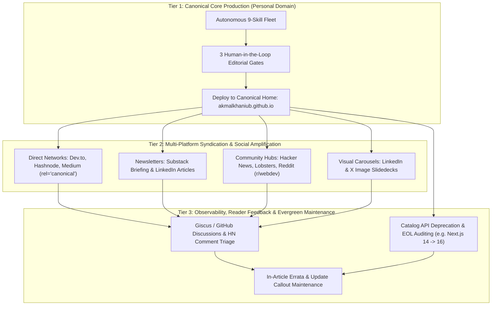
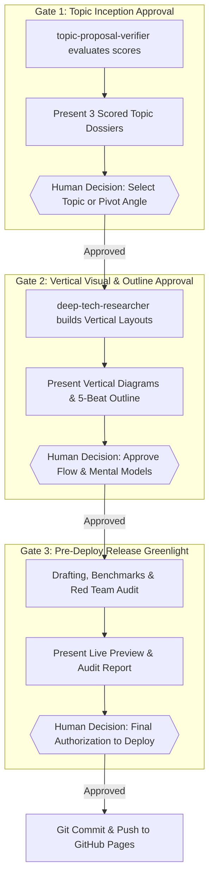

# The 3-Tier Autonomous Engineering Publication Fleet & Visual Framework
**Comprehensive Operations Manual, Vertical Diagram Standards & Canonical Specification**  
**Effective Date:** September 7, 2026  
**Author:** Akmal Khan Engineering Publication  
**Status:** Canonical Operational Specification

---

## 1. Executive Summary: The 3-Tier Publication Model

To ensure strategic human oversight, flawless technical quality, and maximum global reach without SEO duplicate content penalties, our publication operates under a **3-Tier Architecture**:



---

## 2. The Strict Vertical-First Diagram Rule (`flowchart TD`)

> [!IMPORTANT]
> **Why We Banned Horizontal (`LR`) Diagrams**:
> When a diagram flows horizontally (`flowchart LR`), browser containers compress the entire width to fit the screen. This reduces font sizes to unreadable micro-text, frustrating readers and forcing them to zoom in.
>
> **The Vertical-First Mandate**:
> All architectural diagrams, request flows, and compilation pipelines MUST use **`flowchart TD` (Top-Down)**.
> - **Zero Zooming Required**: Boxes retain their natural readable font size (14px-16px).
> - **Mobile & Desktop Native**: Diagrams expand naturally along the natural vertical scroll direction of the article.
> - **Numbered Step Clarity**: Steps `1.`, `2.`, `3.` cascade down the screen like a clear, logical story.

---

## 3. The 3 Human-in-the-Loop (HITL) Checkpoints

The agent fleet acts as the Staff Research & Drafting Bureau, while **Akmal Khan serves as the Editor-in-Chief**. The fleet pauses for explicit user direction at three non-negotiable gates:



---

## 4. Complete Skills Directory & Roles

The `.agents/skills/` directory resides directly inside the repository and is tracked in Git:

```
akmalkhaniub.github.io/
├── .agents/
│   └── skills/
│       ├── topic-proposal-verifier/          # 1. Evaluates topic novelty, scope & feasibility
│       ├── human-editorial-gatekeeper/       # 2. Coordinates the 3 Human-in-the-Loop checkpoints
│       ├── deep-tech-researcher/            # 3. Mines real-time releases, RFCs & blueprints
│       ├── narrative-tech-storyteller/      # 4. Crafts literary prose, cold opens & pacing
│       ├── code-and-benchmark-verifier/     # 5. Production TypeScript/Rust code & benchmarks
│       ├── visual-and-cover-art-creator/    # 6. 16:9 covers & VERTICAL Mermaid v10 diagrams
│       ├── staff-architect-red-team/        # 7. Adversarial fact-checking & citations
│       ├── seo-and-publication-qa-auditor/  # 8. Audits TOC anchors, JSON-LD & static build
│       ├── distribution-and-social-packager/# 9. ByteByteGo visual carousels & HN hooks
│       ├── multi-platform-syndication-manager/# 10. Downstream distribution with canonical tags
│       └── evergreen-lifecycle-and-analytics-monitor/ # 11. Deprecation audits & errata maintenance
├── blog/
├── scripts/
├── PUBLICATION_TARGETS.json                 # Downstream syndication platform configuration
└── DEEP_TECH_RESEARCH_AND_VISUAL_BLOG_FRAMEWORK_2026-09-07.md
```

---

## 5. Non-Negotiable Publication Invariants

1. **The Vertical Diagram Invariant**: All diagrams must flow vertically (`flowchart TD`) to eliminate horizontal squishing and guarantee zero-zoom readability.
2. **The 3-Gate HITL Invariant**: The fleet must obtain explicit human authorization at Topic Selection, Blueprint Approval, and Pre-Deploy Release.
3. **The Canonical SEO Invariant**: All downstream syndication to Dev.to, Hashnode, and Medium must include `canonical_url: https://akmalkhaniub.github.io/blog/<slug>.html`.
4. **The Stack Freshness Invariant**: Always verify live LTS package versions. Never refer to an older release as current.
5. **The Mermaid Parser Safety Invariant**: Square brackets with quotes for nodes (`NodeID["Clean Title"]`), clean edge text (`-->|Cache Hit| Node`), clean subgraphs.
6. **The Red Team Clearance Invariant**: No article may be deployed without explicit clearance from `staff-architect-red-team`.
