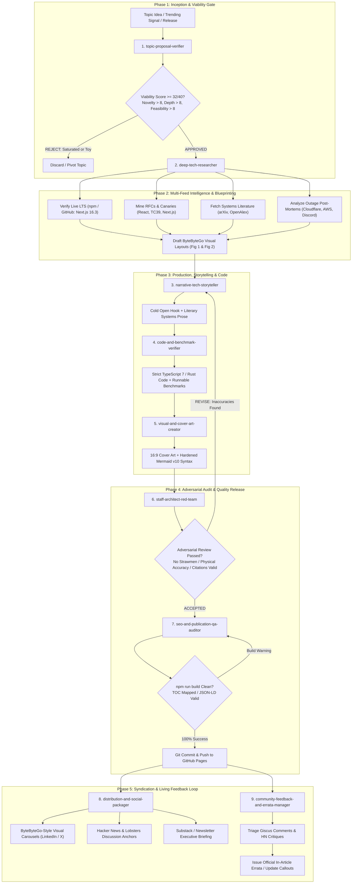

# The Autonomous Engineering Publication Fleet & Architecture Framework
**Comprehensive Operations Manual, Skills Flowchart & Canonical Standard**  
**Effective Date:** September 7, 2026  
**Author:** Akmal Khan Engineering Publication  
**Status:** Canonical Operational Specification

---

## 1. Executive Overview: The 9-Skill Autonomous Fleet

Producing world-class technical essays—at the caliber of **ByteByteGo (Alex Xu)**, **The Pragmatic Engineer (Gergely Orosz)**, **Dan Luu**, and **Stripe Engineering**—requires a seamless, autonomous assembly line spanning nine distinct disciplines:

1. **Strategic Inception**: Preventing wasted effort on saturated, shallow, or unfeasible topics.
2. **Real-Time Intelligence**: Mining bleeding-edge LTS releases (Next.js 16.3, React 19), RFCs, and post-mortems.
3. **ByteByteGo Visual Topologies**: Designing crystal-clear, numbered request flows and comparative diagrams.
4. **Literary Narrative Craft**: Writing visceral, high-stakes essays with dramatic momentum and zero corporate fluff.
5. **Production Code & Benchmarking**: Providing compile-checked, production-grade code with reproducible micro-benchmarks.
6. **Visual Asset Hardening**: Generating 16:9 custom dark-mode covers and hardening Mermaid v10 diagrams.
7. **Adversarial Peer Review**: Simulating a skeptical Principal Engineer to eliminate strawman arguments and fact-check citations.
8. **Pre-Flight Release QA**: Auditing TOC anchors, JSON-LD schemas, feeds, and running static builds.
9. **Syndication & Community Feedback**: Repurposing into LinkedIn/X visual carousels, HN submission hooks, and managing post-release errata.

---

## 2. Complete Skills Flowchart & Runtime Orchestration

The following flowchart details the exact interaction, feedback loops, and handoff contracts between all nine skills:



---

## 3. Directory Layout & Skill Inventory

The `.agents/skills/` directory resides directly inside the repository and is tracked in Git:

```
akmalkhaniub.github.io/
├── .agents/
│   └── skills/
│       ├── topic-proposal-verifier/          # Gatekeeper: Scores novelty, scope & feasibility
│       ├── deep-tech-researcher/            # Intelligence: Mines LTS releases, RFCs & blueprints
│       ├── narrative-tech-storyteller/      # Storytelling: Literary prose, cold opens & pacing
│       ├── code-and-benchmark-verifier/     # Code Engine: Strict TypeScript/Rust & benchmarks
│       ├── visual-and-cover-art-creator/    # Graphics: 16:9 covers & hardened Mermaid v10
│       ├── staff-architect-red-team/        # Review Board: Adversarial fact-checking & citations
│       ├── seo-and-publication-qa-auditor/  # Release QA: TOC anchors, JSON-LD & static build
│       ├── distribution-and-social-packager/# Syndication: ByteByteGo carousels & HN hooks
│       └── community-feedback-and-errata-manager/ # Feedback: Reader comments & living errata
├── blog/
│   ├── posts/                               # Source Markdown files
│   ├── assets/covers/                       # 16:9 custom generated covers
│   ├── posts.json                           # Metadata registry
│   └── article.js                           # Client interactivity (TOC, Mermaid zoom, citations)
├── scripts/
│   └── build-blog.js                        # Static site generator
└── DEEP_TECH_RESEARCH_AND_VISUAL_BLOG_FRAMEWORK_2026-09-07.md
```

---

## 4. The 9 Skills Matrix: Roles, Inputs & Failure Modes Eliminated

| # | Skill Name | Phase | Key Responsibility | Failure Mode Eliminated |
| :---: | :--- | :--- | :--- | :--- |
| **1** | **`topic-proposal-verifier`** | Inception | Evaluates 4-pillar score (Novelty, Scope, Feasibility, Brand). | **Oversaturated topics**, shallow tutorials, and unfeasible proposals. |
| **2** | **`deep-tech-researcher`** | Research | Mines real-time releases, RFCs, and blueprints ByteByteGo visual flows. | **Outdated version claims**, missing theoretical foundations. |
| **3** | **`narrative-tech-storyteller`** | Drafting | Crafts the literary narrative, dramatic cold open, and human stakes. | **Dry, robotic textbook prose**, boring bullet points, corporate fluff. |
| **4** | **`code-and-benchmark-verifier`** | Engineering | Synthesizes strict TypeScript 7 / Rust code and runnable micro-benchmarks. | **Broken code syntax**, toy `foo/bar` examples, unverified speed claims. |
| **5** | **`visual-and-cover-art-creator`** | Visuals | Builds custom 16:9 dark-mode covers and hardens Mermaid v10 syntax. | **Mermaid lexer crashes**, amateur stock photos, poor visual contrast. |
| **6** | **`staff-architect-red-team`** | Peer Review | Adversarial technical review, fact-checking, anti-strawman enforcement. | **Technical hallucinations**, unfair competitor bias, broken citations. |
| **7** | **`seo-and-publication-qa-auditor`** | Pre-Flight QA | Audits TOC anchors, JSON-LD schemas, feeds, and runs `npm run build`. | **Broken navigation links**, malformed search schemas, build failures. |
| **8** | **`distribution-and-social-packager`** | Syndication | Generates ByteByteGo LinkedIn/X carousels and HN submission packages. | **Content obscurity** and poor developer social engagement. |
| **9** | **`community-feedback-and-errata-manager`** | Living Feedback | Triages reader feedback, Giscus comments, and manages official errata. | **Stale unmaintained articles** and ignored reader feedback. |

---

## 5. Non-Negotiable Publication Invariants

1. **The Inception Invariant**: No article may be drafted without receiving a $\ge 32/40$ score from `topic-proposal-verifier`.
2. **The Stack Freshness Invariant**: Always verify live LTS package versions. Never refer to an older release as current.
3. **The ByteByteGo Visual Invariant**: Every post must include at least two high-density, numbered step-by-step diagrams (`1.`, `2.`, `3.`) and comparative topologies.
4. **The Mermaid Parser Safety Invariant**:
   - Square brackets with quotes for nodes: `NodeID["Clean Title"]` (curly-brace quotes are banned).
   - Clean edge labels: `-->|Cache Hit| Node` (colons and numbers in edge labels are banned).
   - Clean subgraph labels: `subgraph SG1_Name ["Descriptive Name (Details)"]`.
5. **The Empirical Proof Invariant**: All performance assertions must include a runnable micro-benchmark harness with reproducible parameters.
6. **The Red Team Clearance Invariant**: No article may be pushed without explicit clearance from `staff-architect-red-team`.
7. **The Clean Build Invariant**: `npm run build` must execute with 100% success across all posts prior to Git commit.
