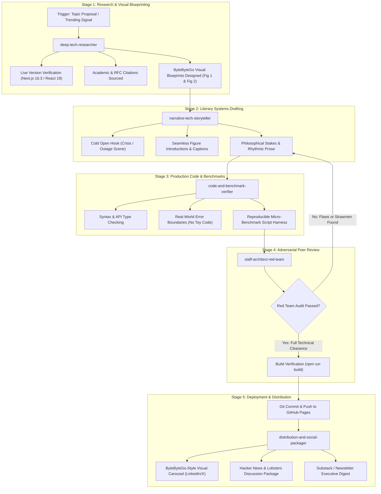

# The Autonomous Engineering Publication Fleet & Architecture Framework
**Comprehensive Operations Manual & Multi-Agent Publishing Standard**  
**Effective Date:** September 7, 2026  
**Author:** Akmal Khan Engineering Publication  
**Status:** Canonical Operational Specification

---

## 1. Executive Summary & Why These Skills Exist

Producing world-class technical writing—at the level of **ByteByteGo (Alex Xu)**, **The Pragmatic Engineer (Gergely Orosz)**, **Dan Luu**, and **Stripe Engineering**—requires a confluence of distinct, highly specialized disciplines:
1. **Trend & Ecosystem Intelligence**: Catching bleeding-edge framework shifts before they hit the mainstream.
2. **Visual System Architecture**: Creating crystal-clear, numbered request flows and comparative topologies that readers can grasp in 15 seconds.
3. **Literary Narrative Craft**: Telling dramatic, visceral stories with stakes, rhythm, and zero corporate fluff.
4. **Empirical Code & Benchmark Rigor**: Guaranteeing 100% production-accurate, compile-checked code and reproducible benchmarks.
5. **Adversarial Peer Review**: Stress-testing every claim to prevent technical strawmen and hallucinations.
6. **High-Signal Syndication**: Repurposing deep dives into viral visual carousels and community discussion hooks.

Trying to execute all these disciplines in a single unconstrained prompt inevitably leads to shortcuts: outdated library versions, syntax bugs in diagrams, shallow code, and dry bullet points.

To solve this permanently, we have architected an **Autonomous Engineering Publication Fleet** consisting of five specialized skills residing directly inside our repository.

---

## 2. Repository Organization & `.agents` Location

The `.agents/` directory is an integral, committed part of the blog repository tracked directly on branch `main`:

```
akmalkhaniub.github.io/
├── .agents/
│   └── skills/
│       ├── deep-tech-researcher/           # Intelligence, RFCs, version verification, ByteByteGo blueprints
│       ├── narrative-tech-storyteller/     # Literary narrative craft, pacing, cold opens, human stakes
│       ├── code-and-benchmark-verifier/    # Production TypeScript/Rust code, micro-benchmark harnesses
│       ├── staff-architect-red-team/       # Adversarial fact-checking, strawman audits, citation verification
│       └── distribution-and-social-packager/# ByteByteGo-style visual carousels, HN hooks, Substack digests
├── blog/
│   ├── posts/                              # Source Markdown articles
│   ├── assets/covers/                      # 16:9 custom article visual covers
│   ├── posts.json                          # Metadata registry
│   └── article.js                          # Client interactive layer (Mermaid, zoom modal, TOC observer)
├── scripts/
│   └── build-blog.js                       # Static site generator (pre-rendering, citations, TOC)
└── DEEP_TECH_RESEARCH_AND_VISUAL_BLOG_FRAMEWORK_2026-09-07.md
```

---

## 3. The 5 Specialized Skills & Their Core Rationale

| Skill Name | Core Rationale & Failure Mode Eliminated | Primary Tools / Inputs |
| :--- | :--- | :--- |
| **1. `deep-tech-researcher`** | Eliminates **stale stack assumptions** and **uninspired topics**. Verifies real-time package releases (e.g. Next.js 16.3 Active LTS), mines active RFCs and post-mortems, and blueprints the ByteByteGo visual layout before writing. | `search_web`, GitHub RFCs, arXiv, HN Algolia API |
| **2. `narrative-tech-storyteller`** | Eliminates **dry, robotic textbook prose**. Applies the storytelling craft of Ted Chiang (philosophical stakes), Neal Stephenson (tactile realism), and Paul Graham (conversational clarity) with zero corporate fluff. | Literary 5-beat essay structure, sensory prose |
| **3. `code-and-benchmark-verifier`** | Eliminates **toy code and unverified performance claims**. Enforces strict TypeScript 7 / React 19 / Rust syntax, realistic error boundaries, and provides runnable micro-benchmark scripts with P50/P99 latency data. | TypeScript compiler, `performance.now()`, Autocannon |
| **4. `staff-architect-red-team`** | Eliminates **technical hallucinations, strawman arguments, and broken citations**. Simulates an adversarial Principal Engineer reviewing the PR to stress-test claims, ensure fairness, and verify primary sources. | Socratic audit rubric, primary RFC/paper verifier |
| **5. `distribution-and-social-packager`** | Eliminates **content obscurity**. Translates the 3,000-word essay into slide-by-slide ByteByteGo-style image carousels, respectful Hacker News submission hooks, and executive Substack digests. | Slide generator, HN Algolia hooks, SEO metadata |

---

## 4. End-to-End Execution Flow (The Publishing Pipeline)

Every article follows this strict, step-by-step assembly line:



---

## 5. Non-Negotiable Invariants (The Publication Rules)

1. **The Stack Freshness Rule**: Never mention an outdated version as "current". Always verify the live LTS via registries.
2. **The ByteByteGo Visual Rule**: Every flagship post must contain at least two high-density visual diagrams with numbered step-by-step flows (`1.`, `2.`, `3.`) and comparative topologies.
3. **The Mermaid v10 Safety Rule**:
   - Node identifiers: `NodeID["Descriptive Title"]` (never `Node{"..."}`).
   - Edge labels: `-->|Cache Hit|` (never colons or numbers in edge syntax).
   - Subgraph identifiers: `subgraph SG1_Name ["Descriptive Name (Details)"]`.
4. **The No-Toy-Code Rule**: All code examples must feature real domain models, realistic error handling, and valid modern syntax.
5. **The Citation Hovercard Rule**: All technical assertions must link to primary RFCs, W3C specs, or peer-reviewed papers with interactive hovercards.
6. **The Red Team Clearance Rule**: No article may be committed to `main` without passing the Staff Architect adversarial review.
