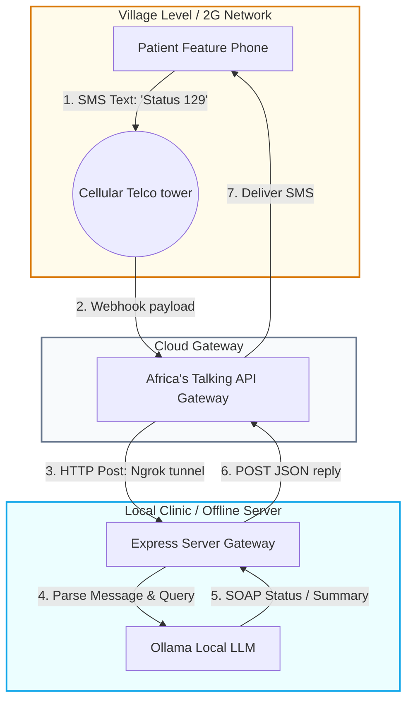

In rural or developing regions, smartphones and mobile data networks are luxuries. While a local clinic might have an offline server running local LLMs, patients in remote villages are completely cut off if they only have access to 2G feature phones.

To bridge this digital gap, we can build a **2G SMS Fallback Bridge**. This architecture allows patients to query the clinic's local clinical assistant, receive appointment updates, or request prescription repeats using simple, low-cost SMS text messages.

This article details how to design and build an SMS-to-AI bridge using **Node.js**, **Express**, and the **Africa's Talking SMS API**, as modeled in my hybrid clinical assistant, [MedEdge](https://github.com/akmalkhaniub/MedEdge).

---

## 🛠️ The SMS Fallback Architecture

The SMS bridge translates incoming cellular text messages into standard HTTP requests, routes them to our local offline AI server, and converts the model's text response back into an outgoing SMS payload.



1.  **Patient Request**: A patient sends an SMS like `"Status 129"` (representing their patient ID) to a dedicated shortcode.
2.  **Webhook Trigger**: The cellular provider routes the SMS to the **Africa's Talking** gateway, which issues an HTTP POST webhook containing the phone number and message body.
3.  **Local Routing**: Since the clinic server is local, we expose a secure endpoint via a tunneling proxy (such as ngrok or cloudflare tunnels). The webhook hits our **Express** server.
4.  **AI Parsing**: The Express server queries the local database to find the patient record, wraps the data in a prompt, and queries the local **Ollama** server.
5.  **SMS Dispatch**: The summarized answer is returned to the Africa's Talking API, which routes it back to the patient's phone as a text message.

---

## 💻 Building the Express Webhook Receiver

Here is the core Express controller used to handle incoming SMS requests and route them to our local clinical database:

```javascript
// smsController.js
const express = require('express');
const router = express.Router();
const africastalking = require('africastalking')({
  apiKey: process.env.AT_API_KEY,
  username: process.env.AT_USERNAME
});
const sms = africastalking.SMS;

router.post('/incoming-sms', async (req, res) => {
  const { from, text } = req.body; // 'from' is phone number, 'text' is SMS body
  
  try {
    // 1. Authenticate patient by phone number
    const patient = await db.findPatientByPhone(from);
    if (!patient) {
      await sendSMS(from, "Error: Your number is not registered with the MedEdge Clinic.");
      return res.sendStatus(200);
    }

    // 2. Parse patient command (e.g. "Status" or "Prescription")
    const responseText = await processCommand(text, patient);

    // 3. Dispatch SMS reply
    await sendSMS(from, responseText);
    res.sendStatus(200);
  } catch (err) {
    console.error("SMS Bridge Error:", err);
    res.sendStatus(500);
  }
});

async function sendSMS(to, message) {
  await sms.send({
    to: [to],
    message: message,
    from: process.env.AT_SHORTCODE
  });
}
```

---

## 🔒 Security: Patient Authentication over Text

Unlike web interfaces that support OAuth and Multi-Factor Authentication, SMS is inherently insecure. Anyone can spoof a sender ID or find a patient's phone. To protect patient data:
*   **Zero PII Leakage**: Never transmit raw Personally Identifiable Information (such as names, addresses, or specific diagnostic terms) over SMS.
*   **PIN Gate Verification**: For sensitive queries (like requesting prescription details), the system sends a one-time random token. The patient must reply with the correct token code within 5 minutes to verify ownership before the summary is returned.
*   **Simple Command Vocabulary**: Enforce strict, hard-coded command verbs (e.g., `STATUS`, `APPOINT`, `HELP`) to prevent prompt injection attempts where patients type instructions attempting to bypass limits.

---

## 📋 SMS Bridge Implementation Checklist

*   [ ] **Africa's Talking Sandbox Testing**: Test your webhook locally using Africa's Talking simulator before purchasing a live shortcode.
*   [ ] **Rate Limiting**: Implement strict IP/Phone rate limiting on your Express controller to prevent denial-of-service billing loops from duplicate incoming text messages.
*   [ ] **SMS Split Handling**: Implement character limit checks (max 160 characters per standard SMS) to truncate or split long AI summaries into multiple parts cleanly.

---

## 📚 References & Further Reading

*   **Africa's Talking API Docs**: [Africa's Talking SMS Services](https://developers.africastalking.com/docs/sms). Official guide on webhooks and outgoing shortcodes.
*   **SMS Security Risks**: *Security and Privacy Vulnerabilities in cellular networks*. Explains SS7 vulnerabilities and SMS spoofing mitigation.

*To inspect our local clinical decision assistant codebase, check out the public [MedEdge](https://github.com/akmalkhaniub/MedEdge) repository.*
