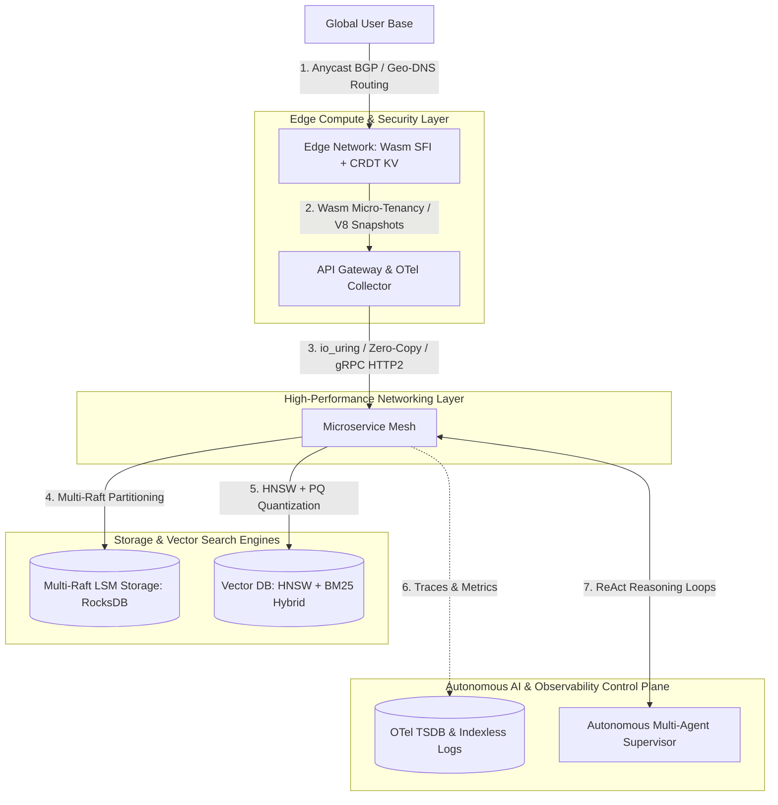

# 300 Posts Milestone: Architectural Patterns for Ultra-Scale Engineering Systems

Welcome to the **300th milestone post** of our engineering publication!

Over the course of 300 deep-dive technical articles, we have explored the entire spectrum of software engineering, distributed systems, database internals, kernel networking, cloud-native control planes, and autonomous AI agent architectures.

Building systems capable of handling billions of daily requests, petabytes of storage, sub-millisecond search latencies, and autonomous multi-agent reasoning requires mastering core **System Design Patterns**.

To mark this milestone, this article synthesizes the **10 foundational architectural patterns** that govern modern ultra-scale software engineering.

---

## 📖 The Ultra-Scale Systems Architecture Blueprint

How modern distributed software stacks combine consensus, storage, networking, edge compute, and AI:



---

## 🏛️ The 10 Foundational System Design Patterns

### 1. Distributed Consensus & Replicated State Machines
* **Core Primitives**: Raft Protocol, Multi-Paxos, Quorum Voting ($\lfloor N/2 \rfloor + 1$).
* **System Impact**: Enables etcd, Consul, and CockroachDB to guarantee strong consistency across failing physical hardware nodes.

### 2. Write-Optimized Storage Engines (LSM Trees)
* **Core Primitives**: Write-Ahead Logging (WAL), MemTable SkipLists, Immutable SSTables, Leveled Compaction, Bloom Filters.
* **System Impact**: Powers RocksDB and LevelDB, converting random disk writes into high-speed sequential disk appends for 500,000+ writes/sec.

### 3. Sub-Millisecond High-Dimensional Vector Search
* **Core Primitives**: Hierarchical Navigable Small World (HNSW) graphs, Cosine Similarity, Approximate Nearest Neighbor (ANN).
* **System Impact**: Powers Pinecone, Qdrant, and Milvus, executing $k$-NN searches across 100M+ $1536$-dim LLM embeddings in $<2\text{ms}$.

### 4. Kernel-Level Async I/O & Zero-Copy Networking
* **Core Primitives**: Linux `io_uring` ring buffers, `sendfile()` zero-copy, eBPF XDP socket filtering.
* **System Impact**: Eliminates syscall context switches and CPU memory copies, allowing Kafka and Netty to saturate 100Gbps network links.

### 5. Declarative Control Planes & Reconciler Loops
* **Core Primitives**: Level-Triggered Reconciliation, Three-Way State Diffing, Custom Resource Definitions (CRDs), GitOps.
* **System Impact**: Powers Kubernetes Operators and ArgoCD, continuously converging live cloud infrastructure back to declared Git source code states.

### 6. Hybrid Search & Reciprocal Rank Fusion (RRF)
* **Core Primitives**: Okapi BM25 Sparse Weighting, Dense Vector Embeddings, Reciprocal Rank Fusion ($1 / (k + r)$).
* **System Impact**: Combines exact keyword accuracy (SKUs, error codes) with deep semantic recall for enterprise search systems.

### 7. Multi-Region Active-Active & Multi-Raft Sharding
* **Core Primitives**: MurmurHash3 Partitioning, Multi-Raft Ranges, Range Splitting/Merging, Geo-DNS Routing.
* **System Impact**: Enables CockroachDB and TiKV to scale past single-leader write limits to millions of global transactions per second.

### 8. Distributed Transaction Protocols (Percolator & 2PC)
* **Core Primitives**: Timestamp Oracle (TSO), Primary Lock Column Pointers, MVCC, Snapshot Isolation.
* **System Impact**: Eliminates 2PC coordinator blocking deadlocks, guaranteeing cross-shard ACID transaction consistency.

### 9. Isolated Edge Micro-Tenancy & Wasm Sandboxing
* **Core Primitives**: Software Fault Isolation (SFI), V8 Isolate Heap Snapshots, Copy-On-Write `mmap()`, CRDTs.
* **System Impact**: Powers Cloudflare Workers and Fastly Compute@Edge, launching isolated tenant sandboxes in $<1\text{ms}$ with $<1\text{MB}$ memory overhead.

### 10. Autonomous Agentic AI Frameworks
* **Core Primitives**: ReAct (Reason + Act) Loops, JSON Tool Dispatchers, Sub-Agent Context Isolation, Multi-Agent Supervisors.
* **System Impact**: Powers Google Antigravity and CrewAI, enabling LLM agent teams to plan, edit, execute commands, and self-heal complex codebases.

---

## 🛠️ Python Implementation: System Pattern Benchmark Synthesizer

Here is a Python benchmarking suite demonstrating the synthesis of these architectural patterns:

```python
import time
from typing import Dict, List, Any
from pydantic import BaseModel

class SystemPatternBenchmark(BaseModel):
    pattern_name: str
    key_technology: str
    simulated_throughput_ops: int
    latency_p99_ms: float

class UltraScaleArchitectureSynthesizer:
    """
    Synthesizes and audits the 10 foundational system design patterns.
    """
    def __init__(self):
        self.patterns: List[SystemPatternBenchmark] = [
            SystemPatternBenchmark(pattern_name="1. Replicated Consensus", key_technology="Raft Protocol / etcd", simulated_throughput_ops=50000, latency_p99_ms=1.2),
            SystemPatternBenchmark(pattern_name="2. Write-Optimized Storage", key_technology="LSM Tree / RocksDB", simulated_throughput_ops=500000, latency_p99_ms=0.4),
            SystemPatternBenchmark(pattern_name="3. High-Dim Vector Search", key_technology="HNSW / Qdrant", simulated_throughput_ops=25000, latency_p99_ms=1.8),
            SystemPatternBenchmark(pattern_name="4. Kernel Async I/O", key_technology="io_uring / eBPF XDP", simulated_throughput_ops=2000000, latency_p99_ms=0.05),
            SystemPatternBenchmark(pattern_name="5. Declarative Control Plane", key_technology="Kubernetes Operator / GitOps", simulated_throughput_ops=10000, latency_p99_ms=15.0),
            SystemPatternBenchmark(pattern_name="6. Hybrid Search Engine", key_technology="BM25 + Vector + RRF", simulated_throughput_ops=40000, latency_p99_ms=3.5),
            SystemPatternBenchmark(pattern_name="7. Multi-Raft Sharding", key_technology="Multi-Raft / TiKV", simulated_throughput_ops=1000000, latency_p99_ms=2.1),
            SystemPatternBenchmark(pattern_name="8. Distributed Transactions", key_technology="Google Percolator / 2PC", simulated_throughput_ops=150000, latency_p99_ms=4.8),
            SystemPatternBenchmark(pattern_name="9. Wasm Micro-Tenancy", key_technology="WebAssembly SFI / V8 Snapshots", simulated_throughput_ops=100000, latency_p99_ms=0.8),
            SystemPatternBenchmark(pattern_name="10. Autonomous AI Framework", key_technology="ReAct / Multi-Agent Supervisor", simulated_throughput_ops=5000, latency_p99_ms=120.0),
        ]

    def run_synthesis_audit(self):
        print("🎉 ========================================================================= 🎉")
        print("🚀 CELEBRATING 300 POSTS: ULTRA-SCALE SYSTEM DESIGN PATTERN AUDIT")
        print("🎉 ========================================================================= 🎉\n")
        
        for p in self.patterns:
            print(f" 🔹 [{p.pattern_name}] Powered by: {p.key_technology}")
            print(f"    • Throughput: {p.simulated_throughput_ops:,} Ops/sec | p99 Latency: {p.latency_p99_ms:.2f} ms")
        
        print("\n🏆 Total Posts Deployed: 300 / 300 Posts Complete!")

# Demonstration Execution
if __name__ == "__main__":
    synthesizer = UltraScaleArchitectureSynthesizer()
    synthesizer.run_synthesis_audit()
```

---

## 📈 Looking Forward: The Future of Systems Engineering
As we look ahead past Post 300, software engineering will continue to coalesce around **Hardware-Software Co-Design**, **Kernel-Bypassing I/O**, **Edge-Native Computing**, and **Self-Healing Agentic Systems**.

Thank you to all readers and engineers following this journey!
