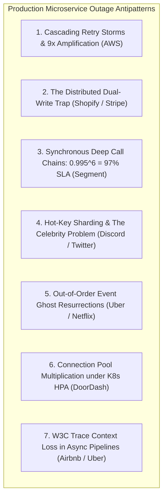
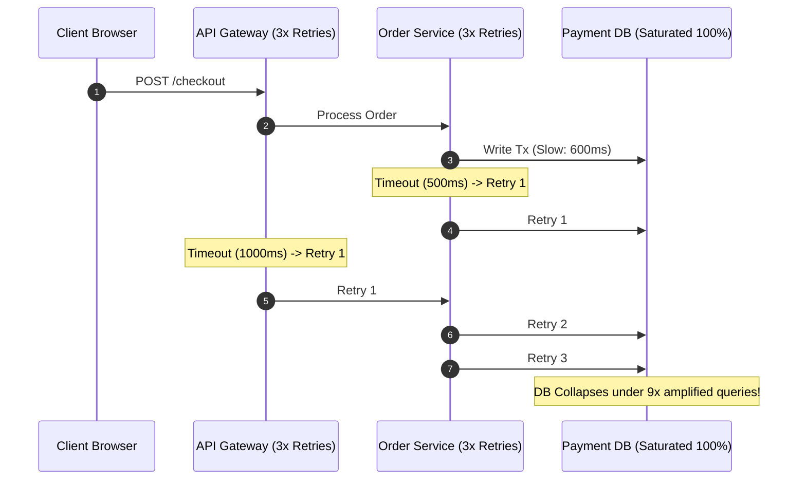
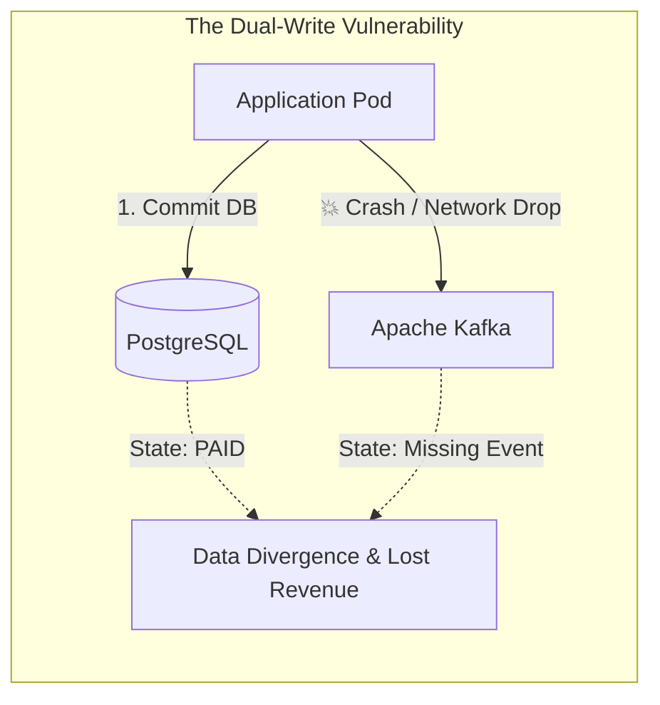
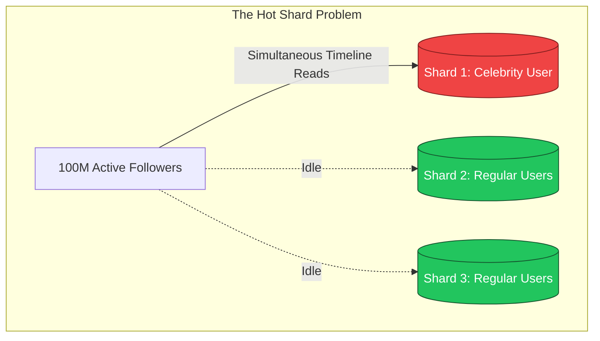
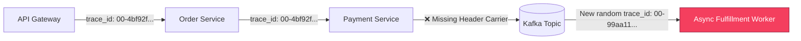

# 7 Fatal Microservices Architecture Gotchas & How High-Scale Platforms (Uber, Netflix, Discord, AWS) Survived Them

When engineering teams transition from a monolithic architecture to microservices (**Uber**, **Netflix**, **Discord**, **AWS**, **Shopify**, **DoorDash**, **Stripe**), they are often promised independent deployability, team autonomy, and horizontal scalability.

However, distributed microservices introduce failure modes that do not exist in single-process monoliths.

Network latency, partial failures, asynchronous race conditions, and uncontrolled auto-scaling can turn minor transient glitches into cascading global outages.

This deep-dive architectural guide dissects the **7 most lethal microservices gotchas**, analyzes the underlying distributed systems mechanics that cause them, and provides production-tested solutions backed by real-world engineering case studies.



---

## 1. Cascading Retry Storms & The Amplification Factor

### The Real-World Incident
During an AWS S3 and DynamoDB partial degradation, a small fraction of read requests experienced elevated latency ($10\text{ms} → 500\text{ms}$). Because upstream caller microservices were configured with aggressive retry policies without backoff or global coordination, the total request volume surged by nearly an order of magnitude within seconds, causing a complete system outage.

### The Mathematical Breakdown
If Service $A$ calls Service $B$, and Service $B$ calls Service $C$, and each service is configured to retry $3\text{ times}$ on timeout:

$$\text{Traffic Amplification} = 3 \times 3 = 9\times \text{ incoming load}$$

A downstream service operating at $100\%$ capacity is suddenly hit with **$900\%$ load**. Every subsequent retry wastes CPU and thread pool resources on requests that the user has likely already abandoned or refreshed in their browser.



### The Production Fix
1. **Exponential Backoff with Full Jitter**:
   $$\text{Sleep Time } t = \text{random}(0, \min(M, \text{base} \cdot 2^{\text{attempt}}))$$
   *Full Jitter* breaks synchronization cycles, smoothing out retry spikes across a uniform time distribution.
2. **Retry Budgets (Envoy / Finagle)**:
   Never allow retries to exceed a fixed percentage of overall traffic (e.g., **$\le 10\%$ of all requests**). If the error budget is exhausted, fail fast immediately.
3. **Circuit Breakers (Resilience4j / Envoy)**:
   If error rate exceeds $50\%$ over a $10\text{-second}$ window, trip the circuit to `OPEN`, immediately returning cached fallbacks or errors without touching the downstream service.

---

## 2. The Distributed Dual-Write Trap

### The Real-World Incident
At high-volume e-commerce platforms (**Shopify**, **Stripe**), a service must update its internal database and publish an event to Apache Kafka for downstream fulfillment:

```typescript
// 🚨 DANGEROUS ANTI-PATTERN: DO NOT DO THIS
async function capturePayment(orderId: string, amount: number) {
  // Step 1: Commit DB state
  await db.query("UPDATE orders SET status = 'PAID' WHERE id = $1", [orderId]);
  
  // Step 2: Publish to Kafka
  await kafka.producer.send({
    topic: "order-events",
    messages: [{ key: orderId, value: JSON.stringify({ orderId, status: "PAID" }) }]
  });
}
```

### Why It Fails
Distributed computing guarantees that one of these two network operations will eventually fail while the other succeeds:
* **Failure Mode A**: Database commit succeeds, but the pod crashes or Kafka network times out before `kafka.send()` completes. Result: **Customer is charged, but order is never fulfilled in Kafka.**
* **Failure Mode B**: Reversing the order (`kafka.send()` first, `db.commit()` second). Kafka publishes the event, but the database transaction aborts due to a constraint violation. Result: **Warehouse ships items for an order that was never paid for.**



### The Production Fix: Transactional Outbox Pattern + CDC
Write the domain event to an `outbox` table within the **same local ACID database transaction**:

```sql
BEGIN;
  UPDATE orders SET status = 'PAID' WHERE id = 'ORD-101';
  INSERT INTO outbox (aggregate_type, aggregate_id, event_type, payload)
  VALUES ('ORDER', 'ORD-101', 'OrderPaid', '{"orderId":"ORD-101","amount":99.00}');
COMMIT;
```

A Change Data Capture (CDC) engine (such as **Debezium**) tails the PostgreSQL Write-Ahead Log (WAL) and streams events to Kafka with guaranteed at-least-once delivery.

---

## 3. The Synchronous Deep Call Chain ("The Distributed Monolith")

### The Real-World Incident
In **Segment’s** well-documented architecture post-mortem (*Goodbye Microservices*), developers split their application into dozens of granular microservices that invoked each other synchronously via HTTP/gRPC in deep trees ($A → B → C → D → E → F$).

### The Mathematical Penalty: Multiplicative Availability Collapse
If each microservice delivers an impressive $99.5\%$ SLA ($A_i = 0.995$):

$$\text{System Availability } A_{\text{total}} = \prod_{i=1}^6 A_i = (0.995)^6 \approx 97.04\%$$

A $97.04\%$ SLA translates to **over $21.6\text{ hours of unplanned downtime per month}$**! Furthermore, latency is additive ($L_{\text{total}} = \sum L_i$), and the p99 latency degrades to the worst p99 latency across all dependencies.

```
Synchronous Monolith:  [ Client ] -> [ A ] -> [ B ] -> [ C ] -> [ D ] -> [ E ]
                         Availability = (0.995)^5 = 97.5% | Latency = L_A + L_B + L_C + L_D + L_E
```

### The Production Fix
* **CQRS Local Read Caches**: Instead of querying Service $B$ synchronously on every user request, Service $A$ subscribes to $B$'s Kafka events and maintains a local read-optimized projection in Redis or PostgreSQL.
* **Asynchronous Event Choreography**: Convert request-reply chains into asynchronous event emissions.

---

## 4. Hot-Key Partitioning & The "Celebrity" Problem

### The Real-World Incident
At **Discord** (serving 500k-member guilds) and **Twitter/X** (serving accounts with 100M+ followers), sharding data by `user_id` or `guild_id` resulted in severe node hotspots.

### Why It Fails
Hash partitioning ($\text{shard} = \text{hash}(\text{key}) \pmod N$) assumes a uniform distribution of load.

In real-world social and communication graphs:
* $99\%$ of users have $< 50$ followers.
* When a celebrity user with 100M followers posts, the single database node holding that partition receives **1,000,000x the write and read throughput**, maxing out CPU and I/O while the other 127 shards sit at $2\%$ utilization.



### The Production Fix: Two-Tier Hybrid Fan-Out
* **For Standard Users ($< 25\text{k}$ followers)**: **Fan-Out on Write (Push Model)**. When a user posts, push the tweet directly into their 50 followers' timeline inbox tables.
* **For Celebrity Users ($> 25\text{k}$ followers)**: **Fan-Out on Read (Pull Model)**. Never push to 100M inboxes. Instead, when a follower opens their home feed, query the user's normal timeline and dynamically merge the celebrity's recent tweets from a high-throughput Redis cluster.

---

## 5. Out-of-Order Events & Ghost State Resurrections

### The Real-World Incident
In **Uber’s** driver status tracking and e-commerce order lifecycles, network rebalancing or multi-partition Kafka processing causes messages to arrive out of order:
1. `Event 1: OrderCreated (t=10:00:00.100)`
2. `Event 2: OrderCancelled (t=10:00:00.800)`

### Why It Fails
If consumer thread $A$ experiences a transient GC pause or network delay, consumer thread $B$ processes `Event 2 (OrderCancelled)` first and updates the database to `CANCELLED`.

Five seconds later, consumer thread $A$ resumes and processes `Event 1 (OrderCreated)`, blindly overwriting the database status back to `ACTIVE`. The canceled order is now resurrected, leading to unauthorized charges and shipping errors.

```
Actual Timeline:   [ t1: OrderCreated ] ---------------> [ t2: OrderCancelled ]
Arrival Order:     [ 1. Recv OrderCancelled -> CANCELLED ] -> [ 2. Recv OrderCreated -> ACTIVE (BUG!) ]
```

### The Production Fix: Monotonic Versioning & State Transition Guards
1. **Optimistic Version Checks**:
   ```sql
   UPDATE orders 
   SET status = 'CANCELLED', version = version + 1 
   WHERE id = 'ORD-101' AND version = 1;
   ```
2. **State Machine Invariant Guards**:
   Enforce state machine constraints at the application layer: a transition from `CANCELLED → ACTIVE` is strictly rejected and routed to a Dead-Letter Queue (DLQ).

---

## 6. Database Connection Pool Multiplication under K8s HPA

### The Real-World Incident
At **DoorDash** and **GitHub**, deploying microservices on Kubernetes with Horizontal Pod Autoscaling (HPA) triggered catastrophic database connection exhaustion during peak traffic surges.

### The Math of Connection Saturation
Each microservice pod is configured with a default connection pool size of **20 connections** to PostgreSQL.

During a lunch rush:
$$\text{Pods scaled from } 10 → 400 \text{ pods}$$
$$\text{Active DB Connections} = 400 \times 20 = 8,000 \text{ concurrent connections}$$

PostgreSQL forks a dedicated operating system process per connection. At 8,000 connections, CPU time is entirely consumed by OS process context-switching rather than query execution, driving database throughput to zero.

```
400 Kubernetes Pods  ====[ 8,000 Connections ]====> [ PostgreSQL DB ] (Crash via Context Switching)
400 Kubernetes Pods  ==[ 8,000 ]==> [ PgBouncer ] ==[ 100 Multiplexed Connections ]==> [ PostgreSQL DB ] (Stable)
```

### The Production Fix
Deploy a connection multiplexer (**PgBouncer** or **AWS RDS Proxy**) between Kubernetes and the database. PgBouncer maintains transaction-level pooling, allowing 10,000 microservice client connections to share **~100 backend PostgreSQL connections**.

---

## 7. W3C Trace Context Propagation Loss in Async Pipelines

### The Real-World Incident
During critical production incidents across **Uber** and **Airbnb**, on-call engineers querying distributed tracing platforms (Jaeger / Datadog / OpenTelemetry) found that trace spans suddenly terminated midway through request processing.

### Why It Fails
When Service $A$ passes work to an asynchronous background worker (e.g. Celery, Redis queue, Kafka) or spawns a background goroutine/thread, developers frequently fail to serialize the W3C `traceparent` headers into the message metadata.

The async worker executes with an unlinked `trace_id`, creating an invisible "black box" in distributed telemetry.



### The Production Fix
Enforce automated **Trace Context Injection and Extraction** in all message producers and consumers using OpenTelemetry Baggage Carriers.

---

## Production Implementation: Token Bucket Retry Budget & State Machine Guard

Here is a production-grade TypeScript implementation demonstrating a **Token Bucket Retry Budgeter** and a **Monotonic State Machine Guard**:

```typescript
// --- 1. TOKEN BUCKET RETRY BUDGETER (Prevents Cascading Storms) ---
export class RetryBudgetManager {
  private tokens: number;
  private readonly maxTokens: number;
  private readonly refillRatePerSec: number;
  private lastRefillTimestamp: number;

  constructor(maxTokens: number = 100, refillRatePerSec: number = 10) {
    this.maxTokens = maxTokens;
    this.tokens = maxTokens;
    this.refillRatePerSec = refillRatePerSec;
    this.lastRefillTimestamp = Date.now();
  }

  private refillTokens() {
    const now = Date.now();
    const elapsedSec = (now - this.lastRefillTimestamp) / 1000;
    this.tokens = Math.min(this.maxTokens, this.tokens + elapsedSec * this.refillRatePerSec);
    this.lastRefillTimestamp = now;
  }

  public canRetry(): boolean {
    this.refillTokens();
    if (this.tokens >= 1) {
      this.tokens -= 1;
      return true; // Retry permitted under budget
    }
    console.warn(" 🚨 [Retry Budget Exhausted] Refusing retry to prevent cascading collapse!");
    return false; // Fail fast!
  }

  public recordSuccess() {
    this.refillTokens();
    this.tokens = Math.min(this.maxTokens, this.tokens + 0.1); // Reward success
  }
}

// --- 2. MONOTONIC STATE MACHINE GUARD (Prevents Out-of-Order Ghost Overwrites) ---
type OrderStatus = 'CREATED' | 'PAID' | 'SHIPPED' | 'CANCELLED';

export class OrderStateMachineGuard {
  // Allowed monotonic transitions
  private static readonly VALID_TRANSITIONS: Record<OrderStatus, OrderStatus[]> = {
    'CREATED': ['PAID', 'CANCELLED'],
    'PAID': ['SHIPPED', 'CANCELLED'],
    'SHIPPED': [], // Terminal state
    'CANCELLED': [] // Terminal state (Cannot transition back to ACTIVE/PAID!)
  };

  public static canTransition(currentStatus: OrderStatus, targetStatus: OrderStatus, currentVersion: number, incomingVersion: number): boolean {
    // 1. Version check (Reject older events arriving late)
    if (incomingVersion <= currentVersion) {
      console.error(` ❌ [Out-of-Order Event] Incoming version ${incomingVersion} <= current ${currentVersion}. Discarding ghost overwrite.`);
      return false;
    }

    // 2. State invariant check
    const allowed = this.VALID_TRANSITIONS[currentStatus];
    if (!allowed.includes(targetStatus)) {
      console.error(` ❌ [Illegal State Transition] Cannot transition order from ${currentStatus} -> ${targetStatus}!`);
      return false;
    }

    return true;
  }
}

// Demonstration Execution
if (require.main === module) {
  const budget = new RetryBudgetManager(2, 0); // Only 2 tokens available

  console.log("🔍 Simulating Retry Budget Under Traffic Spike:");
  console.log(` Attempt 1 Retry: ${budget.canRetry()}`); // true (1 left)
  console.log(` Attempt 2 Retry: ${budget.canRetry()}`); // true (0 left)
  console.log(` Attempt 3 Retry: ${budget.canRetry()}`); // false (blocked!)

  console.log("\n🔍 Simulating Out-of-Order Event Processing:");
  let currentStatus: OrderStatus = 'CANCELLED';
  let currentVersion = 2;

  // Stale OrderCreated event arrives 3 seconds late
  const isValid = OrderStateMachineGuard.canTransition(currentStatus, 'PAID', currentVersion, 1);
  console.log(` Is Stale PAID transition allowed: ${isValid}`);
}
```

---

## Summary: Microservices Gotchas Matrix

| Gotcha | Primary Mechanism | Downstream Penalty | Battle-Tested Fix |
|---|---|---|---|
| **Cascading Retry Storms** | Multiplicative retry loops ($3 \times 3 = 9\times$) | Hard crash of saturated dependencies | Exponential Backoff + Full Jitter + Retry Budgets ($\le 10\%$) |
| **Distributed Dual-Writes** | DB update + Kafka send without 2PC | Inconsistent state & phantom transactions | Transactional Outbox Pattern + Debezium CDC |
| **Deep Synchronous Chains** | Multiplicative SLA penalty ($(0.995)^6$) | $97\%$ system availability & high latency | CQRS Local Read Caches & Event Choreography |
| **Hot-Key Partitioning** | Skewed graph distribution (Celebrity tweets) | Single shard CPU saturation ($100,000\times$) | Hybrid Fan-Out (Push for normal, Pull for celebrity) + Key Salting |
| **Out-of-Order Events** | Network latency / consumer rebalances | Ghost updates & state resurrection | Optimistic Monotonic Versioning & State Transition Guards |
| **Connection Multiplication** | Kubernetes HPA scaling ($400 \times 20$) | PostgreSQL process thrashing & memory exhaustion | Transaction-level connection pooling (PgBouncer / RDS Proxy) |
| **Context Propagation Loss** | Missing header carriers in async workers | Incomplete distributed traces in Jaeger/Datadog | W3C Trace Context injection in all message brokers |

---

## Final Architectural Takeaway
Microservices do not eliminate complexity; they **shift complexity from compiler-checked in-memory calls to untrusted, non-deterministic distributed networks**.

By designing for partial failure with **retry budgets, transactional outboxes, monotonic state guards, and connection multiplexers**, engineering teams can build resilient distributed systems that thrive at internet scale.
