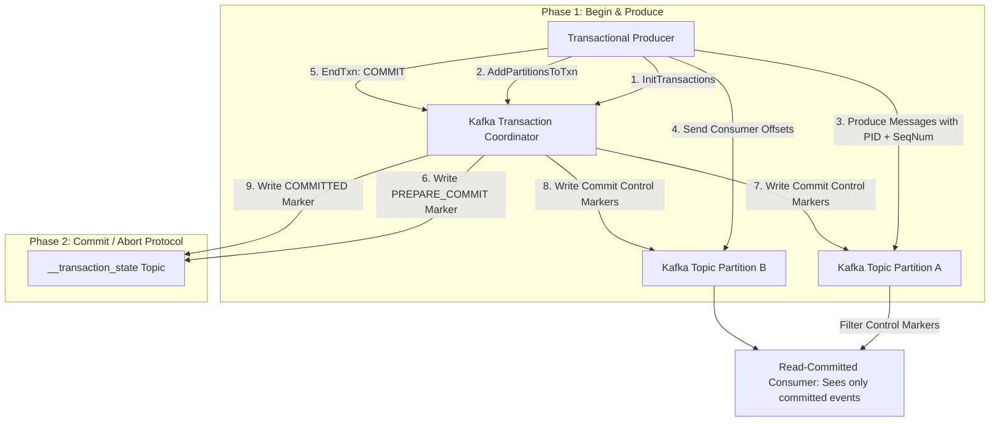

# Achieving Exactly-Once Semantics (EOS) in Distributed Event Streams

In distributed stream processing systems, network timeouts, broker restarts, and consumer group rebalances inevitably cause message re-transmissions. Under default configurations, streaming engines provide **At-Least-Once** delivery, resulting in duplicate records being processed by downstream database sinks or financial transaction systems.

Achieving true **Exactly-Once Semantics (EOS)** guarantees that every event record is processed atomically—preventing both data loss and message duplication.

Kafka achieves EOS through **Idempotent Producers**, the **Transactional Coordinator**, and two-phase commit protocols (`read_committed`).

This article details the end-to-end mechanics required to build fault-tolerant EOS event pipelines.

---

## Kafka Two-Phase Commit Transactional Architecture

The two-phase commit protocol coordinating atomic multi-partition writes:



### Core Prerequisites for Exactly-Once Semantics
1. **Idempotent Producer (`enable.idempotence=true`)**: Every producer is assigned a 64-bit Producer ID (PID). Each batch sent to a topic partition includes a monotonically increasing Sequence Number. If a network retry occurs, the Kafka broker compares the batch sequence number against its expected sequence counter and drops duplicate batches cleanly.
2. **Transactional Coordinator & Log**: Multi-partition writes (such as consuming from topic A, updating internal state, and writing to topic B) are grouped into a single atomic transaction. The Transaction Coordinator writes transaction markers (`PREPARE_COMMIT`, `COMMITTED`, or `ABORTED`) to the internal `__transaction_state` log topic.
3. **Read-Committed Consumers (`isolation.level=read_committed`)**: Downstream consumers filter out uncommitted messages or aborted transaction blocks, advancing offsets only up to the last stable offset (LSO).

---

## Python Implementation: Transactional Kafka Producer & EOS Pipeline

Here is a production-grade Python simulation of an Idempotent Transactional Kafka Producer and Read-Committed Consumer pipeline:

```python
import time
from typing import List, Dict, Any, Optional
from pydantic import BaseModel, Field

class MessageBatch(BaseModel):
    pid: int  # Producer ID
    sequence_number: int
    topic: str
    partition: int
    payload: Dict[str, Any]

class KafkaBrokerPartition:
    """
    Simulates a Kafka Broker Partition with Idempotence deduplication logic.
    """
    def __init__(self, topic: str, partition_id: int):
        self.topic = topic
        self.partition_id = partition_id
        # Tracks last sequence number per Producer ID (PID -> Last Seq)
        self.producer_sequence_table: Dict[int, int] = {}
        self.committed_log: List[MessageBatch] = []
        self.uncommitted_buffer: List[MessageBatch] = []

    def receive_batch(self, batch: MessageBatch) -> bool:
        """Enforces Idempotency using PID and Sequence Numbers."""
        last_seq = self.producer_sequence_table.get(batch.pid, -1)

        # 1. Deduplicate Retries
        if batch.sequence_number <= last_seq:
            print(f" ⚠️ [Broker {self.topic}:{self.partition_id}] DUPLICATE DETECTED! PID {batch.pid} Seq {batch.sequence_number} dropped.")
            return False

        # 2. Sequence Check (Ensure no missing sequence gap)
        if batch.sequence_number != last_seq + 1:
            raise RuntimeError(f"Out of sequence error! Expected {last_seq + 1}, got {batch.sequence_number}")

        # Update last sequence number and buffer batch
        self.producer_sequence_table[batch.pid] = batch.sequence_number
        self.uncommitted_buffer.append(batch)
        print(f" 📥 [Broker {self.topic}:{self.partition_id}] Buffered Batch PID {batch.pid} Seq {batch.sequence_number}")
        return True

    def commit_transaction(self):
        """Applies committed control marker to move buffer into committed log."""
        self.committed_log.extend(self.uncommitted_buffer)
        self.uncommitted_buffer.clear()
        print(f" ✅ [Broker {self.topic}:{self.partition_id}] Transaction COMMITTED! Messages exposed to read_committed consumers.")

    def abort_transaction(self):
        """Drops uncommitted transaction buffer."""
        self.uncommitted_buffer.clear()
        print(f" ❌ [Broker {self.topic}:{self.partition_id}] Transaction ABORTED! Uncommitted buffer purged.")

class TransactionalProducer:
    def __init__(self, pid: int, broker_partitions: Dict[str, KafkaBrokerPartition]):
        self.pid = pid
        self.sequence_counter = 0
        self.broker_partitions = broker_partitions

    def produce_transactional(self, topic: str, payload: Dict[str, Any], simulate_retry: bool = False):
        partition = self.broker_partitions[topic]
        
        # Increment sequence number
        self.sequence_counter += 1
        batch = MessageBatch(
            pid=self.pid, sequence_number=self.sequence_counter, topic=topic, partition=0, payload=payload
        )

        # Send Batch to Broker
        partition.receive_batch(batch)

        # Simulate network timeout retry (re-sending same sequence number)
        if simulate_retry:
            print(f" 🔄 [Producer PID {self.pid}] Network timeout simulated! Retrying batch Seq {self.sequence_counter}...")
            partition.receive_batch(batch)

# Demonstration Execution
if __name__ == "__main__":
    partition_a = KafkaBrokerPartition(topic="orders-tx", partition_id=0)
    brokers = {"orders-tx": partition_a}
    
    producer = TransactionalProducer(pid=9901, broker_partitions=brokers)

    print("🚀 Demonstrating Kafka Idempotence & Transactional EOS Pipeline...")
    print("=" * 75)

    # 1. Produce message with simulated network retry
    producer.produce_transactional("orders-tx", {"order_id": "tx-101", "amount": 250.00}, simulate_retry=True)

    # 2. Commit Transaction via Two-Phase Commit Coordinator
    partition_a.commit_transaction()

    # Verify committed log length
    print(f"\n📊 Total Committed Log Entries: {len(partition_a.committed_log)} (Zero duplication!)")
```

---

## EOS Implementation Gotchas & Guardrails

When configuring Exactly-Once Semantics:

> [!IMPORTANT]
> **Set `transactional.id` Per Producer Instance**: To support transactional recovery after container restarts, every producer process must be configured with a static, unique `transactional.id`. This allows the Kafka Transaction Coordinator to fence out old zombie producer instances (zombie epoch fencing) before starting a new transaction.

> [!CAUTION]
> **Account for Higher Latency Trajectories**: Transactional commits require 2PC network round-trips to write `PREPARE_COMMIT` and `COMMITTED` markers to disk. Transactional pipelines exhibit slightly higher p99 latencies compared to fire-and-forget producers. Batch multiple messages within transactions to maximize throughput.

---

## Real-World Enterprise Impact
Teams deploying EOS pipelines with Kafka report:
* **Zero Duplicate Payments**: Idempotent producers and transactional commit markers prevent duplicate financial charges during network socket drops.
* **Flawless Multi-Topic Consistency**: Atomic transactions guarantee that downstream read databases remain perfectly synchronized with upstream message streams.
