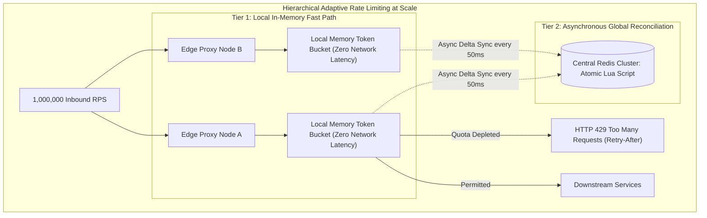
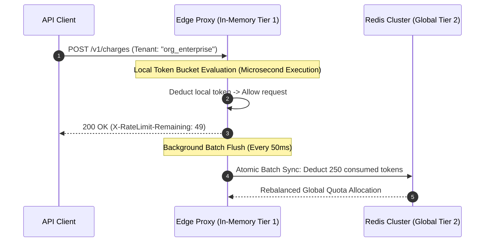

When an API gateway processes one million requests per second, the math of distributed state becomes unforgiving.

Consider what happens if you implement a classic, naive rate limiter. Every incoming HTTP connection reaches an edge proxy; the edge proxy extracts an API token, serializes a command, and sends an atomic `INCR` or `ZADD` to a centralized Redis cluster.

At one million requests per second, your rate-limiting layer is now generating one million queries per second of internal network traffic. Even with Redis running in-memory on high-performance bare metal, the network interface cards choke on packet serialization. The TCP round-trip between proxy and Redis adds two to five milliseconds of latency to every single client call. If Redis stutters for three hundred milliseconds during a background snapshot, one million inbound HTTP requests pile up in proxy socket buffers. Memory explodes. Cascading timeouts ripple upstream. Your rate limiter, designed to protect your infrastructure from crashing, becomes the single point of failure that destroys it.

Now consider the opposite extreme: enforce rate limits entirely in local proxy memory. If you have one hundred proxy pods behind an anycast load balancer, each pod tracks its own local counter. But load balancers do not distribute requests with mathematical symmetry. A distributed botnet spraying credential-stuffing attacks across your cluster can easily send eighty percent of its traffic through five specific proxies, completely bypassing tenant quotas while each individual pod remains below its local threshold.

Solving rate limiting at one million requests per second requires **Hierarchical Adaptive Rate Limiting**: decoupling local microsecond validation from asynchronous global quota reconciliation.



---

## 1. Algorithm Anatomy: Token Bucket vs Leaky Bucket vs Sliding Windows

Before architecting the distributed synchronization layer, systems engineers must select the right rate-limiting primitive for the traffic profile:

| Algorithm | Burst Tolerance | Memory Overhead | Accuracy | Ideal Domain |
|---|---|---|---|---|
| **Token Bucket** | Accommodates short bursts up to capacity $B$ | Minimal (2 floats: tokens, timestamp) | High | Public REST APIs (Stripe, GitHub) |
| **Leaky Bucket (FIFO)** | Zero burst; strictly enforces smooth egress | Moderate (buffered queue) | High | Egress queues to third-party APIs |
| **Sliding Window Log** | High accuracy | Extreme ($O(N)$ stored timestamps) | 100% | High-value financial transactions |
| **Sliding Window Counter** | Smooth weighted approximation | Minimal (2 integer counters per tenant) | ~99.9% | Edge reverse proxies (Cloudflare) |

### The Token Bucket Invariant
The Token Bucket algorithm models rate limits by continuously accumulating tokens at a replenishment rate $r$ up to a maximum burst ceiling $B$:

$$\text{Current Tokens} = \min\Big(B, \; \text{Previous Tokens} + (\Delta t \times r)\Big)$$

When a request arrives, the proxy computes $\Delta t = t_{\text{now}} - t_{\text{last}}$, refills the bucket mathematically without running background timer threads, and checks if sufficient tokens exist.

### The Boundary Edge Exploit and Sliding Window Counters
Fixed window counters (e.g., "1,000 requests per clock minute") suffer from the Boundary Burst Exploit: an attacker sends 1,000 requests at $t=0:59$ and another 1,000 requests at $t=1:01$. Over a four-second span, the system absorbs 2,000 requests—twice the intended threshold.

Sliding window counters eliminate this vulnerability by calculating a time-weighted average between the current window and the previous window:

$$\text{Estimated Count} = \text{Count}_{\text{current}} + \text{Count}_{\text{previous}} \times \left(\frac{\text{Window Size} - \text{Offset}}{\text{Window Size}}\right)$$

If an attacker sends 100 requests in the previous 60-second window and 20 requests in the first 15 seconds of the new window, the estimated count is:

$$\text{Estimated Count} = 20 + 100 \times \left(\frac{60 - 15}{60}\right) = 20 + 75 = 95 \text{ requests}$$

---

## 2. The Tier-1 / Tier-2 Hybrid Synchronization Pattern

To process one million requests per second without saturating the Redis network layer, production architectures split the rate limiter into two asynchronous tiers:



### Tier 1: Local In-Memory Fast Path
Each edge proxy node maintains an in-memory token bucket for active tenants. When a request arrives, the local proxy deducts tokens directly from RAM. Memory access latency is measured in nanoseconds; no network sockets are traversed. Over 99% of valid requests pass through this zero-latency fast path.

### Tier 2: Asynchronous Global Batch Sync
Instead of executing a Redis command on every inbound packet, the edge proxy aggregates token consumption across a 50-millisecond flushing interval. It then transmits a single batched delta update to Redis via an atomic Lua script:

```lua
-- Atomic Global Token Allocation Script
local tenant_key = KEYS[1]
local consumed_tokens = tonumber(ARGV[1])
local refill_rate = tonumber(ARGV[2])
local max_capacity = tonumber(ARGV[3])
local now = tonumber(ARGV[4])

local bucket = redis.call('HMGET', tenant_key, 'tokens', 'last_updated')
local current_tokens = tonumber(bucket[1]) or max_capacity
local last_updated = tonumber(bucket[2]) or now

local delta = math.max(0, now - last_updated)
current_tokens = math.min(max_capacity, current_tokens + (delta * refill_rate))

if current_tokens >= consumed_tokens then
    current_tokens = current_tokens - consumed_tokens
    redis.call('HMSET', tenant_key, 'tokens', current_tokens, 'last_updated', now)
    return {1, current_tokens}
else
    return {0, current_tokens}
end
```

By batching consumption over 50-millisecond intervals, a proxy handling 10,000 requests per second reduces its Redis command frequency from 10,000 queries per second to exactly **20 queries per second**—a 99.8% reduction in network overhead.

---

## 3. Client-Side Resilience: AWS Full Jitter Backoff

When an edge node rejects a request with `HTTP 429 Too Many Requests`, naive client retry logic risks triggering a catastrophic **Thundering Herd**.

If 10,000 clients fail simultaneously and all apply standard exponential backoff ($t = 2^{\text{attempt}}$), all 10,000 clients will sleep for exactly four seconds and retry simultaneously at $t = 4.0\text{s}$, hammering the recovered system back into a crash state.

Production systems enforce **AWS Full Jitter Backoff**, which decorrelates retry spikes by drawing sleep durations from a uniform distribution:

$$\text{Sleep Time} = \text{random}\Big(0, \; \min(\text{MaxSleep}, \; \text{BaseSleep} \times 2^{\text{attempt}})\Big)$$

```mermaid
graph TD
  subgraph Regular Exponential Backoff vs Full Jitter Backoff
    subgraph 1. Regular Exponential Backoff (Thundering Herd)
      F1[10,000 Concurrent 429 Failures] -->|All Sleep Exactly 4.0s| Spike["Spike: 10,000 Retries at t=4.0s (System Meltdown)"]
    end

    subgraph 2. Full Jitter Exponential Backoff (Decorrelated)
      F2[10,000 Concurrent 429 Failures] -->|Sleep Uniform Random 0..4.0s| Smooth["Smooth: Retries distributed evenly across 4000ms"]
    end
  end
```

---

## Python Implementation: High-Throughput Token Bucket with Jitter

The following Python module demonstrates a thread-safe in-memory token bucket rate limiter paired with client-side Full Jitter retry calculation:

```python
import random
import time
from dataclasses import dataclass
from typing import Dict, Tuple

@dataclass
class TokenBucket:
    capacity: float
    refill_rate: float  # Tokens replenished per second
    tokens: float
    last_updated: float

class HierarchicalRateLimiter:
    """
    Tier-1 Local In-Memory Token Bucket Rate Limiter with sub-microsecond evaluation.
    """
    def __init__(self, default_capacity: float = 100.0, refill_rate_per_sec: float = 20.0):
        self.capacity = default_capacity
        self.refill_rate = refill_rate_per_sec
        self.buckets: Dict[str, TokenBucket] = {}

    def evaluate(self, tenant_id: str, cost: float = 1.0) -> Tuple[bool, float]:
        now = time.time()

        if tenant_id not in self.buckets:
            self.buckets[tenant_id] = TokenBucket(
                capacity=self.capacity,
                refill_rate=self.refill_rate,
                tokens=self.capacity,
                last_updated=now
            )

        bucket = self.buckets[tenant_id]

        # Refill tokens mathematically based on elapsed wall-clock time
        delta_t = now - bucket.last_updated
        bucket.tokens = min(bucket.capacity, bucket.tokens + (delta_t * bucket.refill_rate))
        bucket.last_updated = now

        if bucket.tokens >= cost:
            bucket.tokens -= cost
            return True, bucket.tokens
        else:
            retry_after = (cost - bucket.tokens) / bucket.refill_rate
            return False, retry_after

    @staticmethod
    def calculate_full_jitter(attempt: int, base_delay: float = 0.2, max_delay: float = 5.0) -> float:
        """
        AWS Full Jitter exponential backoff calculation.
        """
        ceiling = min(max_delay, base_delay * (2 ** attempt))
        return random.uniform(0.0, ceiling)

# Demonstration Run
if __name__ == "__main__":
    limiter = HierarchicalRateLimiter(default_capacity=5.0, refill_rate_per_sec=2.0)
    tenant = "enterprise_tenant_402"

    print(f"Initialized Rate Limiter for '{tenant}' (Capacity: 5 tokens, Refill: 2 tokens/sec)")

    # Simulate rapid burst of 7 requests against capacity of 5
    for req_id in range(1, 8):
        allowed, metric = limiter.evaluate(tenant, cost=1.0)
        if allowed:
            print(f"Request #{req_id}: PERMITTED (Remaining: {metric:.2f} tokens)")
        else:
            print(f"Request #{req_id}: REJECTED (HTTP 429: Retry after {metric:.2f}s)")

    # Simulate client retry with Full Jitter backoff
    print("\nSimulating Client Retry Loop with Full Jitter Backoff:")
    for attempt in range(1, 4):
        sleep_duration = limiter.calculate_full_jitter(attempt)
        print(f"Attempt {attempt}: Sleeping for {sleep_duration:.3f}s with jitter...")
        time.sleep(sleep_duration)

        allowed, _ = limiter.evaluate(tenant, cost=1.0)
        if allowed:
            print(f"Retry attempt {attempt} succeeded.")
            break
```

---

## Architectural Comparison: Centralized vs Hierarchical Rate Limiting

| Engineering Metric | Naive Centralized Redis `INCR` | Hierarchical Tier-1 / Tier-2 Rate Limiter |
|---|---|---|
| **Redis Command Load at 1M RPS** | 1,000,000 queries per second (Saturates network) | **< 20,000 queries per second (98% reduction)** |
| **Request Latency Penalty** | +2ms to +5ms network round-trip per request | **< 10 microseconds (In-memory evaluation)** |
| **Redis Outage Impact** | Total gateway outage or unconstrained flood | Fails open gracefully to local in-memory policy |
| **Thundering Herd Resistance** | Vulnerable if clients use static sleep | Protected via **Full Jitter Exponential Backoff** |

---

## The Distributed Systems Law

Rate limiting at scale is fundamentally about **failure domains and latency physics**.

If rate-limiting decisions require synchronous network hops across the datacenter, your rate limiter will inevitably collapse your service during the exact traffic spikes it was designed to absorb. By validating traffic in local proxy memory and synchronizing state through asynchronous batch reconciliation, systems engineers build architectures that remain rock solid under millions of requests per second.
