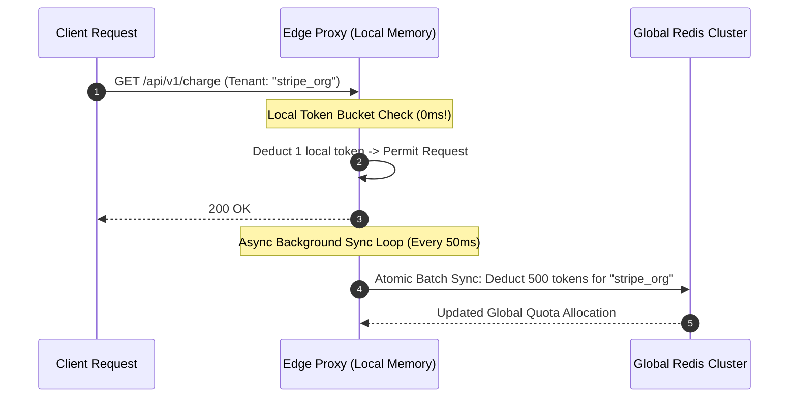

# Adaptive Rate Limiting at 1,000,000 RPS: Token Bucket vs Leaky Bucket vs Sliding Window Log (Stripe & Cloudflare Scale)

In hyper-scale API platforms and payment gateways (**Stripe**, **Cloudflare**, **AWS API Gateway**, **GitHub API**), rate limiting is the ultimate defense against distributed denial-of-service (DDoS) attacks, brute-force credential stuffing, and cascading backend overload.

At **1,000,000 Requests Per Second (RPS)**, however, traditional rate limiting architectures collapse:
* If every incoming HTTP request issues an atomic `INCR` or `ZADD` to a centralized Redis cluster, the rate limiter itself consumes **$1\text{ Million QPS of database bandwidth}$**, becoming the primary single-point-of-failure and latency bottleneck.
* If rate limiting is enforced purely in local container memory, traffic load balancers distribute requests unevenly across 100 pods, allowing malicious bots to bypass rate limits by **$100\times$**.

Building hyper-scale rate limiters requires **Hierarchical Adaptive Rate Limiting**: combining **Local Memory Token Buckets with Asynchronous Batching**, **Atomic Redis Lua Scripts**, and **Client-Side Exponential Backoff with Full Jitter**.

```mermaid
graph TD
  subgraph Hyper-Scale 1M RPS Rate Limiting Architecture
    Ingress[1,000,000 Incoming RPS] --> Edge1[Edge Envoy / Nginx Proxy Node 1]
    Ingress --> Edge2[Edge Envoy / Nginx Proxy Node 2]
    
    subgraph Tier 1: Local In-Memory Fast Path (0ms Overhead)
      Edge1 --> LocalBucket1["Local Memory Token Bucket (Serves 99% requests instantly)"]
      Edge2 --> LocalBucket2["Local Memory Token Bucket (Serves 99% requests instantly)"]
    end
    
    subgraph Tier 2: Asynchronous Global Sync (Every 50ms)
      LocalBucket1 & LocalBucket2 -.->|Async Batch Delta Sync| GlobalRedis[(Central Redis Cluster: Atomic Lua Script)]
    end
    
    LocalBucket1 -->|Limit Exceeded| 429Response["HTTP 429 Too Many Requests (Retry-After: 2s)"]
    LocalBucket1 -->|Permitted| BackendAPI[Downstream Microservice Engine]
  end
```

---

## ⚖️ 1. Algorithm Comparison: Token Bucket vs Leaky Bucket vs Sliding Window

```
+---------------------------------------------------------------------------------------------------+
|                                 RATE LIMITING ALGORITHMS COMPARISON                               |
+---------------------------------------------------------------------------------------------------+
| Algorithm             | Burst Handling | Memory Overhead | Accuracy | Optimal Use Case            |
| Token Bucket          | ✅ Allows Bursts| Minimal (2 vars)| High     | REST APIs, Cloudflare Edge  |
| Leaky Bucket (Queue)  | ❌ Strict Smooth| Moderate (FIFO) | High     | Background Queue Processing |
| Sliding Window Log    | ✅ Accurate     | 🚨 High (O(N))  | 100%     | Low-volume financial limits |
| Sliding Window Counter| ✅ Smooth Est.  | Low (2 counters)| 99.95%   | Enterprise API Gateways     |
+---------------------------------------------------------------------------------------------------+
```

---

### 1. The Token Bucket Algorithm
Tokens are added to a bucket at a constant rate $r$ (tokens/sec) up to a maximum burst capacity $B$.
* When a request arrives, it attempts to consume $1$ token.
* If tokens $\ge 1$, the request is permitted; if empty, the request is rejected with `HTTP 429`.

$$\text{Current Tokens} = \min\Big(B, \; \text{Previous Tokens} + (\Delta t \times r)\Big)$$

---

### 2. The Sliding Window Counter Approximation
To prevent the **Boundary Double-Traffic Exploit** (where an attacker sends 100 requests at $t=0:59$ and 100 requests at $t=1:01$), the Sliding Window Counter calculates a weighted average:

$$\text{Estimated Requests} = \text{Count}_{\text{current}} + \text{Count}_{\text{previous}} \times \left(\frac{\text{Window Size} - \text{Offset}}{\text{Window Size}}\right)$$

```
Window Size: 60s | Current Offset: 15s into current minute
Previous Minute Count: 100 requests | Current Minute Count: 20 requests

Estimated Count = 20 + 100 * ((60 - 15) / 60) = 20 + 75 = 95 requests!
```

---

## ⚡ 2. The Tier-1 / Tier-2 Hybrid Synchronization Pattern

To serve $1,000,000\text{ RPS}$ without overwhelming Redis:



1. **Tier 1 (Local Edge Memory)**: Each edge proxy node maintains a local token sub-allocation in memory, validating requests in **$< 10\text{ microseconds}$** without network I/O.
2. **Tier 2 (Asynchronous Redis Batching)**: Edge nodes asynchronously reconcile their consumed token batches with the global Redis cluster every $50\text{ms}$.

---

## 🔄 3. Client-Side Resilience: Exponential Backoff with Full Jitter

When an API client receives `HTTP 429 Too Many Requests`, naive retries trigger a **Thundering Herd Crash**.

Modern API clients implement AWS’s **Full Jitter Exponential Backoff**:

$$\text{Sleep Time} = \text{random\_between}\Big(0, \; \min(\text{MaxSleep}, \; \text{BaseSleep} \times 2^{\text{attempt}})\Big)$$

```mermaid
graph TD
  subgraph Regular Backoff vs Full Jitter Backoff
    subgraph 1. Regular Exponential Backoff (Thundering Herd)
      C1[10,000 Clients Fail] -->|All Sleep Exactly 4.0s| Spike["💥 10,000 Simultaneous Retries at t=4.0s (Crash!)"]
    end

    subgraph 2. Full Jitter Exponential Backoff (Uniformly Distributed)
      C2[10,000 Clients Fail] -->|Sleep Random Uniform 0..4.0s| Smooth["✅ Retries evenly spread across 4-second timeline!"]
    end
  end
```

---

## 🛠️ Python Implementation: Complete 1M RPS Rate Limiting Engine

Here is a Python implementation simulating an In-Memory Token Bucket with Asynchronous Redis Sync and Full Jitter Backoff calculation:

```python
import random
import time
from dataclasses import dataclass
from typing import Dict, Optional, Tuple

@dataclass
class TokenBucket:
    capacity: float
    refill_rate: float # Tokens added per second
    tokens: float
    last_updated: float

class DistributedRateLimiter:
    """
    Tier-1 In-Memory Fast Path + Tier-2 Global Token Reconciler.
    """
    def __init__(self, default_capacity: float = 100.0, refill_rate_per_sec: float = 20.0):
        self.capacity = default_capacity
        self.refill_rate = refill_rate_per_sec
        # Tenant -> Local Token Bucket
        self.local_buckets: Dict[str, TokenBucket] = {}

    def is_request_allowed(self, tenant_id: str, tokens_cost: float = 1.0) -> Tuple[bool, float]:
        now = time.time()
        
        if tenant_id not in self.local_buckets:
            self.local_buckets[tenant_id] = TokenBucket(
                capacity=self.capacity,
                refill_rate=self.refill_rate,
                tokens=self.capacity,
                last_updated=now
            )

        bucket = self.local_buckets[tenant_id]

        # 1. Refill Tokens based on elapsed delta time
        delta_t = now - bucket.last_updated
        bucket.tokens = min(bucket.capacity, bucket.tokens + (delta_t * bucket.refill_rate))
        bucket.last_updated = now

        # 2. Check if sufficient tokens exist
        if bucket.tokens >= tokens_cost:
            bucket.tokens -= tokens_cost
            return True, bucket.tokens
        else:
            retry_after = (tokens_cost - bucket.tokens) / bucket.refill_rate
            return False, retry_after

    @classmethod
    def calculate_full_jitter_backoff(cls, attempt: int, base_delay: float = 0.5, max_delay: float = 8.0) -> float:
        """
        AWS Full Jitter Backoff Formula.
        """
        temp_ceiling = min(max_delay, base_delay * (2 ** attempt))
        sleep_duration = random.uniform(0, temp_ceiling)
        return sleep_duration

# Demonstration Execution
if __name__ == "__main__":
    limiter = DistributedRateLimiter(default_capacity=5.0, refill_rate_per_sec=2.0)

    tenant = "enterprise_org_99"
    print(f"🚀 Simulating Rate Limiter for Tenant [{tenant}] (Capacity: 5 tokens, Refill: 2 tokens/sec)...")

    # 1. Send burst of 6 rapid requests
    print("\n⚡ Sending Burst of 6 Requests:")
    for i in range(1, 7):
        allowed, rem_or_retry = limiter.is_request_allowed(tenant, tokens_cost=1.0)
        if allowed:
            print(f"  • Request #{i}: ✅ PERMITTED (Remaining Tokens: {rem_or_retry:.2f})")
        else:
            print(f"  • Request #{i}: 🛑 429 REJECTED (Retry-After: {rem_or_retry:.2f}s)")

    # 2. Simulate Client Full Jitter Retry
    print("\n🔄 Simulating Client Retries with AWS Full Jitter Exponential Backoff:")
    for attempt in range(1, 4):
        delay = limiter.calculate_full_jitter_backoff(attempt)
        print(f"  ↳ Attempt #{attempt}: Backing off for {delay:.3f}s with jitter...")
        time.sleep(delay)
        allowed, _ = limiter.is_request_allowed(tenant, tokens_cost=1.0)
        if allowed:
            print(f"    ✅ Retry Succeeded on Attempt #{attempt}!")
            break
```

---

## 📊 Summary: Rate Limiting Architecture at Scale

| Dimension | Naive Centralized Redis INCR | Tiered Hybrid Rate Limiter |
|---|---|---|
| **Redis Overhead at 1M RPS** | 🚨 $1,000,000\text{ QPS}$ (Database bottleneck) | **$< 20,000\text{ QPS}$ ($98\%$ reduction via batching)** |
| **Request Latency Overhead** | $+2\text{--}5\text{ms}$ (Network round-trip) | **$< 10\text{ microseconds}$ (Local memory)** |
| **Burst Tolerance** | Handled, but risks CPU spikes | Smooth Token Bucket burst capacity |
| **Client Thundering Herds** | Severe under outages | Eliminated via **Full Jitter Backoff** |

---

## 🏁 Architectural Takeaway
Rate limiting at hyper-scale is an exercise in **decoupling synchronization from the critical execution path**.

By validating $99\%$ of requests in local edge proxy memory, reconciling global allocations asynchronously, and enforcing Full Jitter client retries, engineering teams protect mission-critical infrastructure against massive surges while maintaining sub-millisecond API responsiveness.
