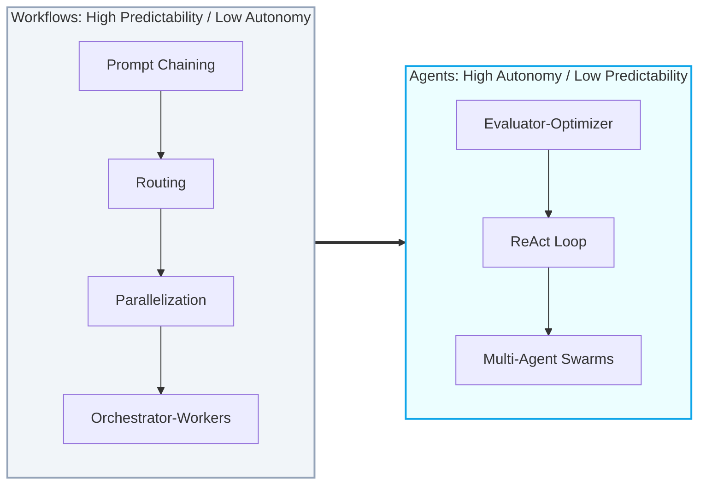
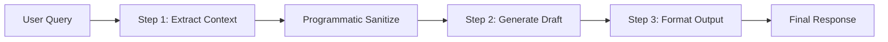
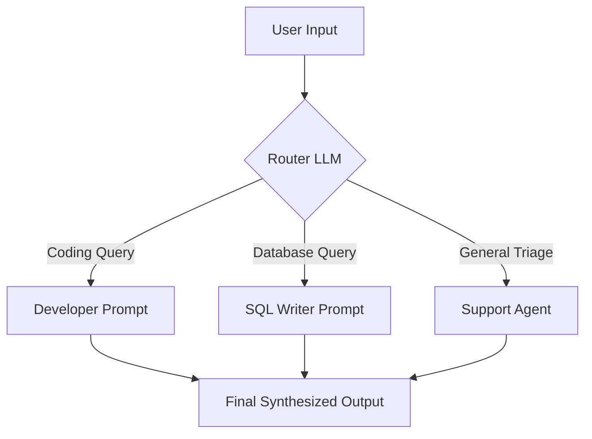
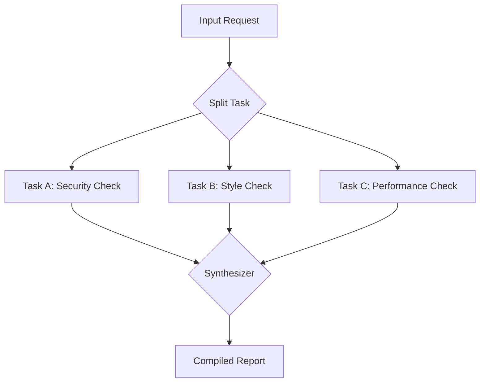
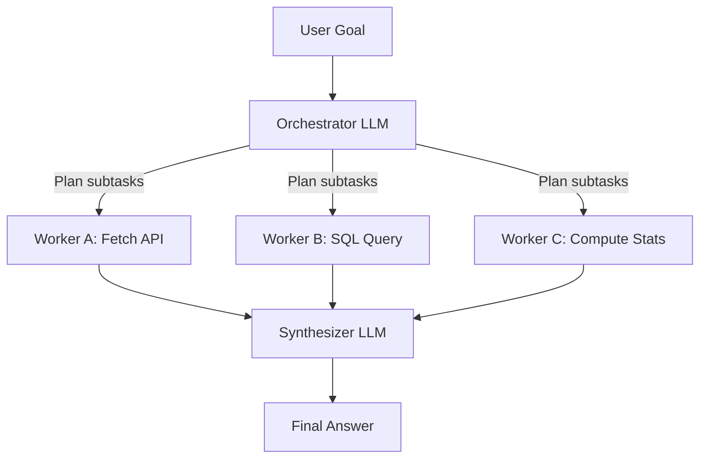
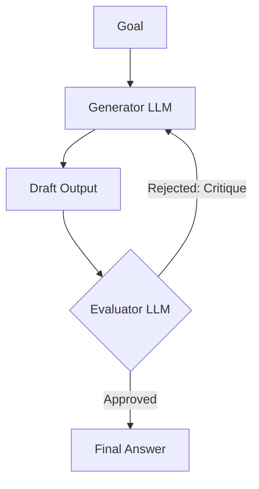
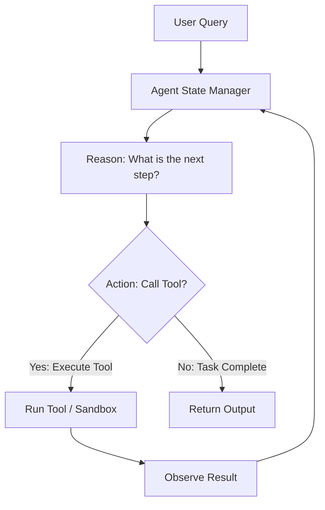
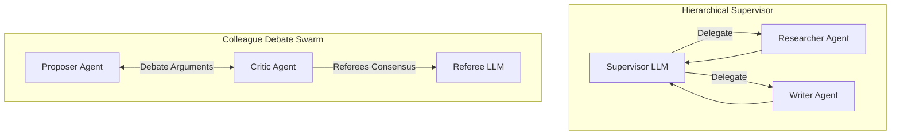

The software engineering landscape is undergoing a massive shift. We are moving from simple **single-prompt LLM utilities**—where a user sends a query and receives a text response—to **stateful, collaborative AI Agents and Workflows**. These systems plan execution paths, invoke specialized tools, evaluate intermediate outputs, and self-correct when errors occur.

> ### 📖 Article Overview
> * **What this article is about:** This article delineates the critical differences between structured AI Workflows and autonomous AI Agents, exploring their respective architectural patterns.
> * **Why it matters:** Choosing the correct pattern is crucial for building predictable, cost-effective, and reliable enterprise-grade AI systems, avoiding issues like attention dispersion and hallucinations.
> * **What we synthesized:** We synthesized core design patterns for both workflows and agents, providing practical use cases and essential production engineering considerations for deployment.

However, when building agentic systems for enterprise environments, developers often struggle with predictability and cost. Giving a single LLM complete autonomy with dozens of tools frequently leads to attention dispersion, high latency, and hallucinations. 

To build reliable systems, we must choose the right architectural pattern. As highlighted in Anthropic's research, the gold standard is to **design for predictability, using workflows for structured paths, and reserving autonomous agent loops only for highly open-ended tasks.**

This article reviews the core multi-agent and workflow coordination patterns, drawing architectural design concepts from my central [agentic-apps-portfolio](https://github.com/akmalkhaniub/agentic-apps-portfolio) repository.

---

## The Spectrum: Workflows vs. Agents

Before coding, it is critical to distinguish between **Workflows** and **Agents**:

* **Workflows** are systems where LLMs and code paths are orchestrated through predefined, structured state transitions. They offer high predictability, lower token cost, and easy debugging.
* **Agents** are systems where the LLM dynamically determines its own loop, tool usage, and execution steps. They offer maximum flexibility but are more expensive and harder to test.

---

## Part 1: Core Workflows (Predictable & Structured)

Workflows are ideal for step-by-step tasks with clear boundaries, such as document processing, data pipelines, or automated triage.

### 1. Prompt Chaining
Prompt Chaining executes a sequence of LLM steps, where each step’s output becomes the input for the next. Intermediate programmatic checks can format or filter data between steps.

* **Best Used For**: Multi-stage generation where breaking the task down into sub-problems improves output quality (e.g., extracting key terms, then writing a summary, then translating).

---

### 2. Routing
Routing classifies a user query and directs it to a specialized downstream LLM prompt or code path. It ensures that specialized tasks are handled by prompts configured specifically for them.

* **Best Used For**: Customer support portals, query dispatch systems, and intent detection gates where a single prompt cannot handle all possible queries.

---

### 3. Parallelization
Parallelization runs multiple LLM tasks concurrently and aggregates their results. There are two primary sub-patterns:
1. **Sectioning (Division of Labor)**: Splawning separate prompts to generate different components of an output (e.g., Introduction, Core Analysis, and Conclusion) in parallel.
2. **Voting (Consensus)**: Running multiple instances of the same model on the same task to get alternative outputs, then choosing the best one via a referee LLM.

* **Best Used For**: Fast document summarization, security code auditing, and checking consensus on ambiguous classification tasks.

---

### 4. Orchestrator-Workers
An Orchestrator LLM breaks a complex user query into dynamically-determined sub-tasks, dispatches them to parallel worker agents, and aggregates their outputs.

* **Best Used For**: Complex research projects, automated software engineering tasks, and large-scale data synthesis.

---

## Part 2: Core Agentic Loops (Autonomous & Iterative)

When tasks are open-ended and the steps to achieve them cannot be predetermined, we transition to autonomous loops.

### 5. Evaluator-Optimizer
An Evaluator-Optimizer loop consists of a Generator that creates a draft, and an Evaluator that grades the draft against quality criteria. If the draft fails, the evaluator provides a structured critique, and the loop repeats.

* **Best Used For**: Code generation, rigorous copyediting, schema compliance checks, and translations where quality must be verified programmatically before delivery.

---

### 6. ReAct (Reason-Action-Observation)
The ReAct paradigm combines reasoning (thoughts) and acting (tool execution) in a single loop. The agent reasons about its current state, selects a tool, runs it, observes the result, and repeats until it decides the task is complete.

* **Best Used For**: Autonomous databases, filesystem managers, and systems that must interact with APIs dynamically to answer open-ended questions.

---

### 7. Multi-Agent Swarms & Coordination
For complex environments, multiple independent agents coordinate their work. Two primary architectures dominate:
1. **Hierarchical Supervisors**: A supervisor agent acts as a manager, coordinating specialized workers and routing messages.
2. **Colleague Debate (Consensus Swarms)**: Multiple agents argue opposing viewpoints to challenge biases and converge on a robust consensus.

---

## Production Engineering for Agentic Systems

Deploying these architectures requires robust infrastructure. Three components are essential:

### 1. Persistent Checkpointing
Agents are stateful. If a network call drops or a token limit is hit halfway through a 15-step agent graph, you cannot afford to restart the entire sequence.
* **Solution**: Implement database-backed checkpointers (using PostgreSQL or Redis) that save the state dictionary at *every node transition*. This enables seamless task resumption and transaction rollbacks.

### 2. Human-in-the-Loop (HITL) Breakpoints
Never let an autonomous agent execute high-risk actions (like sending emails, executing database writes, or transferring money) without human validation.
* **Solution**: Set up graph breakpoints. When a node performs a sensitive action, transition the state to `AWAITING_APPROVAL` and pause execution. Trigger a webhook to alert the administrator, and resume only when an approval payload is sent to the gateway.

### 3. Isolated Code Sandboxes
If you build code-generating agents (like an Autonomous Developer or DevOps Sentinel), they must execute code dynamically. Running these scripts directly on your host server exposes you to local resource exhaustion or security breaches.
* **Solution**: Offload execution to sandboxed micro-containers (using tools like E2B Sandboxes or temporary Docker instances with tight memory and time limits).

---

## Conclusion & Key Takeaways

Navigating the evolving landscape of AI system design requires a clear understanding of architectural choices.
1. **Prioritize Predictability with Workflows:** For most enterprise tasks, structured workflows offer higher predictability, lower costs, and easier debugging, making them the default choice for well-defined problems.
2. **Reserve Autonomy for Open-Ended Challenges:** Autonomous agentic loops, while powerful for dynamic and open-ended tasks, should be carefully applied due to their higher complexity, cost, and potential for unpredictability.
3. **Robust Production Engineering is Non-Negotiable:** Deploying agentic systems successfully demands essential infrastructure like persistent checkpointing, human-in-the-loop breakpoints, and isolated code sandboxes to ensure reliability and security.

*Takeaway: The future of enterprise AI lies in intelligently combining structured workflows with judiciously applied autonomous agents, backed by robust production practices.*
---

## References & Further Reading

For a deeper dive into agentic design patterns and research, check out the following resources:

* **Anthropic Research**: [Building Effective Agents](https://www.anthropic.com/research/building-effective-agents) — The definitive engineering guide on workflows and agent patterns.
* **OpenAI Swarm**: [Orchestrating Agents with Swarm](https://github.com/openai/swarm) — Explore lightweight multi-agent orchestration frameworks and principles.
* **The ReAct Paper**: Yao et al., 2022. *ReAct: Synergizing Reasoning and Acting in Language Models*. arXiv:[2210.03629](https://arxiv.org/abs/2210.03629).
* **The Reflexion Paper**: Shinn et al., 2023. *Reflexion: Language Agents with Active Generative Feedback*. arXiv:[2303.11366](https://arxiv.org/abs/2303.11366).
* **Generative Agents**: Park et al., 2023. *Generative Agents: Interactive Simulacra of Human Behavior*. arXiv:[2304.03442](https://arxiv.org/abs/2304.03442).

*To explore complete code implementations of all 17 agent microservices in a single monorepo, check out the public [agentic-apps-portfolio](https://github.com/akmalkhaniub/agentic-apps-portfolio) repository.*