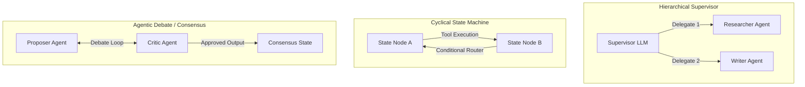

The software engineering landscape is undergoing a massive shift. We are moving from simple **single-prompt LLM utilities** (where a user sends a query and receives a text response) to **stateful, autonomous AI Agents**—autonomous entities that plan actions, utilize tools, evaluate intermediate outputs, and self-correct when errors occur.

However, building a single agent that attempts to handle every task soon runs into a ceiling. If you give one LLM twenty different tools and expect it to manage planning, execution, and quality control, it will quickly suffer from **attention dispersion** and hallucinate.

To solve this, modern AI systems use **Multi-Agent Architectures**. By dividing labor among several specialized, narrow agents and coordinating their state, we build systems that are significantly more reliable, scalable, and audit-friendly.

This article reviews the core multi-agent coordination patterns—drawing design concepts from my central [agentic-apps-portfolio](https://github.com/akmalkhaniub/agentic-apps-portfolio)—and outlines the engineering practices needed to run them in production.

---

## 🛠️ The Paradigms of Multi-Agent Collaboration

There are three primary architectural patterns for coordinating multiple AI agents. The correct pattern depends entirely on the complexity and rigidity of the business workflow:



---

## 1. The Hierarchical Supervisor Network

In a hierarchical network, a single, central LLM acts as the **Supervisor** (or router). 
1. The user request enters the Supervisor.
2. The Supervisor plans the task, decomposing it into smaller sub-tasks.
3. The Supervisor invokes specialized worker agents (e.g. database query worker, file writer worker, or external web search worker) sequentially or in parallel.
4. The workers return their results to the Supervisor, which either delegates the next step or compiles the final answer.

This pattern is highly effective for open-ended requests (like customer support taging, devrel automation, or service dispatch coordination) where the exact sequence of steps cannot be predicted beforehand.

---

## 2. Cyclical State Machines (Directed Acyclic/Cyclic Graphs)

For workflows that require structured compliance (like fintech fraud mitigation, medical intakes, or procurement audits), we cannot rely on a Supervisor to make unchecked routing decisions. Instead, we define the workflow as a **State Machine** (using tools like **LangGraph** or **Temporal.io**).

* **Nodes**: Represent specific computation blocks (an LLM invocation, a tool call, or a database write).
* **Edges**: Represent transitions between nodes. These can be conditional (e.g., if the LLM output is invalid, route back to the correction node).

By enforcing a cyclical graph structure, we allow the agent to iterate and self-correct without risking infinite loops or unstructured state transitions.

Here is a simplified Python structure of a cyclical state machine using a graph-like router:

```python
from typing import TypedDict, List
import json

# Define the shared state dictionary
class AgentState(TypedDict):
    query: str
    gathered_data: str
    draft: str
    revisions_count: int
    is_approved: bool

# Node 1: Gatherer
def gather_data_node(state: AgentState) -> dict:
    # Perform API fetches or database reads
    data = f"Raw source data for: {state['query']}"
    return {"gathered_data": data}

# Node 2: Writer
def write_draft_node(state: AgentState) -> dict:
    # Invokes the LLM to write a technical summary
    draft_text = f"Draft based on: {state['gathered_data']}"
    return {"draft": draft_text}

# Node 3: Critic / Evaluator
def evaluate_draft_node(state: AgentState) -> dict:
    # Enforce quality standards or schema validation
    # If it fails, increment revisions
    revisions = state.get("revisions_count", 0)
    is_valid = len(state["draft"]) > 10 and revisions >= 1
    
    return {
        "is_approved": is_valid,
        "revisions_count": revisions + 1
    }

# Conditional Router Edge
def should_continue_edge(state: AgentState) -> str:
    if state["is_approved"] or state["revisions_count"] >= 3:
        return "end"
    return "write"

# Execution Engine (Simplified State Loop)
def run_workflow(user_query: str):
    state = AgentState(query=user_query, gathered_data="", draft="", revisions_count=0, is_approved=False)
    
    # Execute node A
    state.update(gather_data_node(state))
    
    # Loop state machine
    while True:
        state.update(write_draft_node(state))
        state.update(evaluate_draft_node(state))
        
        next_step = should_continue_edge(state)
        if next_step == "end":
            break
            
    return state["draft"]
```

---

## 3. Agentic Debate & Consensus Swarms

When high-accuracy synthesis is required—such as parsing medical documents or conducting scientific reviews—a single worker and a single critic are not enough. We implement an **Agentic Debate** pattern:

1. **The Proposer**: Generates an initial answer.
2. **The Critic/Debater**: Challenges the proposer's assumptions, citing contradictions or missing context.
3. **The Referee**: An independent LLM with a strict evaluation prompt evaluates the arguments, selects the best points, and synthesizes a consensus output.

This adversarial framework dramatically reduces LLM hallucinations because the outputs are stress-tested by a separate, opposing instance before they are written to the database.

---

## 🏗️ Production Engineering for Agentic Systems

To move these architectures from local prototypes into enterprise-grade software, you must build three core infrastructure components:

### 1. Persistent Checkpointing
Agents are stateful. If a network call drops or a token limit is hit halfway through a 15-step agent graph, you cannot afford to restart the entire sequence.
* **Solution**: Implement database-backed checkpointers (e.g., PostgreSQL or Redis) that save the state dictionary at *every node transition*. This enables transaction rollbacks and seamless task resumption.

### 2. Human-in-the-Loop (HITL) Breakpoints
Never let an autonomous agent execute high-risk actions (like sending emails, executing database writes, or transferring money) without human validation.
* **Solution**: Set up graph breakpoints. When a node performs a sensitive action, transition the state to `AWAITING_APPROVAL` and pause execution. Trigger a webhook to alert the administrator, and resume only when an approval payload is sent to the gateway.

### 3. Isolated Code Sandboxes
If you build code-generating agents (like an Autonomous Developer or DevOps Sentinel), they must execute code dynamically. Running these scripts directly on your host server exposes you to local resource exhaustion or security breaches.
* **Solution**: Offload execution to sandboxed micro-containers (using tools like E2B Sandboxes or temporary Docker instances with tight memory and time limits).

---

## Summary

Building production-ready Agentic AI is an exercise in software architecture, not prompt engineering. By structuring agents into specialized workers, enforcing state machines via directed graphs, and adding strict human approval gates, we build intelligent systems that scale reliably and remain secure under load.

*Explore the individual implementations of all 17 agent microservices in the public [agentic-apps-portfolio](https://github.com/akmalkhaniub/agentic-apps-portfolio) repository.*
