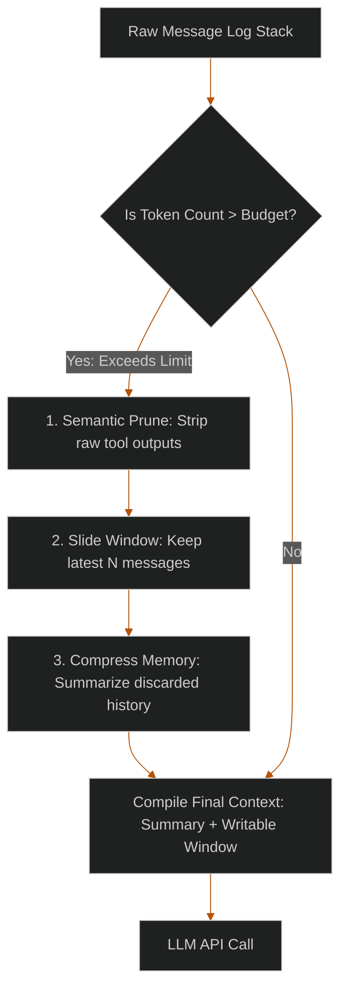

# Context Pruning for Long-Running Swarms: Sliding Windows & Memory Compression

> [!NOTE]
> **📖 Article Overview**
> Long-running agentic workflows—such as analyzing codebase structures, running automated code migrations, or executing hours-long data aggregation loops—accumulate massive chat logs and execution states. Leaving this history unchecked degrades query latency, spikes API costs, and distracts models, leading to failures. This article covers **Context Engineering** techniques to optimize memory usage: **Semantic Pruning** of intermediate tool outputs, **Token Sliding Windows**, and **Recursive Memory Compression**.

---

## The Context Inflation Problem

In a standard agent loop, every message exchanged, prompt executed, and raw tool output (such as SQL tables or raw HTML scans) is appended to the conversation history. On long tasks, this history grows.

When the context window gets bloated:
1. **Financial Cost**: Since LLM APIs charge per token, sending 100k tokens of historic logs on every turn becomes prohibitively expensive.
2. **Lost in the Middle**: LLMs tend to ignore instructions or data stored in the middle of long prompts.
3. **Latency Inflation**: Model processing times increase as the prompt length grows.



---

## 3 Core Optimization Techniques

### 1. Semantic Pruning
Not all messages are equal. A raw database output containing 5,000 lines of CSV data is useful to the tool-caller agent *once* to extract a summary. It does not need to stay in the context history for subsequent steps. Semantic pruning involves stripping out raw tool responses and replacing them with a brief summary (e.g., `[Tool Output: Successfully fetched 50 pending records]`).

### 2. Sliding Windows
We restrict the active conversation history to the most recent $N$ messages (e.g. the last 10 messages). Any message older than the window is sliced out of the active context array.

### 3. Recursive Memory Compression
To prevent the agent from forgetting the overall goal or key facts when older messages are sliced out, we run an asynchronous summarization task. The model condenses the oldest messages into a running system summary (e.g. "Running Summary of past steps..."), which is permanently injected at the start of the system prompt.

---

## Implementing a Context Compressor in Python

Below is a complete, production-ready Python class illustrating token calculation, semantic pruning of verbose tool outputs, and sliding window orchestration.

```python
import tiktoken
from typing import List, Dict, Any

class ContextCompressor:
    def __init__(self, model_name: str = "gpt-4o", max_token_budget: int = 4000):
        self.encoder = tiktoken.encoding_for_model(model_name)
        self.max_token_budget = max_token_budget
        self.running_summary = "Initial goal: Analyse repository logs and generate audit."

    def count_tokens(self, text: str) -> int:
        return len(self.encoder.encode(text))

    def calculate_messages_tokens(self, messages: List[Dict[str, str]]) -> int:
        return sum(self.count_tokens(msg["content"]) for msg in messages)

    def semantic_pruning(self, messages: List[Dict[str, str]]) -> List[Dict[str, str]]:
        pruned_messages = []
        for msg in messages:
            # If the message is a raw tool execution output and is very large, prune it
            if msg["role"] == "tool" and len(msg["content"]) > 500:
                summary = f"[Tool Output: Content pruned. Output contained data matching {msg['content'][:100]}...]"
                pruned_messages.append({"role": "tool", "content": summary})
            else:
                pruned_messages.append(msg.copy())
        return pruned_messages

    def compress_context(self, messages: List[Dict[str, str]]) -> List[Dict[str, str]]:
        # Step 1: Run semantic pruning on tool outputs
        working_messages = self.semantic_pruning(messages)
        
        # Step 2: Check if the token count exceeds budget
        total_tokens = self.calculate_messages_tokens(working_messages)
        summary_tokens = self.count_tokens(self.running_summary)
        
        if (total_tokens + summary_tokens) <= self.max_token_budget:
            # Within budget - compile prompt directly
            return [{"role": "system", "content": self.running_summary}] + working_messages

        print(f"[Compressor] Context ({total_tokens + summary_tokens} tokens) exceeds budget ({self.max_token_budget}). Compressing...")

        # Step 3: Slide window & compress oldest messages
        # We slide the window by removing the oldest non-system messages until within budget
        while (self.calculate_messages_tokens(working_messages) + summary_tokens) > self.max_token_budget:
            if len(working_messages) <= 2:
                # Keep at least the latest user and assistant exchange
                break
                
            discarded = working_messages.pop(0)
            # In a production environment, you would trigger an LLM call here to update the summary:
            # self.running_summary = query_summarizer_llm(self.running_summary, discarded)
            self.running_summary += f"\n- Processed step: {discarded['content'][:80]}..."
            summary_tokens = self.count_tokens(self.running_summary)

        print(f"[Compressor] Compression complete. New context length: {len(working_messages)} active messages.")
        
        # Step 4: Compile the final payload
        system_node = {"role": "system", "content": f"System Summary:\n{self.running_summary}"}
        return [system_node] + working_messages

# Execution
if __name__ == "__main__":
    compressor = ContextCompressor(max_token_budget=150)
    
    conversation = [
        {"role": "user", "content": "Fetch database configurations and audit the schemas."},
        {"role": "assistant", "content": "Executing SQL query to retrieve configuration logs."},
        # Verbose tool output that will trigger semantic pruning
        {"role": "tool", "content": "CONFIG_LOG: " + "a" * 1000},
        {"role": "assistant", "content": "Analysis complete. Schema matches secure baseline."},
        {"role": "user", "content": "Excellent. Now check the cluster pods."}
    ]
    
    final_payload = compressor.compress_context(conversation)
    
    print("\n--- Compiled Prompt Payload ---")
    for msg in final_payload:
        print(f"[{msg['role'].upper()}] {msg['content'][:150]}")
```

---

## Conclusion & Takeaways

Implementing context compression controls ensures runtime cost efficiency and model focus:
* [ ] **Run semantic pruning immediately**: Do not let raw, verbose data outputs persist in the message array. Condense them to structured outcomes immediately after invocation.
* [ ] **Enforce token-based budgets**: Calculate context length using model-specific encoders (like `tiktoken`) rather than raw string lengths.
* [ ] **Run summarization asynchronously**: Keep updates to the running summary separate from the main execution loop to prevent blocking agent runs.
* [ ] **Slide windows selectively**: Never slide out the initial system prompt or user query parameters; keep core execution directives pinned at the top.
