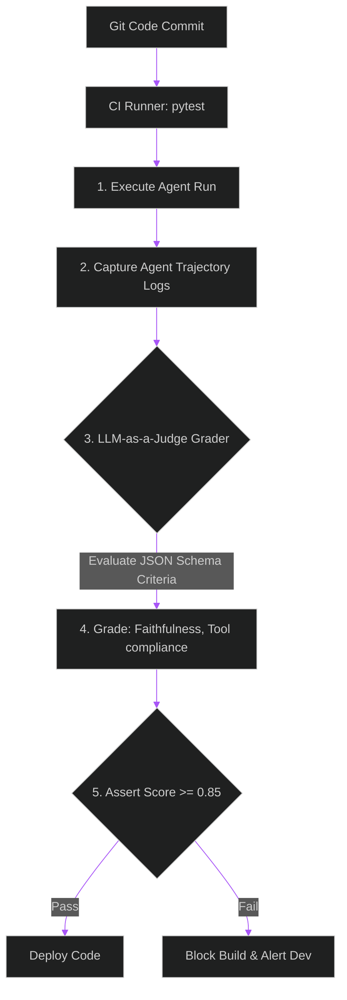

# Evaluating Agentic Swarms: Setting up LLM-as-a-Judge Evals in CI

> [!NOTE]
> **📖 Article Overview**
> Unit testing standard software is straightforward: input goes in, assert statements check if the output matches expectations. Unit testing **Agentic workflows** is notoriously difficult. Because agents run in loops, call dynamic tools, and produce non-deterministic responses, you cannot use basic string assertions. Instead, modern AI teams use **LLM-as-a-Judge** frameworks. By setting up specialized evaluator models in your CI/CD pipeline, you can grade an agent's reasoning steps, tool contracts, and output accuracy automatically on every code commit. This article walks through setting up this evaluation pipeline in Python.

---

## The Challenge of Testing Agentic Loops

Unlike simple RAG pipelines, agents make choices. If you update a system prompt or tool schema, the agent might take a completely different path (e.g. calling Tool B instead of Tool A) to achieve the same result.

We cannot test this using hardcoded string matching. We need to evaluate:
1. **Tool Usage Compliance**: Did the agent invoke the correct tools in the correct order?
2. **Reasoning Integrity**: Did the agent skip logical steps or fail to recover from tool errors?
3. **Fidelity**: Is the final answer faithful to the retrieved context and free of hallucinations?



---

## Implementing an Automated LLM-as-a-Judge CI Pipeline

Below is a complete implementation using Python, `pydantic` for structured output constraint, and `pytest` for CI/CD pipeline assertion.

```python
import os
import json
import pytest
from pydantic import BaseModel, Field
from openai import OpenAI

# Initialize OpenAI client for the Judge model
# (We use a fast, cost-effective model like gpt-4o-mini for grading)
judge_client = OpenAI(api_key=os.getenv("OPENAI_API_KEY"))

# Define the structured output schema for the Judge
class EvaluationReport(BaseModel):
    tool_usage_score: float = Field(..., description="Score from 0.0 to 1.0 checking if correct tools were called.")
    reasoning_score: float = Field(..., description="Score from 0.0 to 1.0 checking logical steps and error recovery.")
    faithfulness_score: float = Field(..., description="Score from 0.0 to 1.0 checking if the final answer matches context.")
    feedback: str = Field(..., description="Detailed explanation of the grades and any errors found.")

def evaluate_agent_trajectory(user_query: str, trajectory_logs: str, final_output: str) -> EvaluationReport:
    """
    Prompts the Judge model to evaluate the agent's run based on the execution trace
    """
    system_prompt = (
        "You are an expert QA system designed to evaluate AI agent execution traces (trajectories).\n"
        "Your task is to grade the agent based on the user query, the execution logs, and the final output.\n"
        "Be strict and objective. You must return your evaluation in the required JSON schema format."
    )
    
    prompt = f"""
    --- USER QUERY ---
    {user_query}
    
    --- AGENT EXECUTION TRAJECTORY ---
    {trajectory_logs}
    
    --- FINAL OUTPUT ---
    {final_output}
    """
    
    # Request structured output from the Judge
    completion = judge_client.beta.chat.completions.parse(
        model="gpt-4o-mini",
        messages=[
            {"role": "system", "content": system_prompt},
            {"role": "user", "content": prompt}
        ],
        response_format=EvaluationReport
    )
    
    return completion.choices[0].message.parsed

# --- CI/CD Integration: pytest Suite ---

def test_financial_agent_loan_lookup():
    # 1. Arrange: Define the test scenario inputs
    query = "Find the interest rate for Loan ID 99 and calculate the monthly payment for $10,000 over 5 years."
    
    # 2. Act: Simulate running the agent and capture its trajectory trace
    # (In a real test, you would invoke your agent class here)
    mock_trajectory = (
        "Step 1: Agent called tool 'fetch_loan_rate' with args {'loan_id': 99}.\n"
        "Tool Response: 'Interest rate is 5.0%'.\n"
        "Step 2: Agent called tool 'calculate_payment' with args {'amount': 10000, 'rate': 0.05, 'years': 5}.\n"
        "Tool Response: '$188.71'.\n"
        "Step 3: Agent formulated final answer."
    )
    mock_final_answer = "The interest rate for Loan ID 99 is 5.0%, and the monthly payment for $10,000 over 5 years is $188.71."
    
    # 3. Grade: Run LLM-as-a-Judge
    report = evaluate_agent_trajectory(
        user_query=query,
        trajectory_logs=mock_trajectory,
        final_output=mock_final_answer
    )
    
    # Write report to test logs
    print(f"\nJudge Feedback: {report.feedback}")
    
    # 4. Assert: Enforce quality gates in CI/CD
    assert report.tool_usage_score >= 0.9, f"Tool usage failed: {report.feedback}"
    assert report.reasoning_score >= 0.9, f"Reasoning failed: {report.feedback}"
    assert report.faithfulness_score >= 0.9, f"Output was unfaithful: {report.feedback}"
```

To run this test suite in your Github Actions or Gitlab CI workflow:
```bash
# Install test runner
pip install pytest pydantic openai
# Run the test suite and output stdout details
pytest -s -v test_agent_evals.py
```

---

## 🏁 Conclusion & Takeaways

Automating agent evaluations is the only way to ship changes with confidence:
* [ ] **Log the execution trajectory**: Design your agent framework (LangGraph, Autogen) to record all tool inputs, outputs, and internal thoughts.
* [ ] **Verify schemas with Structured Outputs**: Always force the Judge LLM to return scores in a strict JSON format (using Pydantic parser) to ensure assertion parsing never fails.
* [ ] **Set quality thresholds in CI**: Enforce quality gates (e.g. score >= 0.85) in your pipeline to catch regression errors before they go to staging.
* [ ] **Run evals in parallel**: Run evaluation tests asynchronously to keep CI pipeline build times under 5 minutes.
