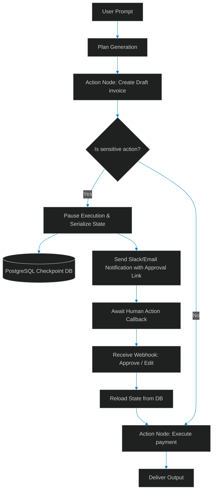

# Human-in-the-Loop (HITL) State Machines: Implementing Asynchronous Interruption & Approval Gates

> [!NOTE]
> **📖 Article Overview**
> While autonomous agent swarms excel at processing data and planning tasks, fully autonomous execution is a liability in enterprise operations. Sending wire transfers, editing customer database entries, or executing server mutations require strict human review. In this article, we cover how to design **Human-in-the-Loop (HITL) state machines** that pause execution at critical nodes, serialize the complete agent memory and execution tree to a database, and resume operation dynamically upon receiving a validated external human approval webhook.

---

## The Autonomy Problem in the Enterprise

When an agent plans and runs a series of actions, it operates in a loop: planning, executing tools, inspecting results, and deciding the next step. If one of these steps involves a sensitive transaction—like spending money or emailing a client—we cannot let the agent run unsupervised. 

We need a way to insert a **Human Gate**:



To achieve this without blocking active server thread pools, we design an **Asynchronous Checkpointed State Machine**. The system serializes the agent's memory stack and current graph position, saves it to a persistent database, and releases the CPU resource.

---

## Designing Thread Checkpointing

In a checkpointed state machine, the agent's execution is represented as a state graph. The state contains:
1. **System Variables**: Current node, execution history, and variables.
2. **Conversation History**: The array of messages exchanged.
3. **Internal Memory**: Intermediate variables and scratchpad steps.

When the agent hits an interruption boundary, the graph engine returns a `PAUSED` signal instead of executing the next node.

---

## Implementing Checkpoint Persistence in Python

Below is a complete, production-grade Python script demonstrating state serialization, checkpoint database persistence (using an in-memory mock representing a SQL/NoSQL store), and asynchronous callback routing.

```python
import json
import uuid
from typing import Dict, List, Any, Optional

# Mock Checkpoint Database
DB_STORE: Dict[str, str] = {}

class AgentState:
    def __init__(self, thread_id: str, messages: List[Dict[str, str]], scratchpad: Dict[str, Any]):
        self.thread_id = thread_id
        self.messages = messages
        self.scratchpad = scratchpad
        self.current_node = "START"
        self.status = "ACTIVE"

    def serialize(self) -> str:
        return json.dumps({
            "thread_id": self.thread_id,
            "messages": self.messages,
            "scratchpad": self.scratchpad,
            "current_node": self.current_node,
            "status": self.status
        })

    @classmethod
    def deserialize(cls, data_str: str) -> 'AgentState':
        data = json.loads(data_str)
        state = cls(data["thread_id"], data["messages"], data["scratchpad"])
        state.current_node = data["current_node"]
        state.status = data["status"]
        return state

class Checkpointer:
    @staticmethod
    def save(state: AgentState) -> None:
        DB_STORE[state.thread_id] = state.serialize()
        print(f"[Checkpointer] Thread {state.thread_id} checkpoint saved at node: {state.current_node}")

    @staticmethod
    def load(thread_id: str) -> Optional[AgentState]:
        data_str = DB_STORE.get(thread_id)
        if not data_str:
            return None
        print(f"[Checkpointer] Thread {thread_id} checkpoint loaded.")
        return AgentState.deserialize(data_str)

class EnterpriseWorkflowEngine:
    def __init__(self, thread_id: str):
        self.thread_id = thread_id
        # Load existing state or initialize a new one
        self.state = Checkpointer.load(thread_id) or AgentState(thread_id, [], {})

    def execute(self, user_input: Optional[str] = None) -> None:
        if self.state.status == "PAUSED":
            print(f"[Engine] Thread {self.thread_id} is PAUSED. Awaiting human callback.")
            return

        if self.state.current_node == "START":
            print("[Engine] Node: START")
            self.state.messages.append({"role": "user", "content": user_input or ""})
            self.state.current_node = "GENERATE_INVOICE"
            Checkpointer.save(self.state)

        if self.state.current_node == "GENERATE_INVOICE":
            print("[Engine] Node: GENERATE_INVOICE")
            invoice_amount = 5000  # Calculated dynamically
            self.state.scratchpad["invoice_amount"] = invoice_amount
            self.state.messages.append({
                "role": "assistant",
                "content": f"Generated invoice of ${invoice_amount}."
            })
            
            # Sensitive Gate Check
            if invoice_amount > 1000:
                print(f"[Engine] Invoice amount ${invoice_amount} exceeds limit. Initiating HITL Gate.")
                self.state.current_node = "EXECUTE_PAYMENT"
                self.state.status = "PAUSED"
                Checkpointer.save(self.state)
                # Send approval alert in production (e.g., Slack Webhook or email notification)
                return
            
            self.state.current_node = "EXECUTE_PAYMENT"

        if self.state.current_node == "EXECUTE_PAYMENT":
            print("[Engine] Node: EXECUTE_PAYMENT")
            # Payment executes
            self.state.messages.append({
                "role": "assistant", 
                "content": f"Invoice of ${self.state.scratchpad['invoice_amount']} successfully paid."
            })
            self.state.current_node = "COMPLETED"
            self.state.status = "COMPLETED"
            Checkpointer.save(self.state)
            print("[Engine] Workflow Completed.")

    def receive_human_callback(self, action: str, feedback: Optional[str] = None) -> None:
        if self.state.status != "PAUSED":
            print(f"[Callback] Cannot callback thread {self.thread_id}; status is {self.state.status}")
            return

        print(f"[Callback] Received callback: {action.upper()}")
        
        if action == "approve":
            self.state.status = "ACTIVE"
            self.state.messages.append({"role": "human_gate", "content": "Approved by human reviewer."})
            Checkpointer.save(self.state)
            # Resume execution
            self.execute()
        elif action == "reject":
            self.state.status = "REJECTED"
            self.state.messages.append({
                "role": "human_gate", 
                "content": f"Rejected by human reviewer. Reason: {feedback or 'None'}"
            })
            Checkpointer.save(self.state)
            print("[Engine] Workflow Rejected and Terminated.")

# Execution Flow Example
if __name__ == "__main__":
    thread_uuid = str(uuid.uuid4())
    print(f"--- Workflow Start (Thread: {thread_uuid}) ---")
    
    # 1. Start execution
    engine = EnterpriseWorkflowEngine(thread_uuid)
    engine.execute(user_input="Submit corporate invoice calculation.")
    
    # 2. Try to run again (will block because state is paused)
    print("\n--- Running engine again while paused ---")
    engine.execute()

    # 3. Simulate human callback (Approved)
    print("\n--- Simulating human approval callback ---")
    engine.receive_human_callback(action="approve")
```

---

## Conclusion & Takeaways

To build safe, enterprise-compliant agentic workflows:
* [ ] **Define clear threshold gates**: Never allow agents to make un-audited state updates or calls for sensitive tasks. Enforce gates at the configuration level.
* [ ] **Decouple state from memory**: Do not keep active execution processes running during human review. Serialize the state to a database and spin down resources.
* [ ] **Generate unique secure URLs**: Include a cryptographically signed token in the human feedback notification to prevent spoofing or unauthorized approvals.
* [ ] **Log human interventions**: Ensure comments, overrides, and approval details are recorded into the conversation thread to maintain strict audit integrity.
