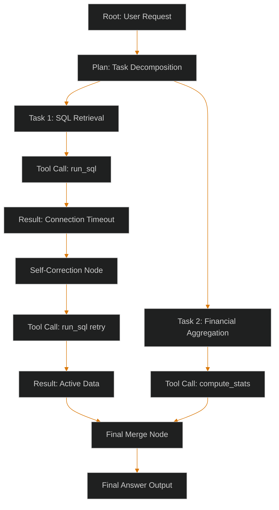

# Agentic Lineage & Audit Trails: Tracing Non-Deterministic Decision Trees for Compliance

> [!NOTE]
> **📖 Article Overview**
> Single-prompt LLM calls are simple to trace. However, when an agentic swarm starts running loops—generating sub-tasks, executing tools, evaluating errors, and self-correcting—understanding why a specific decision was reached becomes extremely difficult. In regulated industries (like finance, legal, or health tech), you must be able to audit every decision. This article shows you how to design an **Agentic Lineage & Audit Trail Observability Pipeline**, storing nested execution traces inside a structured JSON schema in PostgreSQL.

---

## The Auditing Challenge in AI Swarms

Unlike standard software systems with deterministic code paths, AI swarms navigate complex, dynamic decision trees. During a single user request, an agent might:
1. Parse the prompt and split it into three sub-tasks.
2. Call a database tool, encounter a connection error, and retry.
3. Review its own output, detect a validation mismatch, and regenerate its response.

If the final output is incorrect, diagnosing the root cause is impossible without a structured history. We need to capture **Lineage**:



To reconstruct this path, we must store logs as a **Tree of Node Executions**, rather than flat, sequential logs.

---

## The Anatomy of an Agentic Trace

Each execution node in our lineage tree represents a distinct atomic action. The JSON structure for a node must capture:
* `node_id`: Unique identifier (UUID).
* `parent_id`: ID of the node that spawned this action (allowing tree reconstruction).
* `node_type`: e.g., `PLANNING`, `TOOL_CALL`, `SELF_CORRECTION`, `OUTPUT`.
* `inputs`: Parameters passed to the node.
* `thought_process`: The agent's raw thinking or plan.
* `outputs`: The final result or tool execution output.
* `metadata`: Timestamp, model version, execution latency, and token cost.

---

## Implementing an Audit Logger in Python

Below is a complete Python implementation of an agent lineage logger using a context manager pattern. It dynamically captures agent actions, compiles them into a structured parent-child JSON tree, and outputs it ready for database storage.

```python
import uuid
import json
import time
from typing import List, Dict, Any, Optional

class LineageNode:
    def __init__(self, node_type: str, name: str, parent_id: Optional[str] = None):
        self.node_id = str(uuid.uuid4())
        self.parent_id = parent_id
        self.node_type = node_type
        self.name = name
        self.thought_process = ""
        self.inputs: Dict[str, Any] = {}
        self.outputs: Dict[str, Any] = {}
        self.start_time = time.time()
        self.end_time: Optional[float] = None
        self.metadata: Dict[str, Any] = {}

    def complete(self, outputs: Dict[str, Any], thought: str = "", metadata: Dict[str, Any] = None) -> None:
        self.end_time = time.time()
        self.outputs = outputs
        self.thought_process = thought
        self.metadata = {
            "duration_ms": int((self.end_time - self.start_time) * 1000),
            **(metadata or {})
        }

    def to_dict(self) -> Dict[str, Any]:
        return {
            "node_id": self.node_id,
            "parent_id": self.parent_id,
            "node_type": self.node_type,
            "name": self.name,
            "thought_process": self.thought_process,
            "inputs": self.inputs,
            "outputs": self.outputs,
            "metadata": self.metadata
        }

class LineageTracker:
    def __init__(self, session_id: str):
        self.session_id = session_id
        self.nodes: Dict[str, LineageNode] = {}
        self.active_node_id: Optional[str] = None
        self.node_stack: List[str] = []

    def start_node(self, node_type: str, name: str, inputs: Dict[str, Any]) -> str:
        parent_id = self.node_stack[-1] if self.node_stack else None
        node = LineageNode(node_type, name, parent_id)
        node.inputs = inputs
        
        self.nodes[node.node_id] = node
        self.node_stack.append(node.node_id)
        self.active_node_id = node.node_id
        print(f"[Tracker] Started Node: {name} (ID: {node.node_id[:8]})")
        return node.node_id

    def end_node(self, outputs: Dict[str, Any], thought: str = "", metadata: Dict[str, Any] = None) -> None:
        if not self.node_stack:
            return
        
        node_id = self.node_stack.pop()
        node = self.nodes[node_id]
        node.complete(outputs, thought, metadata)
        
        self.active_node_id = self.node_stack[-1] if self.node_stack else None
        print(f"[Tracker] Completed Node: {node.name} in {node.metadata['duration_ms']}ms")

    def compile_tree(self) -> str:
        # Convert flat dictionary into a structured parent-child array tree
        flat_nodes = [node.to_dict() for node in self.nodes.values()]
        return json.dumps({
            "session_id": self.session_id,
            "total_nodes": len(flat_nodes),
            "trace_tree": flat_nodes
        }, indent=2)

# Execution Flow Example
if __name__ == "__main__":
    # Create tracker instance for audit session
    tracker = LineageTracker(session_id=str(uuid.uuid4()))
    
    # 1. Start root node (Planning)
    tracker.start_node("PLANNING", "Task Planner", {"query": "Fetch accounts and update balances."})
    time.sleep(0.05) # Simulate latency
    
    # 2. Start child node (SQL Fetch)
    tracker.start_node(
        "TOOL_CALL", 
        "run_sql_query", 
        {"sql": "SELECT * FROM accounts WHERE status = 'pending'"}
    )
    time.sleep(0.1) # Simulate tool execution
    
    # Complete SQL fetch
    tracker.end_node(
        outputs={"rows_returned": 10, "status": "success"},
        thought="Extracting pending balances to prepare batch transaction inputs.",
        metadata={"model": "gpt-4o", "tokens_used": 350}
    )
    
    # 3. Start child node (Balance updates)
    tracker.start_node(
        "TOOL_CALL",
        "update_accounts",
        {"updates": [{"id": 101, "balance": 4500}]}
    )
    time.sleep(0.15)
    
    tracker.end_node(
        outputs={"updated_rows": 1, "status": "success"},
        thought="Executing balance update on target account after verification."
    )
    
    # Complete planning root node
    tracker.end_node(
        outputs={"status": "completed_successfully"},
        thought="All pending balances processed and saved to database."
    )
    
    # Output the compiled lineage JSON
    print("\n--- Compiled Audit Lineage JSON ---")
    print(tracker.compile_tree())
```

---

## Database Design: Storing and Querying Lineage

For auditing, we store these compiled JSON logs inside a PostgreSQL table using a `JSONB` column:

```sql
CREATE TABLE agent_audit_trails (
    id SERIAL PRIMARY KEY,
    session_id UUID NOT NULL,
    trace_data JSONB NOT NULL,
    created_at TIMESTAMP WITH TIME ZONE DEFAULT CURRENT_TIMESTAMP
);
```

Using PostgreSQL's JSONB operators, auditors can easily query specific operations inside the nested JSON trees:

```sql
-- Query sessions where a specific tool encountered a failure
SELECT session_id, created_at 
FROM agent_audit_trails,
jsonb_to_recordset(trace_data->'trace_tree') as x(node_type text, outputs jsonb)
WHERE x.node_type = 'TOOL_CALL' 
  AND x.outputs->>'status' = 'failed';
```

---

## 🏁 Conclusion & Takeaways

To satisfy audit requirements in enterprise agent networks:
* [ ] **Enforce parent-child keys**: Ensure every action node captures a `parent_id` reference to preserve the non-linear execution path.
* [ ] **Log raw inputs and outputs**: Never allow agents to mutate data without logging the raw input payloads and returned server responses.
* [ ] **Capture token metrics**: Track tokens and execution latencies at every node to monitor efficiency and plan resource budgets.
* [ ] **Structure with JSONB**: Store execution lineages in queryable JSONB columns to enable easy auditing of failures or security compromises.
