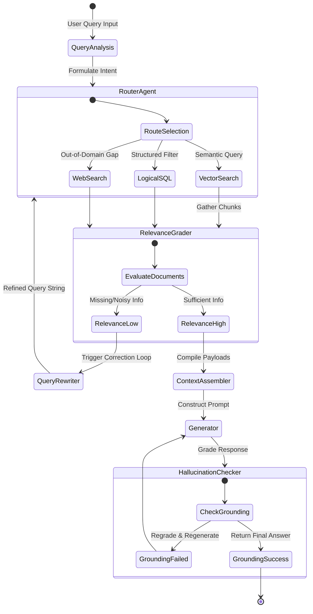

In standard Retrieval-Augmented Generation (RAG) setups, the retrieval process is completely passive. The user submits a query, a vector database runs a cosine similarity match in a single shot, and the raw text chunks are stuffed into the model's context window.

This passive paradigm suffers from two major limitations:
1. **The Semantic Bottleneck**: Pure vector similarity fails on complex comparative queries (e.g., *"Find all contract versions where liability caps exceed $50,000, and cross-reference them with audit summaries"*).
2. **Hallucination Propagation**: If the vector database returns irrelevant chunks, the generator LLM blindly incorporates them, leading to fabricated answers.

To scale AI systems that handle complex enterprise data, we must shift to **Agentic RAG**. Under this architecture, the language model is no longer a passive recipient of context—it is an active coordinator that steers the retrieval process, builds logical query expressions, evaluates document relevance, and self-corrects search terms dynamically.

This article reviews the core patterns of Agentic RAG, examines how to structure hierarchical retrieval interfaces, and showcases how to design a routing agent in TypeScript, drawing from integrations inside my projects [healthcare-audit-vault](https://github.com/akmalkhaniub/healthcare-audit-vault) and [enterprise-procurement-agent](https://github.com/akmalkhaniub/enterprise-procurement-agent).

---

## 🛠️ The Agentic RAG Loop

Unlike linear RAG pipelines, an Agentic RAG architecture functions as a state machine where the model executes tools iteratively, grades search results, and rewrites queries when data is insufficient.



1. **Intention Formulation**: The router agent parses the query to determine what type of retrieval is necessary.
2. **Granular Tool Invocation**: Rather than running a monolithic search, the agent utilizes a set of micro-tools—such as keyword lookup, vector similarity matching, or specific database column filtering.
3. **Relevance Grading**: A separate validator node evaluates the retrieved text. If the chunks do not directly answer the user's intent, the agent invokes a rewriter to reformulate the query and trigger a new search.
4. **Hallucination Verification**: The final output is checked against the raw retrieved chunks to guarantee that every claim is grounded in the source text.

---

## 🔬 Breaking Research: Hierarchical Interfaces & Logical Retrieval

Two recent 2026 arXiv papers outline the theoretical and practical frameworks for scaling Agentic RAG:

### 1. Adaptive Granularity via Hierarchical Interfaces
In **"A-RAG: Scaling Agentic Retrieval-Augmented Generation via Hierarchical Retrieval Interfaces"** (Du et al., Feb 2026), the authors argue that static RAG pipelines fail because they do not let the model choose the granularity of its search. 

A-RAG solves this by exposing three hierarchical tools directly to the model: **keyword search**, **semantic search**, and **chunk read**. By allowing the model to adaptively query at different granularities across multiple turns, A-RAG consistently outperforms single-shot retrievers while reducing retrieved token counts by up to **30%**.

### 2. Logical Query Formulation Over Raw Vectors
In **"Rethinking Agentic RAG: Toward LLM-Driven Logical Retrieval Beyond Embeddings"** (Zeng et al., May 2026), the researchers challenge the reliance on complex, vector-only backends. They demonstrate that LLMs are highly proficient at constructing structured logical expressions (e.g., `WHERE liability_cap > 50000 AND status = 'active'`). 

By allowing the agent to formulate logical intents directly and executing them over a lightweight inverted-index database, their framework matches the accuracy of dense hybrid architectures while significantly lowering execution costs and reducing model hallucinations.

---

## 💻 Coding an Agentic RAG Router in TypeScript

Here is a TypeScript routing controller showing how an agent evaluates a user query, constructs logical database filters, and grades the relevance of retrieved chunks before constructing the prompt. This pattern is modeled on retrieval strategies in [enterprise-procurement-agent](https://github.com/akmalkhaniub/enterprise-procurement-agent).

```typescript
import { ChatAnthropic } from "@langchain/anthropic";
import { executeVectorSearch, executeLogicalSQL } from "./searchTools";

const model = new ChatAnthropic({ modelName: "claude-3-5-sonnet-20241022" });

interface RetrievalResult {
  content: string;
  source: string;
}

// 1. Core routing controller
export async function agenticRetrieveAndAnswer(userQuery: string): Promise<string> {
  let attempts = 0;
  let queryToRun = userQuery;
  let contextChunks: RetrievalResult[] = [];

  while (attempts < 3) {
    // Step A: Agent decides between semantic vector search and structured SQL filter
    const decision = await model.invoke([
      { role: "system", content: "You are a RAG Router. Decide whether to run 'semantic' (for open concepts) or 'logical' (for filters on dates, numbers, codes). Reply in JSON: { type: 'semantic' | 'logical', query: 'string' }" },
      { role: "user", content: queryToRun }
    ]);

    const { type, query } = JSON.parse(decision.content.toString());

    // Step B: Invoke the selected tool
    if (type === "logical") {
      contextChunks = await executeLogicalSQL(query);
    } else {
      contextChunks = await executeVectorSearch(query);
    }

    // Step C: Grade relevance of retrieved chunks
    const grade = await model.invoke([
      { role: "system", content: "Evaluate if the retrieved text is sufficient to answer the user query. Reply exactly 'SUFFICIENT' or 'INSUFFICIENT'." },
      { role: "user", content: `Query: ${userQuery}\n\nRetrieved Context:\n${contextChunks.map(c => c.content).join("\n")}` }
    ]);

    if (grade.content.toString().trim() === "SUFFICIENT") {
      break; // Exit retrieval loop, proceed to generation
    }

    // Step D: If insufficient, rewrite query to search again
    const rewrite = await model.invoke([
      { role: "system", content: "The previous search returned insufficient data. Rewrite the search query to look for missing details." },
      { role: "user", content: `Original Query: ${userQuery}\nPrevious Search: ${queryToRun}` }
    ]);
    queryToRun = rewrite.content.toString();
    attempts++;
  }

  // Step E: Generate final answer grounded in context
  const finalAnswer = await model.invoke([
    { role: "system", content: "Generate a summary answering the user query. Rely ONLY on the provided context chunks. If the answer cannot be found, state so." },
    { role: "user", content: `Context:\n${contextChunks.map(c => c.content).join("\n")}\n\nQuery: ${userQuery}` }
  ]);

  return finalAnswer.content.toString();
}
```

---

## 📋 Implementation Checklist for Agentic RAG

* [ ] **Define Hierarchical Tools**: Ensure your agent has access to low-level text search (keyword matching), high-level semantics (vector similarity), and specific document section reading (chunk read).
* [ ] **Implement Loop Escape Gates**: Always cap agentic retrieval loops (max 3-5 iterations) to prevent infinite token-consuming lookup cycles if query data simply does not exist.
* [ ] **Enforce Read-Only Database Credentials**: When allowing agents to generate logical queries (SQL/NoSQL) directly, run them against read-only replicas to avoid prompt injection data deletion.

---

## 📚 References & Further Reading

* **A-RAG Framework**: Du et al., 2026. *A-RAG: Scaling Agentic Retrieval-Augmented Generation via Hierarchical Retrieval Interfaces*. Exposes adaptive, multi-granularity retrieval interfaces directly to LLMs. [arXiv:2602.03442](https://arxiv.org/abs/2602.03442)
* **Logical Retrieval**: Zeng et al., 2026. *Rethinking Agentic RAG: Toward LLM-Driven Logical Retrieval Beyond Embeddings*. Explores replacing complex dense vector layers with logical query synthesis. [arXiv:2605.27123](https://arxiv.org/abs/2605.27123)

*To see how database schemas and vector search layers are isolated in our stack, explore the public [healthcare-audit-vault](https://github.com/akmalkhaniub/healthcare-audit-vault) and [enterprise-procurement-agent](https://github.com/akmalkhaniub/enterprise-procurement-agent) repositories.*
