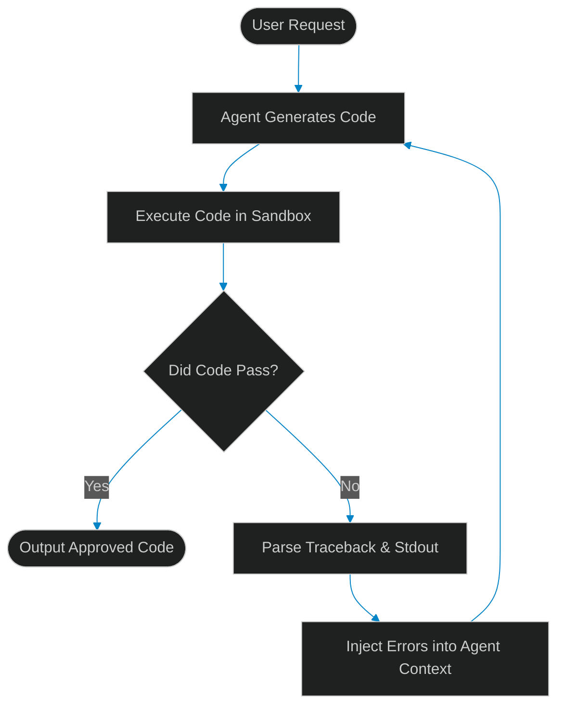

# Agentic Code Generation & Self-Healing: Revolutionizing the Inner Loop of SDLC

> [!NOTE]
> **📖 Article Overview**
> While AI-powered autocomplete and code generation have accelerated developer speed, they still require developers to manually run, debug, and fix syntax or logical errors. Enter **Agentic Self-Healing Loops**: autonomous systems that write code, execute compilation/testing in a secure sandbox, parse traceback errors, and iterate until all checks pass. In this article, we explore how this paradigm shifts the local development "inner loop," analyze error-feedback loops, and implement a self-healing python runtime agent.

---

## Moving Beyond Autocomplete

The traditional "inner loop" of software development consists of writing code, running a local compiler or test runner, diagnosing stack traces, and fixing issues. AI copilots speed up the writing phase but still leave the validation and correction phases in human hands. 

Agentic engineering redefines this flow by combining LLM reasoning with code execution environments. Instead of a single generation pass, the agent functions inside an execution loop:



By programmatically closing the loop between **intent** and **verification**, agents achieve high-fidelity code generations that compile and run correctly before the developer ever opens a pull request.

---

## Mechanics of a Self-Healing Code Generator

A robust self-healing agent relies on three core components:
1. **Isolated Sandbox**: Staging code modifications inside a secure, ephemeral process or container (e.g., Docker, WebAssembly sandbox, or Python virtual environment) to prevent malicious executions.
2. **Traceback Parser**: Regex-based or AST-based parser that isolates the exact file path, line number, exception type, and trace context from output streams.
3. **Context Construction**: Formulating a prompt that instructs the LLM not to rewrite the entire application, but to apply targeted refactoring based specifically on the exception trace and code context.

---

## Implementing a Self-Healing Python Agent

Below is a production-ready Python script demonstrating a self-healing agent loop. It generates a function, runs it inside a subprocess, parses the traceback when it fails, and feeds it back to the agent until the tests pass.

```python
import sys
import os
import subprocess
import re
import tempfile
from typing import Dict, Any, Tuple

# Mock LLM API calls simulating code generation
class MockLLM:
    def __init__(self):
        self.generation_count = 0

    def generate_code(self, prompt: str, error_trace: str = None) -> str:
        self.generation_count += 1
        if self.generation_count == 1:
            # First attempt contains a intentional bug (missing argument in division)
            return """
def divide_numbers(a, b):
    # Bug: trying to call float on b without checking if it is zero
    return float(a) / b

# Simple test assertions
assert divide_numbers(10, 2) == 5.0
# Bug: This will raise ZeroDivisionError and fail the test
assert divide_numbers(5, 0) == 0.0
"""
        else:
            # Second attempt corrects the bug based on the error trace
            return """
def divide_numbers(a, b):
    if b == 0:
        return 0.0
    return float(a) / b

# Simple test assertions
assert divide_numbers(10, 2) == 5.0
assert divide_numbers(5, 0) == 0.0
"""

class SelfHealingInnerLoop:
    def __init__(self, llm: MockLLM):
        self.llm = llm

    def execute_and_heal(self, prompt: str, max_iterations: int = 3) -> Tuple[bool, str, str]:
        error_context = None
        
        for iteration in range(1, max_iterations + 1):
            print(f"\n[Iteration {iteration}] Requesting code from LLM...")
            code = self.llm.generate_code(prompt, error_context)
            
            # Write code to a secure temporary file
            with tempfile.NamedTemporaryFile(suffix=".py", delete=False, mode="w") as f:
                temp_filename = f.name
                f.write(code)

            try:
                print(f"[Iteration {iteration}] Executing code in isolated process...")
                result = subprocess.run(
                    [sys.executable, temp_filename],
                    capture_output=True,
                    text=True,
                    timeout=5
                )
                
                if result.returncode == 0:
                    print(f"🎉 Success! Code execution passed with zero exit code.")
                    return True, code, temp_filename
                else:
                    print(f"⚠️ Execution failed. Extracting stderr traceback...")
                    error_context = self._parse_traceback(result.stderr, code)
                    print(f"--- Traceback Captured ---\n{error_context}\n----------------------")
                    
            except subprocess.TimeoutExpired:
                error_context = "TIMEOUT: The script took too long to execute (infinite loop check)."
                print(f"⚠️ Execution timed out.")
            finally:
                # Clean up file
                if os.path.exists(temp_filename):
                    os.remove(temp_filename)
                    
        return False, "", ""

    def _parse_traceback(self, stderr: str, original_code: str) -> str:
        # Format the error output along with line numbers for context
        lines = original_code.strip().split("\n")
        numbered_code = "\n".join([f"{i+1}: {line}" for i, line in enumerate(lines)])
        
        parsed_error = f"Error Trace:\n{stderr}\n\nOriginal Code:\n{numbered_code}"
        return parsed_error

if __name__ == "__main__":
    llm = MockLLM()
    pipeline = SelfHealingInnerLoop(llm)
    
    prompt = "Create a robust divide_numbers function with test assertions."
    success, stable_code, filepath = pipeline.execute_and_heal(prompt)
    
    if success:
        print("\nStable Code Output:")
        print(stable_code)
    else:
        print("\nFailed to heal code after maximum iterations.")
```

---

## key Takeaways & Impact

* **Shift in Focus**: Developers shift from writing boilerplate code to defining rigorous **verification specifications** (tests, types, and constraints) that guide the self-healing loop.
* **Deterministic Output**: Unlike simple chat generations, self-healed code guarantees that the output satisfies local compilation and test requirements before human review.
* **Scalable Pipelines**: Integrating this local loop into developer environments (like IDE extensions or pre-commit hooks) dramatically reduces time spent fixing trivial syntax errors.
