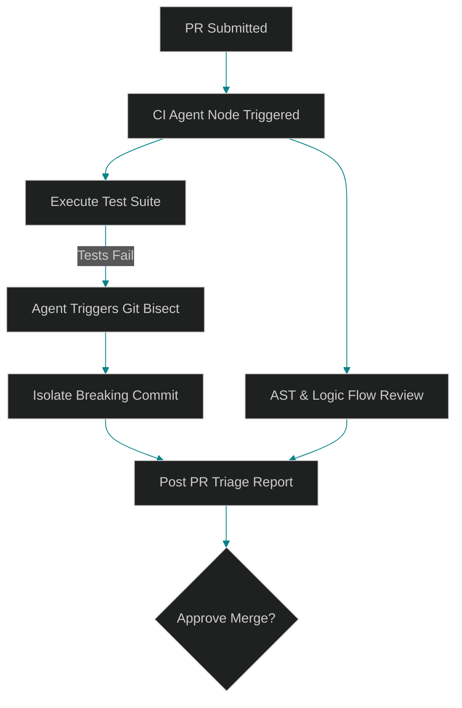

# Automating the Outer Loop: Agentic CI/CD, PR Triage, and Regression Diagnosis

> [!NOTE]
> **📖 Article Overview**
> While developers benefit from AI coding assistants in the inner loop, the **outer loop** of the SDLC—incorporating Code Review, Integration Testing, Pull Request (PR) Triage, and Bug Regression Analysis—remains a highly manual bottleneck. In this article, we explore how autonomous agent swarms act as active CI/CD gatekeepers: running automated git bisections, parsing diff structures to evaluate logic regressions, and auditing security flaws before deployment.

---

## Moving Agents to the CI/CD Pipeline

The software delivery lifecycle doesn't end when code is written. In modern DevOps, code must navigate a complex series of validation stages. When integrated directly into these environments, agents can handle complex workflows that simple test pipelines cannot:

* **Semantic Code Auditing**: Looking past basic lint rules to identify logic bugs, race conditions, or unhandled exceptions in newly modified functions.
* **Auto-Triage & Labeling**: Classifying pull requests, assigning optimal human reviewers, and suggesting dependency updates.
* **Regression Diagnosis**: Pinpointing which change introduced a bug when a pipeline test breaks, tracing the commit history to isolate the breaking modification.



---

## Autonomous Regression Hunting via Git Bisect

When a test suite breaks on a development branch, identifying the exact root cause can be tedious. Using `git bisect` is highly effective but historically manual. An agentic runner can automate this entirely:
1. **Initialize Bisect**: Establish the "good" commit (last known passing build) and the "bad" commit (current breaking branch).
2. **Execute Loop**: Automate Git to checkout the midpoint commit, run validation tests in an isolated worker sandbox, and report the exit code (0 for success, non-zero for failure).
3. **Analyze Root Cause**: Once Git locates the breaking commit, the agent inspects the file diffs, compares the AST, writes a detailed explanation of *why* the code broke, and posts it to the PR discussion thread.

---

## Code Demo: Autonomous Bisect and Diagnosis Runner

The following Python script models an agentic CI runner. It automates git-like operations on a mock history list, executing a check function to locate the exact change that introduced a logic error.

```python
import sys
from typing import List, Dict, Any, Tuple

# Mock commit history
MOCK_COMMITS = [
    {"hash": "c1", "author": "devA", "code": "def process(x):\n    return x * 2", "message": "Initial commit"},
    {"hash": "c2", "author": "devB", "code": "def process(x):\n    return x * 2", "message": "Add helper utilities"},
    {"hash": "c3", "author": "devC", "code": "def process(x):\n    # Regression: changed multiplier without updating tests\n    return x * 3", "message": "Optimize multiplier logic"},
    {"hash": "c4", "author": "devD", "code": "def process(x):\n    return x * 3", "message": "Implement logging handlers"},
    {"hash": "c5", "author": "devE", "code": "def process(x):\n    return x * 3", "message": "Update dependencies"},
]

class CIAgentRunner:
    def __init__(self, commits: List[Dict[str, Any]]):
        self.commits = commits

    def run_tests(self, code: str) -> bool:
        # Define validation assertion: process(10) must return 20
        namespace = {}
        try:
            exec(code, namespace)
            process_fn = namespace.get("process")
            return process_fn(10) == 20
        except Exception:
            return False

    def find_breaking_commit(self) -> Tuple[Dict[str, Any], int]:
        low = 0
        high = len(self.commits) - 1
        breaking_index = -1

        print("🚀 Starting Agentic Git Bisect Loop...")
        
        while low <= high:
            mid = (low + high) // 2
            commit = self.commits[mid]
            print(f"Checking commit midpoint [{commit['hash']}] - Message: '{commit['message']}'")
            
            passed = self.run_tests(commit["code"])
            
            if not passed:
                # The bug is present at mid, so look earlier (left half)
                breaking_index = mid
                high = mid - 1
            else:
                # Mid is good, so the bug was introduced later (right half)
                low = mid + 1

        if breaking_index != -1:
            return self.commits[breaking_index], breaking_index
        raise ValueError("No regression found in commit history.")

    def diagnose_regression(self, bad_commit: Dict[str, Any], prior_commit: Dict[str, Any]) -> str:
        # Formulate diagnosis report
        return f"""
### CI Agent Regression Diagnosis
* **Breaking Commit**: `{bad_commit['hash']}`
* **Author**: {bad_commit['author']}
* **Commit Message**: "{bad_commit['message']}"

**Code Difference Analysis:**
- BEFORE (Commit `{prior_commit['hash']}`):
```python
{prior_commit['code']}
```
- AFTER (Commit `{bad_commit['hash']}`):
```python
{bad_commit['code']}
```

**Diagnosis**: The change from `x * 2` to `x * 3` in commit `{bad_commit['hash']}` broke the test suite, which expects the output to remain consistent with a doubler multiplier.
"""

if __name__ == "__main__":
    runner = CIAgentRunner(MOCK_COMMITS)
    
    # 1. Run git bisect simulation
    breaking, idx = runner.find_breaking_commit()
    prior = MOCK_COMMITS[idx - 1]
    
    # 2. Diagnose diff
    report = runner.diagnose_regression(breaking, prior)
    print("\n--- Diagnostic Report Generated ---")
    print(report)
```

---

## Elevating PR Collaboration

By deploying autonomous review agents in the CI pipeline:
* **Trivial PRs are Auto-Merged**: PRs that only fix simple documentation formatting or dependency updates can be auto-tested, approved, and merged without human intervention.
* **Human Time is Saved**: Engineers no longer spend hours hunting down which commit in a massive merge request broke the main build. The agent flags the line and developer author instantly.
* **Proactive Defense**: By running AST-level security scanners inside containerized test jobs, agents flag potential prompt injection vectors or API authorization gaps before deploying to staging.
