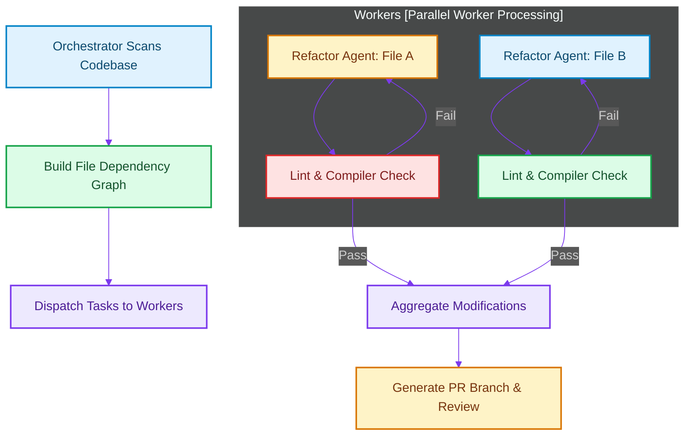

# Agentic Refactoring & Migration: Automating Legacy Upgrades and Codebase-Wide Deprecations

> [!NOTE]
> **📖 Article Overview**
> Codebase maintenance—such as upgrading framework versions, migrating APIs, or refactoring deprecated functions across thousands of files—is one of the costliest and most repetitive aspects of the enterprise SDLC. While toolings like AST codemods exist, they are rigid and fragile under complex, non-trivial code patterns. By orchestrating a swarm of specialized refactoring agents, organizations can automate codebase-wide migrations, verifying compilation and syntax compliance incrementally.

---

## The Migration Tax

Enterprise systems are often burdened by legacy structures:
1. **Framework Upgrades**: Upgrading from Angular AngularJS to Signals, or Next.js Pages to App Router.
2. **Library Deprecations**: Swapping out old HTTP libraries (like `request`) for modern alternatives (`axios` or native `fetch`).
3. **Typing Migrations**: Transitioning raw JavaScript codebases into strictly-typed TypeScript.

Manual refactoring of these issues across hundreds of microservices is slow and error-prone [1]. AST codemods help but struggle when code style deviates or imports are structured dynamically. 

Agentic migration swarms offer a dynamic alternative. By reasoning over code structures and dependencies, agents apply context-specific edits, verify each change against compiler flags, and resolve secondary type errors recursively.

---

## Architecting a Multi-Agent Migration Pipeline

A scalable codebase migration swarm is organized hierarchically:
* **Orchestrator Node**: Scans the target repository, maps import dependency trees, and builds an execution graph. It schedules sub-tasks, grouping files to avoid dependency conflicts.
* **Refactoring Workers**: Specialized agent nodes that take a specific file, read its content along with related type definitions, swap out target legacy patterns, and write modifications back.
* **Verification Node**: Automatically compiles, runs linters (e.g., `eslint`, `mypy`), and executes unit tests on the edited file. If syntax errors or typing conflicts are found, it passes the feedback back to the refactor worker.



---

## Code Demo: Codebase-Wide Refactoring Agent

Below is a complete Python migration script. It acts as an orchestrator that recursively scans files in a directory, extracts functions matching a deprecated pattern, runs a simulated LLM code transformation on those functions, updates import lines, and verifies the file compiles successfully.

```python
import os
import sys
import ast
from typing import List, Dict, Any

# Mock LLM API that rewrites deprecated code structures
class MockMigrationLLM:
    def rewrite_file(self, content: str) -> str:
        # Scenario: Migrate deprecated urllib2 requests to modern requests library
        rewritten = content.replace("import urllib2", "import requests")
        # Replace urllib2.urlopen(url).read() with requests.get(url).text
        rewritten = rewritten.replace("urllib2.urlopen", "requests.get")
        rewritten = rewritten.replace(".read()", ".text")
        return rewritten

class MigrationOrchestrator:
    def __init__(self, llm: MockMigrationLLM):
        self.llm = llm

    def migrate_directory(self, target_dir: str) -> List[Dict[str, Any]]:
        results = []
        print(f"📁 Scanning directory: {target_dir}")
        
        for root, _, files in os.walk(target_dir):
            for file in files:
                if file.endswith(".py"):
                    file_path = os.path.join(root, file)
                    result = self.process_file(file_path)
                    results.append(result)
        return results

    def process_file(self, file_path: str) -> Dict[str, Any]:
        print(f"🔍 Analyzing {os.path.basename(file_path)}...")
        
        with open(file_path, "r", encoding="utf-8") as f:
            original_content = f.read()

        # Check if deprecated pattern is present
        if "urllib2" not in original_content:
            return {"file": file_path, "status": "SKIPPED", "error": None}

        # Apply transformation
        modified_content = self.llm.rewrite_file(original_content)
        
        # Verify file syntax using AST parsing (local compiler check)
        try:
            ast.parse(modified_content)
            # Write back the migrated code
            with open(file_path, "w", encoding="utf-8") as f:
                f.write(modified_content)
            print(f"✅ Migrated and verified successfully.")
            return {"file": file_path, "status": "MIGRATED", "error": None}
        except SyntaxError as e:
            print(f"❌ Migration generated syntax errors: {e}")
            return {"file": file_path, "status": "FAILED", "error": str(e)}

if __name__ == "__main__":
    llm = MockMigrationLLM()
    orchestrator = MigrationOrchestrator(llm)

    # Setup dummy legacy folder for testing the runner
    temp_dir = "./legacy_mock_app"
    os.makedirs(temp_dir, exist_ok=True)
    
    dummy_file = os.path.join(temp_dir, "client.py")
    with open(dummy_file, "w") as f:
        f.write("""import urllib2

def fetch_data(url):
    response = urllib2.urlopen(url)
    return response.read()
""")

    # Run migration
    reports = orchestrator.migrate_directory(temp_dir)
    print("\n--- Migration Summary Report ---")
    for report in reports:
        print(f"File: {os.path.basename(report['file'])} | Status: {report['status']}")

    # Clean up dummy test files
    if os.path.exists(dummy_file):
        os.remove(dummy_file)
    if os.path.exists(temp_dir):
        os.rmdir(temp_dir)
```

---

## Scaling Codebase Upgrades in the Enterprise

Automating legacy refactoring with agentic swarms:
* **Preserves Dev Focus**: Engineers no longer have to spend weeks performing mechanical API translations. Instead, they focus on resolving high-level logic exceptions flagged during the migration test suites.
* **Eliminates Code Rot**: Upgrading package structures monthly or refactoring deprecations instantly prevents technical debt from accumulating.
* **Guarantees Conformity**: Multi-agent pipelines enforce 100% type safety and compiler compliance, producing highly standardized code across diverse microservice ecosystems. [2]

## References & Further Reading

1. **Mohan, C., et al. (1992)**. *ARIES: A Transaction Recovery Method Supporting Fine-Granularity Locking and Partial Rollbacks*. ACM TODS. [https://doi.org/10.1145/128765.128770](https://doi.org/10.1145/128765.128770)
2. **O'Neil, P., Cheng, E., Gawlick, D., & O'Neil, E. (1996)**. *The Log-Structured Merge-Tree (LSM-Tree)*. Acta Informatica. [https://www.cs.umb.edu/~poneil/lsmtree.pdf](https://www.cs.umb.edu/~poneil/lsmtree.pdf)
3. **PostgreSQL Global Development Group (2024)**. *PostgreSQL Documentation*. postgresql.org. [https://www.postgresql.org/docs/current/](https://www.postgresql.org/docs/current/)
4. **React Team (2024)**. *React Compiler*. react.dev. [https://react.dev/learn/react-compiler](https://react.dev/learn/react-compiler)
5. **React Team (2024)**. *React 19 Blog Post*. react.dev. [https://react.dev/blog/2024/12/05/react-19](https://react.dev/blog/2024/12/05/react-19)
6. **Ry, R. (2024)**. *SolidJS Reactivity*. solidjs.com. [https://www.solidjs.com/guides/reactivity](https://www.solidjs.com/guides/reactivity)
7. **Svelte Team (2024)**. *Svelte 5 Runes*. svelte.dev. [https://svelte.dev/docs/svelte/what-are-runes](https://svelte.dev/docs/svelte/what-are-runes)
