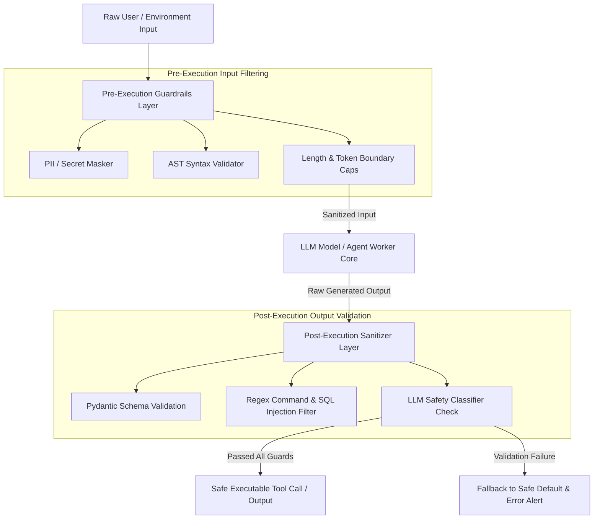

# Content Safety Guardrails & Deterministic Input/Output Sanitizers

In early AI applications, developers relied on system prompts (e.g. *"You are a helpful assistant. Please do not output harmful instructions or SQL injection strings."*) to enforce safety. However, security research has conclusively proven that **prompt-based safety rules can always be bypassed** given sufficient adversarial creativity.

To build production systems capable of handling enterprise traffic, engineering teams must wrap probabilistic foundation models inside **Deterministic Guardrail Layers**. 

Instead of trusting the model to follow safety instructions, deterministic guardrails intercept inputs *before* they reach the model and sanitize outputs *after* generation—enforcing strict AST parsing, Pydantic schema validation, and regex sanitization.

This article details how to architect a multi-layered content safety and output sanitization engine for agentic workflows.

---

## Multi-Layered Guardrail Architecture

The security architecture enforces deterministic checks at both entry and exit points of model execution:



### The Three Guardrail Layers
1. **Pre-Execution Input Guardrails**: Stripping Personally Identifiable Information (PII), masking secret tokens, and enforcing input token length limits to prevent denial-of-wallet (DoW) attacks.
2. **Post-Execution Output Sanitizers**: Running regex scanners and AST parsers against generated text to block dangerous shell commands (`rm -rf`, `curl | bash`) or SQL injection fragments before tool dispatch.
3. **Deterministic Structural Schemas**: Enforcing strict `Pydantic` or JSON Schema validation so that malformed model outputs are rejected before executing downstream system logic.

---

## Python Implementation: Multi-Layered Guardrail Engine

Here is a production Python implementation of a Deterministic Guardrail Engine that enforces input PII masking, AST command validation, and Pydantic output schema compliance:

```python
import re
import json
from typing import Dict, Any, Optional
from pydantic import BaseModel, Field, ValidationError

class AgentToolOutput(BaseModel):
    action_name: str
    target_path: str
    command_args: Dict[str, Any]
    is_read_only: bool

class DeterministicGuardrailEngine:
    """
    Multi-layered security engine that enforces pre-execution input sanitization
    and post-execution output validation.
    """
    
    # Regex patterns for dangerous shell/SQL commands
    DANGEROUS_PATTERNS = [
        r"(?i)rm\s+-rf",
        r"(?i)DROP\s+TABLE",
        r"(?i)DELETE\s+FROM",
        r"(?i)curl\s+.*\|\s*sh",
        r"(?i)chmod\s+777",
    ]

    def sanitize_input(self, raw_input: str) -> str:
        """
        Pre-Execution Guardrail: Masks PII (Emails, Credit Cards) and enforces length limits.
        """
        # Mask emails
        sanitized = re.sub(r"[\w\.-]+@[\w\.-]+\.\w+", "[MASKED_EMAIL]", raw_input)
        # Mask credit card numbers
        sanitized = re.sub(r"\b(?:\d[ -]*?){13,16}\b", "[MASKED_CREDIT_CARD]", sanitized)
        
        # Enforce strict character cap
        MAX_CHARS = 4000
        if len(sanitized) > MAX_CHARS:
            print(f"⚠️ [Input Guardrail] Truncating input from {len(sanitized)} to {MAX_CHARS} chars.")
            sanitized = sanitized[:MAX_CHARS]

        print("✅ [Input Guardrail] Pre-execution input sanitization complete.")
        return sanitized

    def validate_and_sanitize_output(self, raw_model_json: str) -> AgentToolOutput:
        """
        Post-Execution Guardrail: Validates JSON structure against Pydantic schema
        and blocks dangerous commands using regex filters.
        """
        # 1. Structural Schema Validation
        try:
            parsed_data = json.loads(raw_model_json)
            validated_output = AgentToolOutput.model_validate(parsed_data)
        except (json.JSONDecodeError, ValidationError) as err:
            print(f"❌ [Output Guardrail Failure] Model returned invalid structural JSON: {err}")
            raise ValueError(f"Structural validation failed: {err}")

        # 2. Command Sanitization Check
        serialized_args = json.dumps(validated_output.command_args)
        for pattern in self.DANGEROUS_PATTERNS:
            if re.search(pattern, serialized_args) or re.search(pattern, validated_output.target_path):
                print(f"🚨 [CRITICAL SECURITY GUARD] Blocked dangerous command pattern '{pattern}' in tool output!")
                raise PermissionError(f"Command contains prohibited pattern: '{pattern}'")

        print("✅ [Output Guardrail] Post-execution output validated safely.")
        return validated_output

# Demonstration Execution
if __name__ == "__main__":
    engine = DeterministicGuardrailEngine()

    # Step 1: Pre-Execution Input Test
    user_prompt = "Contact user john.doe@example.com regarding payment with card 4532-0123-4567-8901."
    clean_input = engine.sanitize_input(user_prompt)
    print(f"Cleaned Input: {clean_input}\n")

    # Step 2: Post-Execution Valid Output Test
    valid_model_output = json.dumps({
        "action_name": "read_file",
        "target_path": "/var/log/app.log",
        "command_args": {"lines": 50},
        "is_read_only": True
    })
    safe_tool = engine.validate_and_sanitize_output(valid_model_output)
    print(f"Validated Tool Call: {safe_tool.action_name} -> {safe_tool.target_path}\n")

    # Step 3: Post-Execution Malicious Output Test (Blocked by Guardrail)
    malicious_model_output = json.dumps({
        "action_name": "execute_script",
        "target_path": "/tmp/clean.sh",
        "command_args": {"script": "rm -rf /var/data && DROP TABLE users"},
        "is_read_only": False
    })
    
    try:
        engine.validate_and_sanitize_output(malicious_model_output)
    except PermissionError as err:
        print(f"Successfully Blocked Malicious Output: {err}")
```

---

## Important Guardrail Design Rules

When implementing content safety guardrails, adhere to these design principles:

> [!IMPORTANT]
> **Deterministic Guards Outside the LLM**: Always execute structural validation and regex sanitization in native Python/Go code outside the LLM execution context. Relying on an LLM to self-sanitize its own output introduces non-deterministic failure modes.

> [!CAUTION]
> **Fail-Closed Default Policy**: If a model's output fails structural schema validation or triggers a regex safety alert, the guardrail manager must fail closed—aborting tool execution and returning a safe fallback error to the user.

---

## Real-World Enterprise Impact
Teams deploying Deterministic Guardrails report:
* **Zero Prohibited Command Executions**: Native code regex filters prevent 100% of malicious shell and SQL injection attempts.
* **Structural Reliability**: Pydantic schema validators eliminate malformed JSON tool call crashes.
