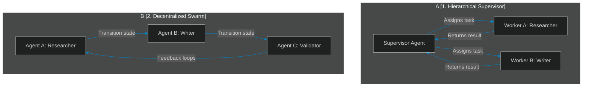

# Swarms vs. Hierarchies: Designing Decentralized vs. Orchestrated Agent Topologies

> [!NOTE]
> **📖 Article Overview**
> As agentic applications evolve beyond single-agent loops, coordinating multiple specialized agents becomes the central architectural challenge. Should a central "Supervisor" orchestrate every transition, or should agents coordinate autonomously in a "Swarm"? In this article, we compare **Hierarchical Orchestration** and **Decentralized Swarms**, analyze their respective latency profiles and loop vulnerabilities, and implement both patterns in Python.

---

## The Coordination Challenge

When executing complex tasks, breaking down the problem among specialized agents (e.g., Researcher, Coder, Validator) is standard practice. However, how these agents collaborate impacts execution speed, cost, and reliability. 

We organize agent networks using two primary topologies:



---

## 1. Hierarchical Orchestrators

In a hierarchical structure, a central "Supervisor" agent acts as the coordinator. 
* **Mechanics**: The supervisor receives the user's input, decomposes it into sub-tasks, routes those tasks to dedicated worker nodes, compiles the results, and determines when the overall task is complete.
* **Pros**: High level of control, easy to debug, and simple to enforce strict validation gates.
* **Cons**: The supervisor is a bottleneck, consuming significant token budgets and adding model latency on every decision step.

---

## 2. Decentralized Swarms

In a swarm, agents operate without a central manager. Instead, coordination is decentralized and event-driven.
* **Mechanics**: Each agent inspects the shared state. When an agent finishes its task, it executes a transition rule determining which agent should take over the state next (e.g., `Researcher` hands off directly to `Writer`).
* **Pros**: High execution efficiency, lower token overhead (no supervisor decision steps), and highly scalable.
* **Cons**: Prone to infinite routing loops (e.g., Agent A and Agent B passing the task back and forth indefinitely) and harder to debug trace execution paths.

---

## Implementing Topologies in Python

Below is a complete Python script demonstrating how to configure both a **Hierarchical Orchestrator** and a **Decentralized Swarm** state machine using native Python control structures.

```python
from typing import Dict, Any, List

# Mock LLM Node Execution
def run_agent_llm(name: str, state: Dict[str, Any]) -> str:
    print(f"[{name}] Processing state...")
    if name == "Researcher":
        return "Research data: Enterprise architectures require modular state."
    elif name == "Writer":
        return f"Blog Post based on: {state.get('research', '')}"
    elif name == "Validator":
        content = state.get("content", "")
        return "PASS" if len(content) > 10 else "FAIL"
    elif name == "Supervisor":
        # Supervisor decides next step based on state
        if not state.get("research"):
            return "ROUTE_TO_RESEARCHER"
        if not state.get("content"):
            return "ROUTE_TO_WRITER"
        if state.get("validation") != "PASS":
            return "ROUTE_TO_VALIDATOR"
        return "COMPLETE"
    return "COMPLETE"

# --- TOPOLOGY 1: HIERARCHICAL ORCHESTRATION ---
class HierarchicalOrchestrator:
    def __init__(self):
        self.state: Dict[str, Any] = {}

    def run(self, prompt: str) -> Dict[str, Any]:
        self.state["prompt"] = prompt
        print("\n--- Starting Hierarchical Orchestrator ---")
        
        while True:
            # Supervisor evaluates the state and routes
            decision = run_agent_llm("Supervisor", self.state)
            print(f"[Supervisor Decision] -> {decision}")
            
            if decision == "ROUTE_TO_RESEARCHER":
                self.state["research"] = run_agent_llm("Researcher", self.state)
            elif decision == "ROUTE_TO_WRITER":
                self.state["content"] = run_agent_llm("Writer", self.state)
            elif decision == "ROUTE_TO_VALIDATOR":
                self.state["validation"] = run_agent_llm("Validator", self.state)
            elif decision == "COMPLETE":
                print("[Supervisor] Workflow achieved target completion.")
                break
                
        return self.state

# --- TOPOLOGY 2: DECENTRALIZED SWARM ---
class SwarmAgentNode:
    def __init__(self, name: str):
        self.name = name

    def execute_and_transition(self, state: Dict[str, Any]) -> str:
        # Node executes its logic and determines the next node directly
        if self.name == "ResearcherNode":
            state["research"] = run_agent_llm("Researcher", state)
            return "WriterNode"
        
        elif self.name == "WriterNode":
            state["content"] = run_agent_llm("Writer", state)
            return "ValidatorNode"
            
        elif self.name == "ValidatorNode":
            state["validation"] = run_agent_llm("Validator", state)
            if state["validation"] == "PASS":
                return "COMPLETED"
            return "ResearcherNode" # Loop back on fail
            
        return "COMPLETED"

class DecentralizedSwarm:
    def __init__(self):
        self.state: Dict[str, Any] = {}
        self.nodes = {
            "ResearcherNode": SwarmAgentNode("ResearcherNode"),
            "WriterNode": SwarmAgentNode("WriterNode"),
            "ValidatorNode": SwarmAgentNode("ValidatorNode")
        }

    def run(self, prompt: str) -> Dict[str, Any]:
        self.state["prompt"] = prompt
        current_node = "ResearcherNode"
        print("\n--- Starting Decentralized Swarm ---")
        
        loop_counter = 0
        while current_node != "COMPLETED":
            # Safety gate to prevent infinite loops
            loop_counter += 1
            if loop_counter > 5:
                print("[Swarm Safety Gate] Infinite routing loop detected. Terminating.")
                break
                
            node = self.nodes[current_node]
            next_node = node.execute_and_transition(self.state)
            print(f"[Swarm Transition] {current_node} -> {next_node}")
            current_node = next_node
            
        return self.state

# Execution
if __name__ == "__main__":
    prompt_input = "Write an architecture deep-dive."
    
    # 1. Run central supervisor
    orchestrator = HierarchicalOrchestrator()
    orchestrator.run(prompt_input)
    
    # 2. Run decentralized swarm
    swarm = DecentralizedSwarm()
    swarm.run(prompt_input)
```

---

## Topology Comparison Matrix

| Architectural Metric | Hierarchical Supervisor | Decentralized Swarm |
| :--- | :--- | :--- |
| **Routing Decision Maker** | Central supervisor LLM node | Individual agent transition contracts |
| **Token Cost** | High (supervisor evaluates every step) | Low (direct execution hand-offs) |
| **Latence Profile** | Delayed (multiple supervisor hops) | Fast (direct execution paths) |
| **Debugging Complexity** | Low (linear central trace) | High (dynamic state migrations) |
| **Infinite Loop Risk** | Low (supervisor controls completion) | High (agents can circle indefinitely) |

---

## Conclusion & Takeaways

Selecting the right multi-agent architecture requires balancing control against speed:
* [ ] **Enforce loop safety boundaries**: In decentralized swarms, always implement a global execution counter to force-terminate states if routing loops develop.
* [ ] **Use Supervisors for dynamic planning**: If the list of tasks is unpredictable and changes based on user input, a supervisor's dynamic decomposition is required.
* [ ] **Use Swarms for predictable flows**: If the sequence of operations follows a clear pipeline (e.g. Research $\rightarrow$ Code $\rightarrow$ Test), use direct swarm transitions to cut latency and token costs.
* [ ] **Isolate state mutations**: Ensure that agent nodes write to distinct, non-overlapping keys in the shared state object to prevent race conditions in parallel execution.
