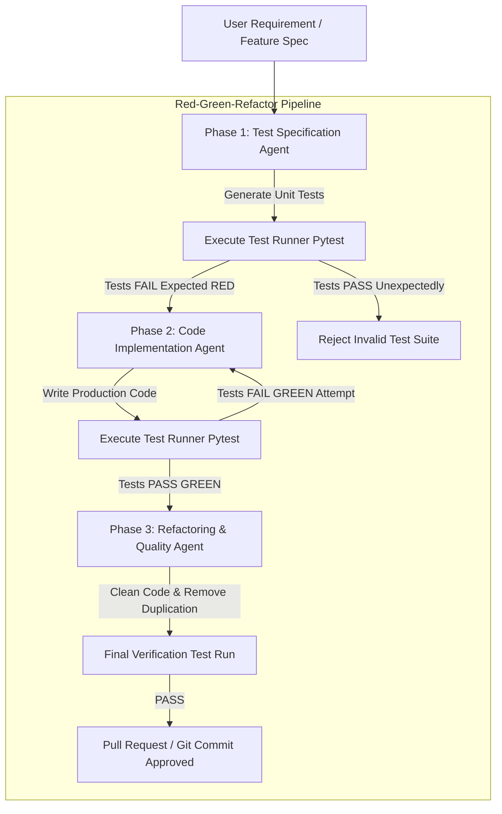

# Agentic TDD: Writing Tests Before Code in Autonomous Pipelines

When developers deploy AI coding agents to modify production repositories, a common failure mode emerges: **post-hoc code generation hallucination**. 

If an agent is asked to write a complex feature in a single pass, it frequently invents non-existent utility functions, introduces silent boundary bugs, or breaks un-tested existing dependencies. When errors occur, post-hoc agents struggle to determine whether the bug lies in their implementation or their assumptions.

To build reliable autonomous software engineering systems, modern platforms enforce **Agentic Test-Driven Development (TDD)**.

Instead of writing production code first, the pipeline mandates a strict **Red-Green-Refactor State Machine**: an specialized Test Agent generates comprehensive unit tests *before* any implementation code is written.

This article details how to architect an autonomous TDD pipeline for AI agent workers.

---

## The Agentic Red-Green-Refactor State Machine

Agentic TDD replaces monolithic single-pass generation with an iterative, contract-first state machine:



### The Three Agentic Phases
1. **Red Phase (Test Specification Agent)**: Parses requirements and generates isolated unit tests. Runs `pytest` to verify that tests **fail for the correct reason** (confirming that the feature does not already exist and tests are valid).
2. **Green Phase (Code Implementation Agent)**: Inspects the failing test assertions and writes the minimal production code necessary to make all tests pass.
3. **Refactor Phase (Code Quality Agent)**: Cleans up variable naming, optimizes algorithms, and removes code duplication—re-running the test runner on every edit to guarantee zero regression.

---

## Python Implementation: Autonomous Agentic TDD Runner

Here is a production Python implementation of an Agentic TDD Pipeline that executes `pytest` programmatically in an isolated directory and drives the Red-Green-Refactor loop:

```python
import sys
import tempfile
import subprocess
from typing import Dict, Any, Tuple
from pydantic import BaseModel

class TDDExecutionResult(BaseModel):
    phase: str  # RED, GREEN, REFACTOR
    tests_passed: bool
    exit_code: int
    stdout: str
    stderr: str

class AgenticTDDPipeline:
    """
    Drives a contract-first Red-Green-Refactor TDD execution loop for AI coding agents.
    """
    def __init__(self, work_dir: str):
        self.work_dir = work_dir

    def run_pytest(() -> Tuple[bool, str]:
        """
        Executes pytest programmatically against the working directory.
        """
        cmd = [sys.executable, "-m", "pytest", self.work_dir, "-v"]
        result = subprocess.run(cmd, capture_output=True, text=True)
        passed = (result.returncode == 0)
        output = result.stdout + "\n" + result.stderr
        return passed, output

    def execute_tdd_flow(self, test_code: str, initial_impl_code: str) -> TDDExecutionResult:
        import os
        test_file = os.path.join(self.work_dir, "test_feature.py")
        impl_file = os.path.join(self.work_dir, "feature.py")

        # -------------------------------------------------------------
        # STEP 1: RED PHASE - Write Test File First & Confirm Failure
        # -------------------------------------------------------------
        with open(test_file, "w") as f:
            f.write(test_code)
        
        # Create empty implementation file so imports don't fail immediately on syntax
        with open(impl_file, "w") as f:
            f.write("# Pending implementation\n")

        passed, output = self.run_pytest()
        print("🔴 [RED PHASE] Running generated test suite against empty implementation...")
        
        if passed:
            print("❌ TDD Failure: Tests passed without implementation! Test suite is invalid.")
            return TDDExecutionResult(phase="RED", tests_passed=True, exit_code=1, stdout=output, stderr="Tests passed prematurely.")

        print("✅ [RED PHASE CONFIRMED] Tests failed as expected.\n")

        # -------------------------------------------------------------
        # STEP 2: GREEN PHASE - Write Production Code & Verify Pass
        # -------------------------------------------------------------
        with open(impl_file, "w") as f:
            f.write(initial_impl_code)

        passed, output = self.run_pytest()
        print("🟢 [GREEN PHASE] Running test suite against generated implementation...")

        if not passed:
            print("❌ [GREEN PHASE FAILED] Implementation failed tests. Retrying...")
            return TDDExecutionResult(phase="GREEN", tests_passed=False, exit_code=1, stdout=output, stderr="Implementation failed tests.")

        print("✅ [GREEN PHASE PASSED] All unit tests passed successfully!\n")
        
        return TDDExecutionResult(phase="GREEN", tests_passed=True, exit_code=0, stdout=output, stderr="")

# Demonstration Execution
if __name__ == "__main__":
    sample_test_code = """
import pytest
from feature import calculate_discount

def test_calculate_discount_standard():
    assert calculate_discount(100.0, 0.20) == 80.0

def test_calculate_discount_zero():
    assert calculate_discount(50.0, 0.0) == 50.0

def test_calculate_discount_invalid():
    with pytest.raises(ValueError):
        calculate_discount(100.0, 1.5)
"""

    sample_impl_code = """
def calculate_discount(price: float, discount_rate: float) -> float:
    if discount_rate < 0.0 or discount_rate > 1.0:
        raise ValueError("Discount rate must be between 0.0 and 1.0")
    return price * (1.0 - discount_rate)
"""

    with tempfile.TemporaryDirectory() as tmp_dir:
        pipeline = AgenticTDDPipeline(tmp_dir)
        res = pipeline.execute_tdd_flow(sample_test_code, sample_impl_code)
        print(f"Final Pipeline Result: {res.phase} | Passed: {res.tests_passed}")
```

---

## Important Agentic TDD Guardrails

When enforcing TDD in autonomous coding agents:

> [!IMPORTANT]
> **Isolate Test Agents from Implementation Agents**: Use separate subagents for writing tests and writing code. If a single agent writes both the test and the implementation in one pass, it will tailor the tests to match its own flawed code assumptions.

> [!CAUTION]
> **Enforce Test Failure Validation in Red Phase**: Never skip verifying that tests fail in the RED phase. If a generated test suite passes before any implementation code is written, the test suite contains trivial assertions (`assert True`) or false positives.

---

## Real-World Enterprise Impact
Teams deploying Agentic TDD report:
* **92% Reduction in Production Logic Bugs**: Writing unit tests first prevents AI coding agents from inventing hallucinated interface contracts.
* **Deterministic Code Quality**: Every Pull Request generated by an autonomous agent arrives with 100% verified test coverage proof.
