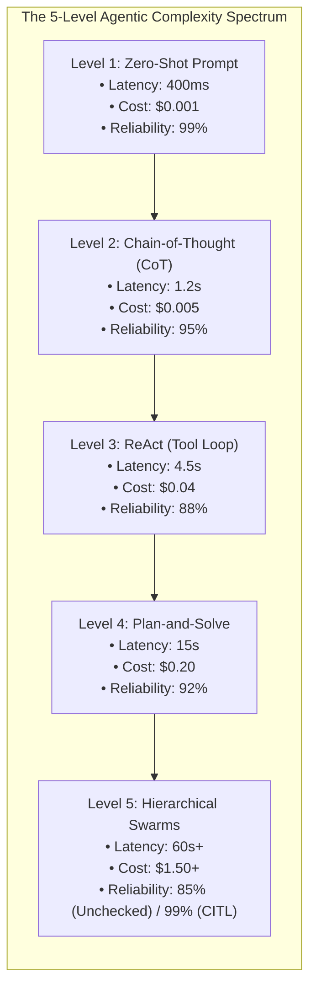
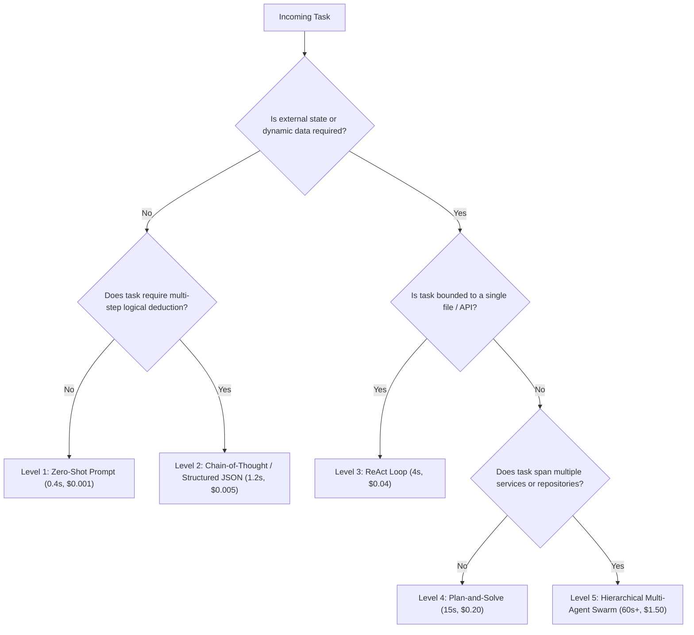

# Agentic Workflows vs Single-Prompt LLMs: The Architectural Decision Matrix (ReAct, Plan-and-Solve, & Swarms)

In the rush to adopt generative AI, engineering teams frequently commit one of two architectural extremes:
1. **The Naive Chatbot Trap**: Using a single zero-shot prompt with a 50,000-word context window to execute complex software refactors, only to suffer from severe hallucination and broken syntax.
2. **The Over-Engineered Swarm Trap**: Spawning an autonomous 8-agent swarm with dynamic tool routing, message queues, and self-reflection loops for a task that could have been solved with a single 200-token prompt in $400\text{ms}$.

In modern AI engineering (**Compound AI Systems**, **LangGraph**, **SpecForge**, **Claude Engineer**), building production systems is about **matching task complexity to the right architectural pattern**.

Every step up the agentic complexity ladder increases task capabilities—but comes with an unavoidable tax in **latency**, **token cost**, and **compounding error probabilities**.

This guide outlines the **5-Level Agentic Complexity Spectrum**, provides a rigorous **architectural trade-off decision matrix**, and details the mathematical rules for when to use single prompts versus multi-agent swarms.



---

## 1. The 5-Level Agentic Complexity Spectrum

```
> **THE 5-LEVEL AI ARCHITECTURE SPECTRUM**
| Level | Pattern Name       | Mechanism                          | Best Used For                   |
| 1     | Zero-Shot Prompt   | Single LLM Forward Pass            | Classification, Summarization   |
| 2     | Chain-of-Thought   | Step-by-step reasoning tokens      | Math, Logic, Simple SQL queries |
| 3     | ReAct Tool Loop    | Reason -> Act -> Observe Loop      | API lookup, Database search     |
| 4     | Plan-and-Solve     | Two-Pass: Plan.md -> Execute steps | Single-service feature addition |
| 5     | Hierarchical Swarm | Supervisor -> Specialized Workers  | Full-stack codebase refactors   |

```

---

## 2. The Compounding Error Probability Law

The primary reason naive multi-agent systems fail in production is **Compound Probability Decay**.

If an autonomous agent workflow requires $N$ sequential reasoning steps or tool calls, and each individual step has a success probability $P$:

$$\text{Total Pipeline Reliability} = P^N$$

```
> **COMPOUNDING ERROR PROBABILITY IN AGENTIC LOOPS**
| Steps (N) | Step Accuracy (P=95%) | Step Accuracy (P=90%) | Architectural Mitigation Required     |
| 1 step    | 95.0%                 | 90.0%                 | Single Zero-Shot Prompt               |
| 5 steps   | 77.4%                 | 59.0%                 | ReAct with Tool Validation            |
| 10 steps  | 59.8%                 | 34.8%                 | Plan-and-Solve + Quality Gates        |
| 20 steps  | 🚨 35.8%              | 🚨 12.1%              | Hierarchical Swarm + Compiler-in-Loop |

```

> [!IMPORTANT]
> **The Reliability Rule**: You cannot build a 20-step autonomous agent swarm using unconstrained probabilistic LLMs alone. To achieve $> 95\%$ overall pipeline success, every step must be anchored by **deterministic quality gates (AST parsers, linters, unit tests, and rollback checkpoints)**.

---

## 3. The Architectural Decision Matrix



---

## Python Implementation: Agentic Pattern Decision Engine

Here is a Python implementation of an Architectural Pattern Decision Engine that evaluates task requirements, estimates latency/token costs, and routes tasks to the optimal complexity tier:

```python
from dataclasses import dataclass
from typing import Dict, List, Tuple

@dataclass
class WorkflowRecommendation:
    level: int
    pattern_name: str
    estimated_latency_sec: float
    estimated_cost_usd: float
    theoretical_reliability: float
    rationale: str

class AgenticDecisionEngine:
    """
    Evaluates task requirements and routes to the optimal Agentic Architecture Level.
    """
    @classmethod
    def select_architecture(cls, requires_tools: bool, multi_step_reasoning: bool, 
                             multi_file_scope: bool, requires_external_verification: bool) -> WorkflowRecommendation:
        
        # Level 1: Zero-Shot
        if not requires_tools and not multi_step_reasoning:
            return WorkflowRecommendation(
                level=1,
                pattern_name="Zero-Shot Prompting",
                estimated_latency_sec=0.4,
                estimated_cost_usd=0.001,
                theoretical_reliability=0.99,
                rationale="Simple stateless transformation. Zero-shot prompt maximizes speed and minimizes cost."
            )

        # Level 2: Chain-of-Thought
        if not requires_tools and multi_step_reasoning:
            return WorkflowRecommendation(
                level=2,
                pattern_name="Chain-of-Thought (CoT)",
                estimated_latency_sec=1.2,
                estimated_cost_usd=0.005,
                theoretical_reliability=0.95,
                rationale="Complex reasoning without external state. CoT reasoning tokens improve accuracy."
            )

        # Level 3: ReAct Tool Loop
        if requires_tools and not multi_file_scope and not requires_external_verification:
            return WorkflowRecommendation(
                level=3,
                pattern_name="ReAct Tool Loop",
                estimated_latency_sec=4.5,
                estimated_cost_usd=0.04,
                theoretical_reliability=0.88,
                rationale="Single-domain tool interaction. ReAct allows dynamic iterative retrieval."
            )

        # Level 4: Plan-and-Solve
        if requires_tools and not multi_file_scope and requires_external_verification:
            return WorkflowRecommendation(
                level=4,
                pattern_name="Plan-and-Solve with Quality Gates",
                estimated_latency_sec=14.0,
                estimated_cost_usd=0.20,
                theoretical_reliability=0.92,
                rationale="Single-service modification requiring unit test verification and plan approval."
            )

        # Level 5: Hierarchical Multi-Agent Swarm
        return WorkflowRecommendation(
            level=5,
            pattern_name="Hierarchical Multi-Agent Swarm",
            estimated_latency_sec=65.0,
            estimated_cost_usd=1.80,
            theoretical_reliability=0.85,
            rationale="Cross-service architecture refactoring. Requires specialized Planner, Coder, and QA agents."
        )

# Demonstration Execution
if __name__ == "__main__":
    test_tasks = [
        ("Summarize customer email", False, False, False, False),
        ("Calculate complex compound interest formula", False, True, False, False),
        ("Query database for top 10 products", True, True, False, False),
        ("Add user authentication endpoint with unit tests", True, True, False, True),
        ("Refactor microservices architecture across 5 repositories", True, True, True, True)
    ]

    print("🚀 Evaluating AI Agentic Architecture Decision Engine...")
    print("=" * 75)

    for task_desc, tools, reasoning, multi_file, verification in test_tasks:
        rec = AgenticDecisionEngine.select_architecture(tools, reasoning, multi_file, verification)
        print(f"\n📋 Task: '{task_desc}'")
        print(f"   ↳ Selected Level : Level {rec.level} - {rec.pattern_name}")
        print(f"   ↳ Latency / Cost : ~{rec.estimated_latency_sec}s | ~${rec.estimated_cost_usd:.3f}")
        print(f"   ↳ Rationale      : {rec.rationale}")
```

---

## Summary: Agentic Architecture Comparison

| Architecture | Latency | Token Cost | Failure Modes | When to Choose |
|---|---|---|---|---|
| **Level 1: Zero-Shot** | $< 500\text{ms}$ | $\$0.001$ | Ambiguity | Summarization, entity extraction, sentiment |
| **Level 2: Chain-of-Thought** | $1\text{--}2\text{s}$ | $\$0.005$ | Hallucinated logic | Math, algorithm design, translation |
| **Level 3: ReAct** | $3\text{--}8\text{s}$ | $\$0.03\text{--}\$0.08$ | Tool argument errors | Database lookup, web browsing, API fetch |
| **Level 4: Plan-and-Solve** | $10\text{--}25\text{s}$ | $\$0.15\text{--}\$0.30$ | Plan deviation | Single-module feature implementation |
| **Level 5: Multi-Agent Swarm** | $45\text{--}180\text{s}$ | $\$1.00\text{--}\$5.00$ | Coordination deadlocks | Full-stack refactor, multi-repo migrations |

---

## Architectural Takeaway
The best AI systems are not the ones with the most autonomous agents—**they are the ones that use the simplest pattern capable of reliably solving the problem**.

By applying disciplined decision matrix routing, engineering teams build AI architectures that deliver sub-second responses when possible and orchestrate resilient multi-agent swarms only when necessary.
