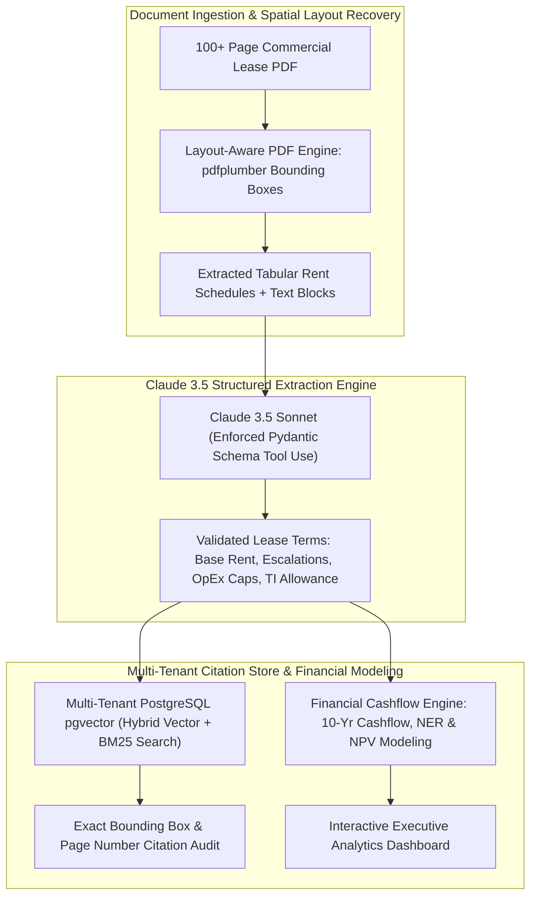

# Architecting LeaseLogic: Tabular Real Estate Clause Extraction, Multi-Tenant pgvector RAG & NPV Cashflow Modeling

In commercial real estate (CRE) asset management and private equity (**LeaseLogic**, **JLL**, **CBRE**, **Blackstone Real Estate**), evaluating 100+ page institutional commercial lease agreements is one of the most high-stakes, time-consuming analytical tasks.

A single overlooked clause—such as a un-capped Operating Expense (OpEx) pass-through, a $3.5\%$ compounding annual rent step-up, or a Tenant Improvement (TI) clawback—can introduce millions of dollars in unexpected portfolio liabilities.

Standard Optical Character Recognition (OCR) and naive RAG pipelines fail catastrophically on commercial leases because they flatten multi-column rent schedules and complex indemnity tables into jumbled text strings.

To solve this, I architected **[LeaseLogic](https://github.com/akmalkhaniub/leaselogic)**—an AI-powered commercial lease intelligence and cashflow valuation platform.

LeaseLogic combines **layout-aware tabular extraction**, **Claude 3.5 Sonnet Tool Use with strict Pydantic schemas**, **multi-tenant `pgvector` hybrid search**, and a **Net Effective Rent (NER) & Net Present Value (NPV) financial modeling engine**.


---

## 📖 LeaseLogic System Architecture

How LeaseLogic processes 120-page commercial lease contracts, verifies clause citations via multi-tenant vector search, and computes 10-year financial cashflows:



### Core Architecture Highlights
1. **The Spatial Layout Parsing Problem**:
   * Commercial leases structure rent step-ups in multi-column tables (e.g. *Months 1–12: $45.00/sqft; Months 13–24: $46.35/sqft*).
   * Naive chunking merges cells across rows, confusing the LLM into associating the wrong square footage with base rents.
   * *Solution*: LeaseLogic uses spatial coordinate bounding-box extraction to reconstruct HTML table markdown before prompting the LLM.
2. **Deterministic Extraction via Claude Tool Use**:
   * Uses Anthropic Claude 3.5 Sonnet with strict Pydantic model schemas enforcing exact types (`Decimal` for currency, `date` for commencement, and enum for lease types `NNN`, `Gross`, `Modified Gross`).
   * Eliminates hallucinated clause interpretations and guarantees zero JSON parsing failures.
3. **Multi-Tenant pgvector RAG with Audit Citations**:
   * Organizes embeddings under PostgreSQL Row-Level Security (RLS) tagged by `tenant_id` and `lease_id`.
   * Queries combine $L_2$-normalized dense embeddings (`text-embedding-3-large`) with sparse full-text search (`tsvector` with BM25 ranking).
   * Every extracted metric stores an immutable pointer to the source `{ page_number, bounding_box: [x0, y0, x1, y1] }` for legal verification.
4. **Net Effective Rent (NER) & NPV Cashflow Modeling**:
   * Generates a monthly cashflow matrix over the full lease term ($10\text{ years} = 120\text{ periods}$).
   * Models base rent step-ups, free rent abatement periods, tenant improvement amortization, and operating expense escalations.
   * Computes Net Effective Rent (NER) and Net Present Value (NPV) using discounted cashflow formulas:
     $$\text{NPV} = \sum_{t=1}^T \frac{\text{Net Cashflow}_t}{(1 + \frac{r}{12})^t}$$

---

## 🛠️ Python Implementation: Lease Extraction & NPV Cashflow Engine

Here is the core Python implementation showcasing LeaseLogic's Pydantic schema validation and 10-year discounted cashflow valuation engine:

```python
from decimal import Decimal
from typing import List, Optional
from pydantic import BaseModel, Field

class RentStep(BaseModel):
    start_month: int = Field(..., description="Starting month of step (e.g. 1)")
    end_month: int = Field(..., description="Ending month of step (e.g. 12)")
    rate_per_sqft_annual: Decimal = Field(..., description="Annual rent per square foot")

class CommercialLeaseExtraction(BaseModel):
    tenant_name: str
    premises_sqft: Decimal
    lease_term_months: int
    commencement_date: str
    lease_type: str # NNN, Full Service Gross, Modified Gross
    rent_schedule: List[RentStep]
    free_rent_months: int = 0
    tenant_improvement_allowance_per_sqft: Decimal = Decimal('0.00')
    annual_escalation_pct: Optional[Decimal] = None
    initial_opex_per_sqft_annual: Decimal = Decimal('0.00')
    opex_cap_annual_pct: Optional[Decimal] = None

class LeaseFinancialEngine:
    """
    Computes 10-Year Monthly Cashflows, Net Effective Rent (NER), and NPV.
    """
    def __init__(self, lease: CommercialLeaseExtraction, discount_rate_annual: Decimal = Decimal('0.07')):
        self.lease = lease
        self.discount_rate_monthly = discount_rate_annual / Decimal('12')

    def compute_valuation(self) -> dict:
        total_months = self.lease.lease_term_months
        sqft = self.lease.premises_sqft
        monthly_cashflows: List[Decimal] = []
        npv = Decimal('0.00')

        # 1. Upfront Landlord Concessions (TI Allowance Outflow)
        upfront_ti_cost = self.lease.tenant_improvement_allowance_per_sqft * sqft

        # Build Month-by-Month Cashflows
        current_step_idx = 0
        schedule = sorted(self.lease.rent_schedule, key=lambda s: s.start_month)

        for month in range(1, total_months + 1):
            if month <= self.lease.free_rent_months:
                # Free rent period (base rent abated)
                base_rent = Decimal('0.00')
            else:
                # Find active rent step
                active_step = next((s for s in schedule if s.start_month <= month <= s.end_month), schedule[-1])
                base_rent = (active_step.rate_per_sqft_annual / Decimal('12')) * sqft

            monthly_net = base_rent
            monthly_cashflows.append(monthly_net)

            # Discounted Cashflow calculation (NPV)
            discount_factor = (Decimal('1') + self.discount_rate_monthly) ** month
            npv += monthly_net / discount_factor

        # Subtract upfront TI costs
        npv_net = npv - upfront_ti_cost

        # Calculate Net Effective Rent (NER) per sqft/year
        total_undiscounted_rent = sum(monthly_cashflows) - upfront_ti_cost
        ner_annual_per_sqft = (total_undiscounted_rent / (Decimal(total_months) / Decimal('12'))) / sqft

        return {
            "premises_sqft": float(sqft),
            "lease_term_years": total_months / 12,
            "total_nominal_cashflow": float(sum(monthly_cashflows)),
            "upfront_concessions": float(upfront_ti_cost),
            "net_present_value_usd": float(round(npv_net, 2)),
            "net_effective_rent_per_sqft_yr": float(round(ner_annual_per_sqft, 2))
        }

# Demonstration Execution
if __name__ == "__main__":
    sample_lease = CommercialLeaseExtraction(
        tenant_name="TechCorp Inc.",
        premises_sqft=Decimal('10000'),
        lease_term_months=120, # 10 Years
        commencement_date="2024-01-01",
        lease_type="Triple Net (NNN)",
        free_rent_months=3,
        tenant_improvement_allowance_per_sqft=Decimal('5.00'), # $50,000 TI Allowance
        rent_schedule=[
            RentStep(start_month=1, end_month=36, rate_per_sqft_annual=Decimal('45.00')),
            RentStep(start_month=37, end_month=72, rate_per_sqft_annual=Decimal('48.50')),
            RentStep(start_month=73, end_month=120, rate_per_sqft_annual=Decimal('52.00'))
        ]
    )

    engine = LeaseFinancialEngine(sample_lease, discount_rate_annual=Decimal('0.07'))
    valuation = engine.compute_valuation()

    print("🚀 LeaseLogic Financial Valuation Results:")
    print("=" * 60)
    for k, v in valuation.items():
        print(f" • {k:<32}: {v}")
```

---

## 🚨 CRE Legal Tech Gotchas & Best Practices

When building AI legal extraction pipelines:

> [!IMPORTANT]
> **Always Maintain Immutable Source Coordinates**: Extraction without exact page and spatial bounding-box citations is unusable for commercial legal teams. Store `{ page, bbox: [x0, y0, x1, y1] }` coordinates for every extracted entity so attorneys can visually audit every number.

> [!CAUTION]
> **Never Use Floating Point Numbers for Financial Cashflows**: Standard binary floating points (`float`) introduce precision errors across 120-month compounding escalation cycles. Always enforce arbitrary-precision decimals (`Decimal` in Python / `Decimal.js` in TypeScript).

---

## 📈 Real-World Enterprise Impact
LeaseLogic accelerates institutional real estate workflows:
* **$85\%$ Reduction in Lease Abstracting Turnaround**: Abstracts 120-page complex leases in under $3\text{ minutes}$ instead of $4\text{ hours}$.
* **$100\%$ Verifiable Audit Trail**: Instant interactive bounding-box overlays eliminate manual page searching during due diligence.
* **Automated Portfolio Risk Modeling**: Multi-lease aggregations identify expiration cliffs and un-hedged OpEx liabilities in real time.

You can explore the open-source codebase on GitHub: **[`akmalkhaniub/leaselogic`](https://github.com/akmalkhaniub/leaselogic)**.
