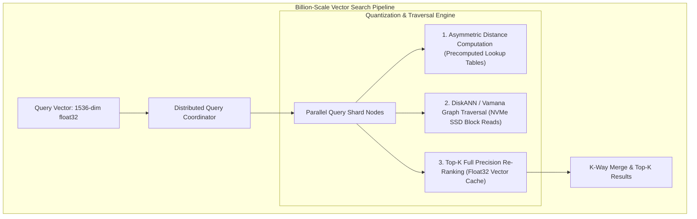
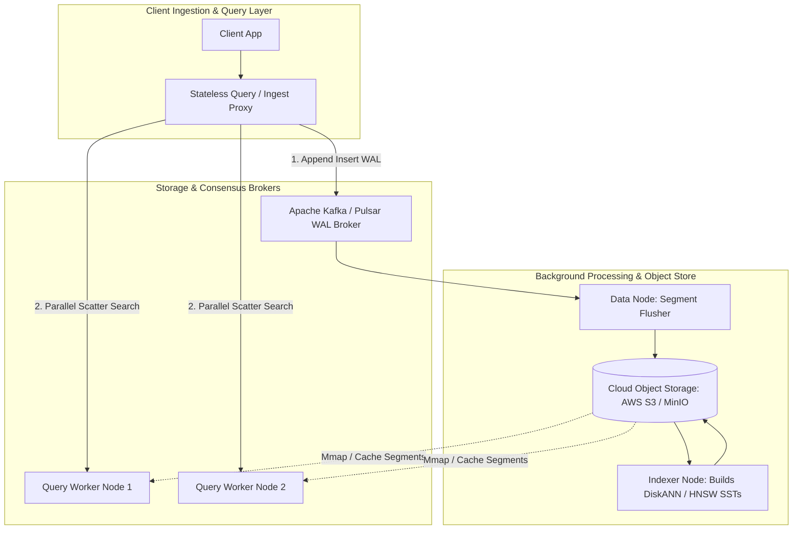

# The Architecture of Distributed Vector Databases at Scale: HNSW Graphs, Product Quantization (PQ) & DiskANN across 1 Billion Embeddings

In the modern AI infrastructure stack (**Milvus**, **Qdrant**, **Pinecone**, **pgvector**, **Weaviate**), vector similarity search has transformed from an experimental research tool into the foundational layer powering Retrieval-Augmented Generation (RAG), multimodal search, and recommendation engines.

However, scaling vector search from $100,000$ embeddings to **1 Billion high-dimensional vectors** introduces a massive infrastructure bottleneck.

One billion 1536-dimensional `float32` embeddings (the standard OpenAI embedding dimensionality) require:

$$\text{Raw Embedding Footprint} = 10^9 \times 1536 \times 4 \text{ bytes} \approx \mathbf{6.14 \text{ Terabytes of uncompressed data}}$$

If stored as an in-memory **Hierarchical Navigable Small World (HNSW)** graph, adjacency list pointer overhead inflates the RAM requirement to over **$10\text{ to }12\text{ Terabytes}$**, costing tens of thousands of dollars per month in memory-heavy cloud instances.

This article details how modern distributed vector databases achieve sub-$10\text{ms}$ recall across 1 billion vectors using **Product Quantization (PQ)**, **Asymmetric Distance Computation (ADC)**, **DiskANN SSD-optimized graph traversal**, and **disaggregated compute-storage architectures**.



---

## 🗜️ 1. Product Quantization (PQ) & Asymmetric Distance Math

**Product Quantization (PQ)** (Jégou et al.) is the algorithmic cornerstone of vector compression, reducing RAM footprints by up to **$95\%$** with minimal loss in search recall.

```
Original Vector (1536-dim float32 = 6,144 bytes):
[ -0.042, 0.183, ... | 0.921, -0.401, ... | ... | 0.005, 0.771, ... ]
  \________________/   \________________/         \________________/
     Sub-vector 1         Sub-vector 2               Sub-vector M (e.g. M = 96)
          |                    |                          |
          v                    v                          v
     Quantized to         Quantized to               Quantized to
     Centroid #42         Centroid #189              Centroid #12
     (1 byte)             (1 byte)                   (1 byte)
     
Compressed Vector Code = [ 42, 189, ..., 12 ]  ---> Total: 96 bytes (64x Compression!)
```

### The PQ Algorithm:
1. **Space Decomposition**: Divide the $D$-dimensional vector space ($D = 1536$) into $M$ orthogonal sub-vectors of dimension $d = D/M$ (e.g., $M = 96 \implies d = 16$).
2. **K-Means Clustering**: Run K-Means independently on each sub-space to identify $K = 256$ centroids ($2^8 = 8\text{ bits} = 1\text{ byte}$ per sub-vector).
3. **Vector Quantization**: Replace each $16\text{-dimensional}$ sub-vector with the $1\text{-byte}$ index of its closest centroid.
4. **Compression Ratio**:
   $$\text{Original Size} = 1536 \times 4 = 6,144 \text{ bytes} \longrightarrow \text{PQ Size} = 96 \text{ bytes} \quad (\mathbf{64\times \text{ Compression}})$$

### Asymmetric Distance Computation (ADC)
When a user submits an uncompressed query vector $\vec{q}$:
1. The database computes the exact Euclidean distance from $\vec{q}$'s sub-vectors to all $256$ centroids in each of the $M$ sub-spaces, storing them in an $M \times 256$ **Distance Lookup Table**.
2. Calculating the approximate distance to any compressed vector requires zero floating-point vector multiplications—only **$M$ array table lookups and integer additions**:

$$\text{Dist}(\vec{q}, \vec{x}_{\text{compressed}}) \approx \sum_{m=1}^M \text{LookupTable}[m][\vec{x}_{\text{compressed}}[m]]$$

---

## 💾 2. DiskANN & The Vamana Graph Protocol

To completely overcome the RAM ceiling, **DiskANN** (Microsoft Research, Subramanya et al.) stores the graph structure and compressed vectors on fast **NVMe SSDs** rather than in RAM.

```mermaid
graph LR
  subgraph In-Memory Cache (~10% RAM)
    Mem[Compressed PQ Vectors + Fast Entry Point Index]
  end
  
  subgraph NVMe SSD Disk Layout (90% Cold)
    SSD[Vamana Graph Nodes + Full Precision 1536-dim Vectors]
  end
  
  Query[Query Vector] --> Mem
  Mem -->|Greedy Beam Search Routing| SSD
  SSD -->|Zero-Copy io_uring Asynchronous Sector Reads| TopK[Top-K Nearest Neighbors]
```

### The Vamana Graph Advantage over HNSW:
* **HNSW Limitation**: HNSW maintains multiple hierarchical layers (Layer 0, Layer 1, Layer 2), requiring random memory pointer dereferences that cause catastrophic disk thrashing if stored on SSDs.
* **Vamana Solution**: DiskANN uses a single-layer flat graph called **Vamana** with an **$\alpha$-pruned edge selection heuristic**:
  * Edges are selected not just by proximity, but by **directional diversity** ($\alpha \ge 1.0$).
  * A single node has both short-range local neighbors and long-range highway edges, allowing the greedy search to jump across the dataset in very few sequential disk sector reads ($< 8\text{ NVMe I/O operations per query}$).

---

## 🌐 3. Distributed Cluster Topology: Milvus & Qdrant at Scale

At enterprise scale, vector databases decouple stateful storage from stateless compute nodes:



### Architectural Responsibilities:
1. **Stateless Query Nodes**: Hold cached DiskANN/PQ segments in local NVMe storage and execute ADC beam searches in parallel across assigned shards.
2. **Log Broker (Kafka / Pulsar)**: Serves as the distributed Write-Ahead Log, guaranteeing $100\%$ durability for incoming vectors before they are indexed.
3. **Indexer Nodes**: Asynchronously pull raw vector segments from S3, compute K-Means PQ centroids, construct Vamana graph files, and upload immutable indexed segments back to S3.

---

## 🛠️ Python Implementation: Product Quantization (PQ) & ADC Search Engine

Here is a complete Python implementation demonstrating a Product Quantization (PQ) encoder and Asymmetric Distance Computation (ADC) search engine:

```python
import numpy as np
from typing import List, Tuple

class ProductQuantizer:
    """
    Product Quantization (PQ) Engine:
    Decomposes D-dimensional vectors into M sub-vectors and clusters via K-Means.
    """
    def __init__(self, d_dim: int = 64, m_subvectors: int = 8, k_centroids: int = 16):
        assert d_dim % m_subvectors == 0, "Dimension must be divisible by m_subvectors"
        self.d_dim = d_dim
        self.m = m_subvectors
        self.d_sub = d_dim // m_subvectors
        self.k = k_centroids
        # Centroids tensor: [M, K, d_sub]
        self.codebooks = np.zeros((self.m, self.k, self.d_sub), dtype=np.float32)

    def fit(self, training_vectors: np.ndarray, iterations: int = 10):
        print(f" 🧠 [PQ Training] Fitting {self.m} sub-spaces with K={self.k} centroids each...")
        N = training_vectors.shape[0]
        
        for m in range(self.m):
            # Extract sub-vectors for m-th sub-space: [N, d_sub]
            sub_vecs = training_vectors[:, m * self.d_sub : (m + 1) * self.d_sub]
            
            # Simple K-Means clustering
            random_indices = np.random.choice(N, self.k, replace=False)
            centroids = sub_vecs[random_indices].copy()

            for _ in range(iterations):
                # Calculate distances to centroids: [N, K]
                dists = np.linalg.norm(sub_vecs[:, np.newaxis, :] - centroids[np.newaxis, :, :], axis=2)
                assignments = np.argmin(dists, axis=1)
                
                # Recompute centroids
                for k in range(self.k):
                    assigned_vecs = sub_vecs[assignments == k]
                    if len(assigned_vecs) > 0:
                        centroids[k] = assigned_vecs.mean(axis=0)

            self.codebooks[m] = centroids
        print(" ✨ [PQ Training Complete] Codebooks successfully constructed.")

    def encode(self, vectors: np.ndarray) -> np.ndarray:
        """
        Compresses vectors into M-byte codes: [N, D] -> [N, M] (uint8)
        """
        N = vectors.shape[0]
        codes = np.zeros((N, self.m), dtype=np.uint8)

        for m in range(self.m):
            sub_vecs = vectors[:, m * self.d_sub : (m + 1) * self.d_sub]
            # Compute distance to centroids in m-th sub-space: [N, K]
            dists = np.linalg.norm(sub_vecs[:, np.newaxis, :] - self.codebooks[m][np.newaxis, :, :], axis=2)
            codes[:, m] = np.argmin(dists, axis=1)

        return codes

    def compute_adc_distance_table(self, query_vector: np.ndarray) -> np.ndarray:
        """
        Builds Distance Lookup Table: [M, K]
        """
        lut = np.zeros((self.m, self.k), dtype=np.float32)
        for m in range(self.m):
            q_sub = query_vector[m * self.d_sub : (m + 1) * self.d_sub]
            # Distance from query sub-vector to all K centroids: [K]
            lut[m] = np.sum((self.codebooks[m] - q_sub) ** 2, axis=1)
        return lut

    def search_adc(self, query_vector: np.ndarray, compressed_dataset: np.ndarray, top_k: int = 5) -> List[Tuple[int, float]]:
        """
        Asymmetric Distance Computation (ADC): Fast table lookup per vector.
        """
        lut = self.compute_adc_distance_table(query_vector)
        N = compressed_dataset.shape[0]
        distances = np.zeros(N, dtype=np.float32)

        # Sum distances across all M sub-spaces using table lookups
        for m in range(self.m):
            centroid_indices = compressed_dataset[:, m]
            distances += lut[m, centroid_indices]

        top_indices = np.argsort(distances)[:top_k]
        return [(int(idx), float(distances[idx])) for idx in top_indices]

# Demonstration Execution
if __name__ == "__main__":
    np.random.seed(42)
    D = 64
    M = 8
    N = 10000

    print("🚀 Initializing 10,000 Vector Dataset (64-dim float32)...")
    dataset = np.random.randn(N, D).astype(np.float32)

    pq = ProductQuantizer(d_dim=D, m_subvectors=M, k_centroids=16)
    pq.fit(dataset[:2000]) # Train on 2k sample vectors

    compressed_db = pq.encode(dataset)
    
    raw_size_kb = dataset.nbytes / 1024
    compressed_size_kb = compressed_db.nbytes / 1024
    print(f"\n📊 Compression Benchmark:")
    print(f" • Raw Dataset Size       : {raw_size_kb:.2f} KB")
    print(f" • Compressed PQ Size     : {compressed_size_kb:.2f} KB ({raw_size_kb/compressed_size_kb:.1f}x Compression)")

    # Execute ADC Search
    query = np.random.randn(D).astype(np.float32)
    results = pq.search_adc(query, compressed_db, top_k=3)

    print("\n🔍 ADC Approximate Nearest Neighbor Results (Top-3):")
    for rank, (idx, dist) in enumerate(results, 1):
        print(f"   Rank {rank}: Vector ID #{idx:<5} | Approx L2 Sq Distance: {dist:.4f}")
```

---

## 📊 Summary: Vector Indexing Trade-Offs

| Vector Index | RAM Footprint | Search Latency (p99) | Recall @ 10 | Scaling Limit |
|---|---|---|---|---|
| **Flat (Exact Brute Force)** | $100\%$ ($6.1\text{ TB}$) | $> 500\text{ms}$ (Unusable) | $100\%$ | $< 1\text{M}$ vectors |
| **In-Memory HNSW Graph** | $150\%\text{--}200\%$ ($10\text{ TB}$) | $< 2\text{ms}$ (Ultra Fast) | $98\%\text{--}99\%$ | $10\text{M}\text{--}50\text{M}$ vectors / node |
| **Product Quantization (PQ)** | $1.5\%\text{--}5\%$ ($150\text{ GB}$) | $< 5\text{ms}$ (Lookup Table) | $85\%\text{--}92\%$ | $100\text{M}\text{--}500\text{M}$ vectors |
| **DiskANN (Vamana on SSD)** | $5\%\text{--}10\%$ ($300\text{ GB}$) | $< 8\text{ms}$ (NVMe Sector Reads) | $95\%\text{--}98\%$ | **1 Billion+ vectors** |

---

## 🏁 Architectural Takeaway
Scaling vector databases to 1 billion embeddings is fundamentally a problem of **memory economics and I/O layout**.

By combining **Product Quantization** to reduce vector dimensionality in memory with **DiskANN Vamana graphs** on high-throughput NVMe SSDs, modern AI engineering platforms achieve sub-10ms similarity search at a fraction of traditional cloud infrastructure costs.
