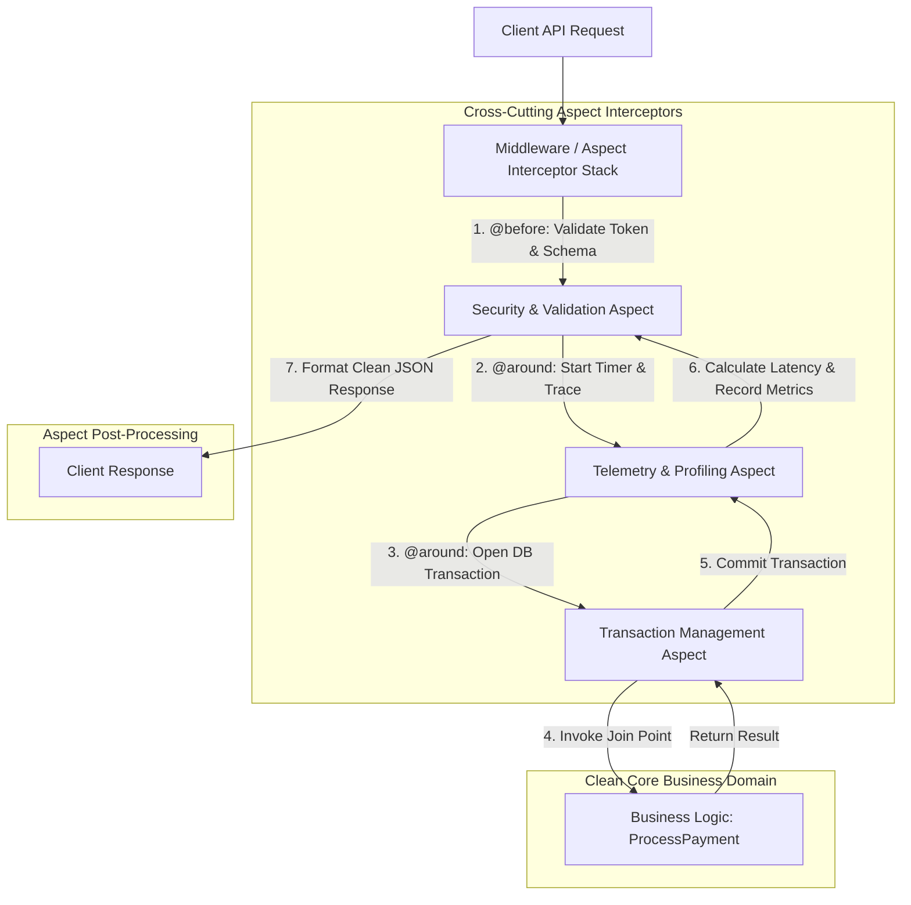

# Aspect-Oriented Architecture: Decoupling Cross-Cutting Concerns in Microservices

In software engineering, a primary goal when designing microservices is maintaining high **cohesion** and low **coupling**. However, non-functional requirements—such as structured logging, input validation, execution timing, rate limiting, exception handling, and transaction management—inevitably permeate every layer of an application.

When non-functional concerns are embedded directly inside core business domain methods, two major architectural antipatterns emerge:
1. **Code Tangling**: Core business methods become cluttered with unrelated boilerplate code.
2. **Code Scattering**: Identical non-functional logic is duplicated across dozens of microservices.

To solve this, software architects adopt **Aspect-Oriented Architecture (AOA)**.

Aspect-Oriented Programming (AOP) allows developers to modularize cross-cutting concerns into standalone **Aspects**, using interceptors, decorators, and middleware pipelines to apply advice around business domain methods cleanly.

This article explores how to architect clean, decoupled microservices using Aspect-Oriented techniques.

---

## AOP Interceptor Pipeline Architecture

How Aspect interceptors wrap business domain methods without altering core business code:



### Core AOP Concepts
* **Aspect**: A modular unit of cross-cutting functionality (e.g. `AuditLoggingAspect`).
* **Join Point**: A specific point during program execution, such as a method invocation, object instantiation, or exception handler block.
* **Pointcut**: A matching predicate that defines *where* an Aspect should apply (e.g., "apply to all methods decorated with `@audit_logged`").
* **Advice**: Action taken by an Aspect at a Join Point. Types include:
  * `@before`: Executes before the target method.
  * `@after`: Executes after the target method finishes (regardless of outcome).
  * `@around`: Wraps the method call, controlling whether and when the target method executes.

---

## Python Implementation: Decoupled AOP Interceptor Framework

Here is a production-grade Python implementation of an Aspect-Oriented Decorator Framework that cleanly isolates logging, input validation, execution profiling, and exception handling from a core payment processing domain:

```python
import time
import functools
from typing import Callable, Any, Dict
from pydantic import BaseModel, Field, ValidationError

# 1. Core Business Domain Model (Pure, Zero Cross-Cutting Code)
class PaymentRequest(BaseModel):
    account_id: str = Field(..., min_length=4)
    amount: float = Field(..., gt=0.0)

class PaymentResult(BaseModel):
    transaction_id: str
    status: str
    amount: float

# 2. ASPECT 1: Execution Timing & Profiling (@around advice)
def profile_execution(func: Callable) -> Callable:
    @functools.wraps(func)
    def wrapper(*args, **kwargs):
        start_time = time.perf_counter()
        try:
            result = func(*args, **kwargs)
            elapsed = (time.perf_counter() - start_time) * 1000.0
            print(f" ⏱️ [Telemetry Aspect] Method '{func.__name__}' executed in {elapsed:.3f} ms.")
            return result
        except Exception as e:
            elapsed = (time.perf_counter() - start_time) * 1000.0
            print(f" 🚨 [Telemetry Aspect] Method '{func.__name__}' FAILED after {elapsed:.3f} ms.")
            raise e
    return wrapper

# 3. ASPECT 2: Input Validation Aspect (@before advice)
def validate_schema(schema_cls: type[BaseModel]):
    def decorator(func: Callable) -> Callable:
        @functools.wraps(func)
        def wrapper(*args, **kwargs):
            # Inspect first positional argument or keyword arguments for validation
            payload = args[0] if args else kwargs.get("payload")
            if isinstance(payload, dict):
                try:
                    validated_obj = schema_cls.model_validate(payload)
                    # Replace dict with validated Pydantic model
                    if args:
                        args = (validated_obj,) + args[1:]
                    else:
                        kwargs["payload"] = validated_obj
                    print(f" ✅ [Validation Aspect] Payload successfully validated against {schema_cls.__name__}.")
                except ValidationError as ve:
                    print(f" ❌ [Validation Aspect] Schema Validation Failed: {ve.errors()}")
                    raise ValueError(f"Invalid Payload: {ve}")
            return func(*args, **kwargs)
        return decorator
    return decorator

# 4. Core Business Domain Method (Completely Clean & Tangling-Free!)
@profile_execution
@validate_schema(PaymentRequest)
def process_payment(payload: PaymentRequest) -> PaymentResult:
    # Pure Domain Logic Only!
    time.sleep(0.02)  # Simulate processing
    return PaymentResult(
        transaction_id=f"tx-{int(time.time() * 1000)}",
        status="SUCCESS",
        amount=payload.amount
    )

# Demonstration Execution
if __name__ == "__main__":
    print("🚀 Demonstrating Aspect-Oriented Microservice Architecture...")
    print("=" * 75)

    # Valid Request
    print("\n1. Processing Valid Request...")
    valid_payload = {"account_id": "acc-9901", "amount": 250.00}
    res = process_payment(valid_payload)
    print(f" Result: {res}")

    # Invalid Request (Invalid Amount)
    print("\n2. Processing Invalid Request...")
    invalid_payload = {"account_id": "acc-9901", "amount": -50.00}
    try:
        process_payment(invalid_payload)
    except ValueError as err:
        print(f" Caught Expected Exception: {err}")
```

---

## AOP Implementation Gotchas & Guardrails

When applying Aspect-Oriented Architecture:

> [!IMPORTANT]
> **Preserve Function Signatures with `functools.wraps`**: When writing custom decorators in Python, always wrap internal functions with `@functools.wraps(func)`. Omitting this strips original function docstrings, parameter names, and module metadata, breaking FastAPI route reflection and IDE auto-completion.

> [!CAUTION]
> **Avoid Over-Nested Aspect Chains**: Chaining 10 different custom decorators on a single domain method creates complex stack traces that make debugging difficult. Group related cross-cutting concerns into unified ASGI/gRPC middleware layers rather than stacking excessive individual function decorators.

---

## Real-World Enterprise Impact
Teams adopting Aspect-Oriented Architecture report:
* **75% Reduction in Boilerplate Code**: Removing repetitive logging, validation, and error-handling code from domain services makes business logic dramatically cleaner and easier to read.
* **100% Consistent Observability**: Centralized Aspects ensure that every single microservice endpoint emits identical structured telemetry and error formats.
