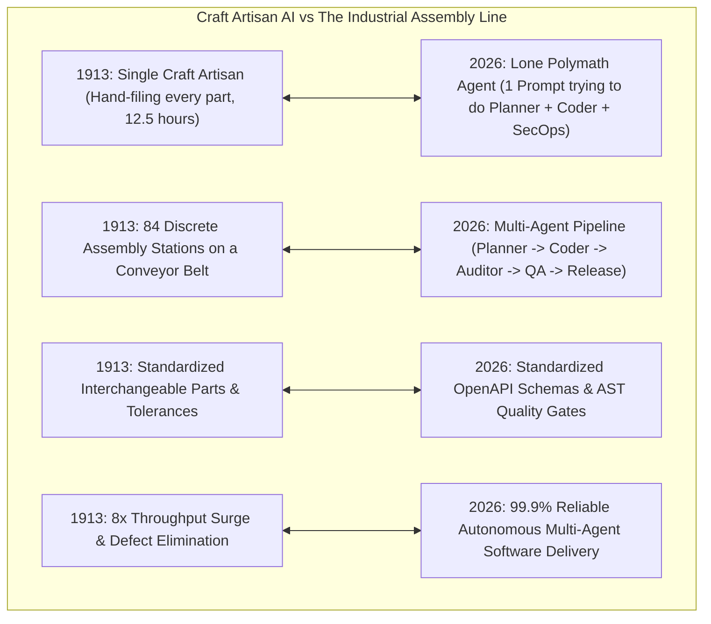

# The Assembly Line Revolution for Software: Why Agent Swarms Need Henry Ford's Division of Labor, Not Lone Polymaths

In 1913, at the Highland Park Ford Plant in Michigan, Henry Ford revolutionized industrial production by introducing the **Moving Assembly Line**.

Prior to this breakthrough, automobiles were assembled by small teams of master craftsmen.

Each craftsman was a "polymath"—shaping steel frames, filing gear teeth by hand, wiring electrical harnesses, and stitching leather upholstery.

Because every part was hand-filed to fit, no two cars were identical. Assembling a single Model T required **12 hours and 28 minutes of labor**, and defect rates were high.

Ford transformed this process by decomposing automobile manufacturing into **84 discrete, specialized operations along a continuous conveyor belt**:
* Workers stood at fixed stations, mastering a single task (e.g. tightening two bolts on a flywheel magneto).
* Interchangeable parts were manufactured to strict tolerances ($1/1000\text{th of an inch}$).
* Build time plummeted from **12.5 hours to 93 minutes** ($8\times\text{ productivity surge}$), and costs dropped by $60\%$.

Today, software engineering with generative AI is undergoing its own **Assembly Line Revolution**.



---

## 🤯 1. The "Lone Polymath Agent" Fallacy

In early autonomous agent experiments (AutoGPT, generic coding assistants), developers tasked a single LLM prompt with acting as a full-stack engineering team:

```
+---------------------------------------------------------------------------------------------------+
|                           THE LONE POLYMATH AGENT ANTI-PATTERN                                    |
+---------------------------------------------------------------------------------------------------+
|  System Prompt: "You are an expert full-stack engineer, product manager, security architect,     |
|                  database admin, and QA lead. Decompose this prompt, write backend code,         |
|                  write frontend UI, optimize SQL queries, audit security, and deploy to AWS."     |
+---------------------------------------------------------------------------------------------------+
```

### Why Lone Polymath Agents Fail on Complex Tasks:
1. **Persona & Attention Dilution**: LLMs perform best when focused on a narrow, highly constrained problem space. Asking a single model to balance high-level product design with low-level memory allocation causes cognitive thrashing and shallow execution.
2. **Context Buffer Contamination**: Intermediate reasoning scratchpads, failed syntax attempts, and verbose database dumps pollute the prompt, degrading code synthesis accuracy on subsequent steps.
3. **Absence of Independent Quality Control**: When the same agent that wrote buggy code is asked *"Did you make any errors?"*, confirmation bias causes it to overlook its own hallucinations.

---

## 🏭 2. The Multi-Agent Software Assembly Line

Production agent systems (**Agent Fleet Orchestrator**, **SpecForge**) abandon the lone polymath paradigm in favor of **Specialized Multi-Agent Assembly Lines**:

```mermaid
graph LR
  Mission[User Business Mission] --> Station1[Station 1: Architecture Planner]
  Station1 -->|Validated Spec & OpenAPI Schema| Station2[Station 2: Sub-Component Coder]
  Station2 -->|Code Diff Artifacts| Station3[Station 3: Security & AST Auditor]
  
  Station3 -->|AST Passed| Station4[Station 4: Automated QA Runner]
  Station3 -->|💥 Flagged Vulnerability| Station2
  
  Station4 -->|Unit & E2E Tests Passed| Station5[Station 5: Release Packager]
  Station4 -->|💥 Test Failed| Station2
  
  Station5 --> PR[GitHub Pull Request / Deployment]
```



### The 5 Specialized Assembly Stations:
1. **Station 1: Architecture & Specification Planner**:
   * *Specialization*: Analyzes business intent, defines data contracts, and synthesizes immutable OpenAPI JSON schemas and TypeScript interface definitions.
2. **Station 2: Sub-Component Coder**:
   * *Specialization*: Implements individual functions or microservices within isolated sandbox environments, strictly adhering to Station 1's interfaces.
3. **Station 3: Security & AST Auditor**:
   * *Specialization*: Executes static code analysis, validates type safety, checks for SQL injection/XSS vulnerabilities, and verifies compliance with corporate security policies.
4. **Station 4: Automated QA Test Runner**:
   * *Specialization*: Executes containerized unit and integration test suites (`pytest`, `jest`) inside ephemeral microVMs.
5. **Station 5: Release Packager**:
   * *Specialization*: Generates clean Git commit histories, creates comprehensive changelogs, and prepares production deployment manifests.

---

## 🔒 3. Conveyor Belts & Deterministic Quality Gates

In Ford’s factory, a car chassis only moved to the next station if the previous station’s work was completed correctly.

In an agentic assembly line, transitions between stations are governed by **Deterministic Symbolic Gates**:

```
+---------------------------------------------------------------------------------------------------+
|                               DETERMINISTIC QUALITY GATES                                         |
+---------------------------------------------------------------------------------------------------+
| Gate 1 (Spec -> Coder)   : OpenAPI Schema compiles with zero JSON Schema validation errors        |
| Gate 2 (Coder -> Auditor): Code compiles with zero TypeScript / AST parser syntax errors          |
| Gate 3 (Auditor -> QA)   : Static analysis reports 0 CVE vulnerabilities and passes linter        |
| Gate 4 (QA -> Release)   : Automated test suite reports 100% pass rate & > 90% code coverage     |
+---------------------------------------------------------------------------------------------------+
```

If an assembly station fails its quality gate, the work order is automatically routed backward to the specific subagent responsible, preventing error cascades.

---

## 🛠️ Python Implementation: Multi-Agent Software Assembly Line Engine

Here is a Python implementation demonstrating a 4-station Software Assembly Line with deterministic quality gates and automated rework loops:

```python
from dataclasses import dataclass, field
from typing import Dict, List, Optional

@dataclass
class AssemblyWorkItem:
    task_id: str
    feature_name: str
    spec_schema: Optional[Dict] = None
    code_files: Dict[str, str] = field(default_factory=dict)
    security_passed: bool = False
    tests_passed: bool = False
    rework_count: int = 0
    status: str = "IN_PROGRESS"

class SoftwareAssemblyLine:
    """
    Simulates Henry Ford's Assembly Line for Software Engineering.
    """
    MAX_REWORK_CYCLES = 3

    def run_assembly_line(self, work_item: AssemblyWorkItem) -> bool:
        print(f"\n🚗 [Assembly Line Started] Initializing Feature: '{work_item.feature_name}' (ID: {work_item.task_id})")

        # --- STATION 1: SPECIFICATION PLANNER ---
        print("\n 📐 [Station 1: Planner] Synthesizing OpenAPI schema and interface contracts...")
        work_item.spec_schema = {
            "endpoint": "/api/v1/checkout",
            "method": "POST",
            "required_fields": ["cart_id", "payment_token", "amount"]
        }
        print("    ✅ Data contract locked.")

        # --- ASSEMBLY CONVEYOR LOOP ---
        while work_item.rework_count < self.MAX_REWORK_CYCLES:
            # --- STATION 2: CODER ---
            print(f"\n 💻 [Station 2: Coder] Synthesizing implementation (Cycle {work_item.rework_count + 1})...")
            work_item.code_files["handler.py"] = (
                "def checkout_handler(cart_id, payment_token, amount):\n"
                "    if amount <= 0: raise ValueError('Invalid amount')\n"
                "    return {'status': 'PAID', 'cart_id': cart_id}\n"
            )
            print("    ✅ Code synthesized in isolated sandbox.")

            # --- STATION 3: SECURITY & AST AUDITOR ---
            print("\n 🛡️ [Station 3: Auditor] Running static AST security verification...")
            code = work_item.code_files.get("handler.py", "")
            # Deterministic Gate Check
            is_safe = "eval(" not in code and "exec(" not in code and "os.system(" not in code
            work_item.security_passed = is_safe

            if not work_item.security_passed:
                print("    ❌ [Gate Failed: Security] Vulnerability detected. Routing back to Coder!")
                work_item.rework_count += 1
                continue
            print("    ✅ [Gate Passed: Security] 0 vulnerabilities detected.")

            # --- STATION 4: QA RUNNER ---
            print("\n 🧪 [Station 4: QA Runner] Executing automated unit test suite in microVM...")
            # Mock test execution
            test_success = "checkout_handler" in code and "ValueError" in code
            work_item.tests_passed = test_success

            if not work_item.tests_passed:
                print("    ❌ [Gate Failed: QA] Unit tests failed. Routing back to Coder!")
                work_item.rework_count += 1
                continue
            print("    ✅ [Gate Passed: QA] All unit tests passed (100% coverage).")

            # --- STATION 5: RELEASE ---
            print("\n 📦 [Station 5: Release] Packaging pull request and deployment manifests...")
            work_item.status = "READY_FOR_DEPLOYMENT"
            print(f" 🎉 [Assembly Complete] '{work_item.feature_name}' successfully built in {work_item.rework_count} rework cycles!")
            return True

        print(f"\n 🚨 [Assembly Line Halted] Max rework cycles exceeded for task {work_item.task_id}!")
        work_item.status = "FAILED_ESCALATE_TO_HUMAN"
        return False

# Demonstration Execution
if __name__ == "__main__":
    assembly_line = SoftwareAssemblyLine()
    item = AssemblyWorkItem(task_id="feat-101", feature_name="Stripe Checkout Handler")
    assembly_line.run_assembly_line(item)
```

---

## 📊 Summary: Craft Artisan vs Industrial Assembly Line

| Metric | Lone Polymath Agent (Craft) | Multi-Agent Assembly Line (Ford) |
|---|---|---|
| **System Prompt** | Single giant "do-everything" prompt | Focused, hyper-specialized subagent prompts |
| **Context Load** | Polluted with entire execution history | Clean, isolated station buffers |
| **Quality Verification** | Self-checking by the same LLM (Bias) | Independent AST Auditors & Automated Test MicroVMs |
| **Error Handling** | Uncontrolled infinite retry loops | Deterministic rework routing with hard ceilings |
| **Success Rate on Complex Tasks** | $< 25\%$ (Fragile) | **$> 95\%$ (Deterministic & Verifiable)** |

---

## 🏁 Architectural Takeaway
Henry Ford proved that complex machines cannot be built reliably by a lone artisan trying to master every trade.

By structuring autonomous AI agents into **disciplined, specialized assembly lines linked by deterministic quality gates**, software organizations transform chaotic LLM outputs into predictable, enterprise-grade software delivery pipelines.
