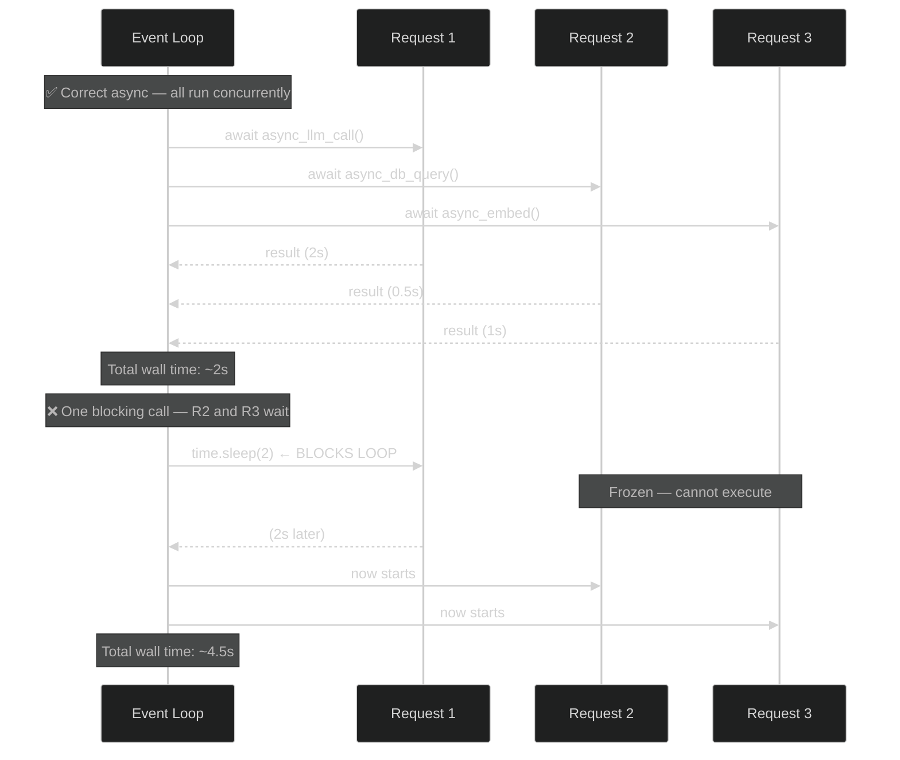

# Stop Handling Async Python Wrong: 8 Patterns That Block Your Event Loop

> [!NOTE]
> **📖 Article Overview**
> Python's `asyncio` is the backbone of every high-performance AI API — FastAPI, async Anthropic clients, async database drivers, SSE generators. Yet it's one of the most misused constructs in production Python codebases. The failure is always the same: a single blocking call buries the entire event loop, turning your async server into a slower-than-synchronous bottleneck. This article covers **8 async Python anti-patterns** that silently strangle your LLM API servers — with concrete fixes, benchmarks, and patterns for `asyncio.gather`, `TaskGroup`, `CancelledError`, and the `run_in_executor` escape hatch.

---

## How One Blocking Call Destroys Async Performance

The event loop is a single-threaded scheduler. When you call a blocking function inside a coroutine, the entire loop stalls — **no other coroutines run until the blocking call returns**. In a server handling 100 concurrent requests, one accidental `time.sleep(2)` inside a coroutine stalls all 100 requests for 2 seconds.



---

## Anti-Pattern 1: `time.sleep()` Inside a Coroutine

```python
# Blocks the entire event loop for 2 seconds
async def process_document(doc_id: str):
    result = await fetch_document(doc_id)
    time.sleep(2)  # ← BLOCKS — no other requests can run
    return await embed_document(result)

# Yields control back to the event loop
async def process_document(doc_id: str):
    result = await fetch_document(doc_id)
    await asyncio.sleep(2)  # ← Suspends this coroutine, loop runs others
    return await embed_document(result)
```

**Detection**: Search your codebase for `time.sleep` in any file containing `async def`. Every hit is a latency bomb.

---

## Anti-Pattern 2: Synchronous I/O in Async Context

**Symptom**: FastAPI endpoint is slower than a synchronous Flask equivalent. Adding more workers doesn't help.

```python
import requests  # ❌ Synchronous HTTP — blocks event loop
import psycopg2  # ❌ Synchronous Postgres driver

# Both of these block the event loop
async def bad_handler():
    response = requests.get("https://api.example.com/data")  # Blocks!
    conn = psycopg2.connect(DATABASE_URL)                     # Blocks!
    return response.json()

# Use async equivalents
import httpx
import asyncpg

async def good_handler():
    async with httpx.AsyncClient() as client:
        response = await client.get("https://api.example.com/data")  # Non-blocking
    
    conn = await asyncpg.connect(DATABASE_URL)  # Non-blocking
    return response.json()
```

**The async alternatives map:**

| Blocking (❌) | Async Alternative (✅) |
|--------------|----------------------|
| `requests` | `httpx.AsyncClient` |
| `psycopg2` | `asyncpg` or `psycopg3` (async mode) |
| `redis-py` (sync) | `redis.asyncio` |
| `boto3` (sync) | `aioboto3` |
| `open()` / file I/O | `aiofiles` |
| `time.sleep()` | `asyncio.sleep()` |

---

## Anti-Pattern 3: `asyncio.run()` Inside an Already-Running Loop

**Symptom**: `RuntimeError: This event loop is already running` — common when mixing Jupyter notebooks, FastAPI, and async library code.

```python
# asyncio.run() creates a NEW event loop — crashes if one is already running
async def call_llm(prompt: str):
    result = asyncio.run(some_async_function())  # RuntimeError in FastAPI context!
    return result

# Just await it — you're already in an async context
async def call_llm(prompt: str):
    result = await some_async_function()
    return result

# If you genuinely need to call async code from sync context:
import asyncio

def sync_wrapper(coro):
    """Call async code from synchronous context safely."""
    try:
        loop = asyncio.get_event_loop()
        if loop.is_running():
            # Use thread pool to avoid nested loop issue
            import concurrent.futures
            with concurrent.futures.ThreadPoolExecutor() as pool:
                future = pool.submit(asyncio.run, coro)
                return future.result()
        return loop.run_until_complete(coro)
    except RuntimeError:
        return asyncio.run(coro)
```

---

## Anti-Pattern 4: Sequential `await` When You Need Concurrency

**Symptom**: Calling 5 embedding APIs takes 5x longer than calling 1. You're awaiting them one at a time.

```python
# Sequential — takes 5 × latency
async def embed_all_sequential(texts: list[str]) -> list[list[float]]:
    results = []
    for text in texts:
        embedding = await embed_single(text)  # Waits for each before starting next
        results.append(embedding)
    return results

# Concurrent — takes max(individual latencies)
async def embed_all_concurrent(texts: list[str]) -> list[list[float]]:
    tasks = [embed_single(text) for text in texts]
    return await asyncio.gather(*tasks)

# With error handling — gather fails fast by default
async def embed_all_safe(texts: list[str]) -> list[list[float] | Exception]:
    tasks = [embed_single(text) for text in texts]
    results = await asyncio.gather(*tasks, return_exceptions=True)
    
    for i, result in enumerate(results):
        if isinstance(result, Exception):
            print(f"[Embed] Text {i} failed: {result}")
            results[i] = []  # Fallback to empty vector
    
    return results

# Python 3.11+ TaskGroup — cancels all siblings on first failure
async def embed_all_taskgroup(texts: list[str]) -> list[list[float]]:
    results = [None] * len(texts)
    
    async with asyncio.TaskGroup() as tg:
        async def embed_and_store(i: int, text: str):
            results[i] = await embed_single(text)
        
        for i, text in enumerate(texts):
            tg.create_task(embed_and_store(i, text))
    
    return results
```

---

## Anti-Pattern 5: Swallowing `CancelledError`

**Symptom**: FastAPI takes 30+ seconds to shut down gracefully. Uvicorn hangs on SIGTERM. Background tasks run indefinitely after shutdown is requested.

**Root cause**: `CancelledError` is how asyncio signals a coroutine to stop. Catching it with a bare `except Exception` swallows it — the coroutine never terminates.

```python
# Swallows CancelledError — coroutine NEVER stops when cancelled
async def stream_tokens():
    try:
        async for token in llm_stream():
            yield token
    except Exception:  # CancelledError is a subclass of BaseException, not Exception!
        pass           # ← CancelledError IS caught here in Python < 3.8, silently

# Also wrong in Python 3.8+
async def background_worker():
    while True:
        try:
            await do_work()
        except Exception as e:
            print(f"Error: {e}")
            # CancelledError not re-raised — worker loops forever after cancellation

# Always re-raise CancelledError
async def background_worker():
    while True:
        try:
            await do_work()
        except asyncio.CancelledError:
            print("[Worker] Cancellation received — shutting down cleanly")
            await cleanup_resources()
            raise  # ← MUST re-raise so the event loop knows we stopped
        except Exception as e:
            print(f"[Worker] Error (continuing): {e}")

# Or use BaseException to catch everything including CancelledError
async def stream_tokens():
    try:
        async for token in llm_stream():
            yield token
    except asyncio.CancelledError:
        await close_llm_connection()
        raise
    except Exception as e:
        print(f"Stream error: {e}")
```

---

## Anti-Pattern 6: Blocking CPU Work Without `run_in_executor`

**Symptom**: Embedding large batches with a local SentenceTransformer model blocks your entire FastAPI server during inference — all other requests queue up for 2-10 seconds.

**Root cause**: CPU-bound work (numpy operations, PyTorch inference, JSON serialisation of huge payloads) holds the GIL and blocks the event loop just like I/O blocking calls.

```python
import asyncio
from concurrent.futures import ThreadPoolExecutor, ProcessPoolExecutor
from sentence_transformers import SentenceTransformer
import numpy as np

model = SentenceTransformer("all-MiniLM-L6-v2")

# Blocks the event loop during model inference
async def embed_blocking(texts: list[str]) -> np.ndarray:
    return model.encode(texts)  # CPU-bound — blocks everything!

# Run CPU work in a thread pool — releases the event loop
thread_pool = ThreadPoolExecutor(max_workers=4)

async def embed_nonblocking(texts: list[str]) -> np.ndarray:
    loop = asyncio.get_event_loop()
    return await loop.run_in_executor(
        thread_pool,
        lambda: model.encode(texts, batch_size=32)
    )

# For truly CPU-heavy work (no GIL sharing needed): process pool
process_pool = ProcessPoolExecutor(max_workers=2)

def cpu_intensive_task(data: bytes) -> dict:
    """Pure CPU work — runs in separate process, bypasses GIL entirely."""
    import json, hashlib
    return {"hash": hashlib.sha256(data).hexdigest(), "size": len(data)}

async def run_cpu_task(data: bytes) -> dict:
    loop = asyncio.get_event_loop()
    return await loop.run_in_executor(process_pool, cpu_intensive_task, data)
```

---

## Anti-Pattern 7: Creating Tasks Without Storing References

**Symptom**: Background tasks silently disappear. Fire-and-forget tasks get garbage collected before completion.

```python
# Task may be garbage collected before it completes
async def handle_request(user_id: str, prompt: str):
    asyncio.create_task(log_to_analytics(user_id, prompt))  # Reference lost immediately!
    return await generate_response(prompt)

# Keep a strong reference to background tasks
_background_tasks: set[asyncio.Task] = set()

async def handle_request(user_id: str, prompt: str):
    task = asyncio.create_task(log_to_analytics(user_id, prompt))
    _background_tasks.add(task)
    task.add_done_callback(_background_tasks.discard)  # Auto-cleanup when done
    
    return await generate_response(prompt)
```

---

## Anti-Pattern 8: Not Setting Timeouts on Awaited Calls

**Symptom**: A slow third-party API call hangs indefinitely. Your server runs out of connections waiting for a response that never comes.

```python
# No timeout — hangs forever if external service is unresponsive
async def fetch_context(query: str):
    return await external_search_api(query)  # What if this takes 5 minutes?

# Always set timeouts on external awaited calls
async def fetch_context(query: str, timeout_seconds: float = 5.0):
    try:
        return await asyncio.wait_for(
            external_search_api(query),
            timeout=timeout_seconds
        )
    except asyncio.TimeoutError:
        print(f"[Timeout] Search API exceeded {timeout_seconds}s — using fallback")
        return []  # Return empty context instead of hanging

# Timeout on gather — cancel all if any exceeds limit
async def parallel_with_timeout(tasks: list, timeout: float = 10.0):
    try:
        return await asyncio.wait_for(
            asyncio.gather(*tasks, return_exceptions=True),
            timeout=timeout
        )
    except asyncio.TimeoutError:
        print("[Timeout] Parallel task group exceeded time limit")
        return [None] * len(tasks)
```

---

## Conclusion & Key Takeaways

Async Python is not automatically fast — it is fast only when every I/O operation correctly yields control back to the event loop. A single blocking call anywhere in a hot code path negates the entire benefit of async architecture.

*   **Audit aggressively**: Use `pytest-asyncio` with `anyio` or `asyncio-debugger` to detect accidental blocking calls in your test suite before they hit production.
*   **Default to `asyncio.gather`** for parallel I/O, `run_in_executor` for CPU work, and `TaskGroup` (Python 3.11+) when you need all-or-nothing semantics.
*   **Never suppress `CancelledError`** — it is how graceful shutdown works in every async Python server, including Uvicorn and Gunicorn with worker class `uvicorn.workers.UvicornWorker`.

---

### Research References & Resources
*   **Python asyncio Documentation**: [Coroutines and Tasks](https://docs.python.org/3/library/asyncio-task.html)
*   **FastAPI Concurrency Guide**: [Async and Await](https://fastapi.tiangolo.com/async/)
*   **Python 3.11 TaskGroup**: [PEP 654 — Exception Groups and except*](https://peps.python.org/pep-0654/)
