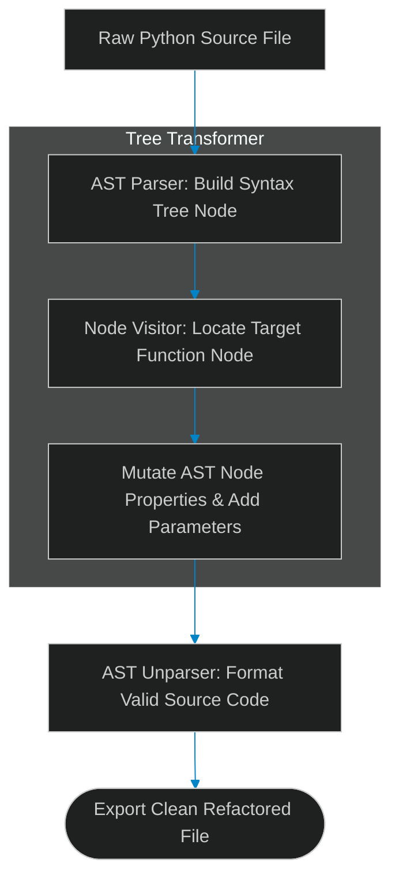

# AST Code Mutation: Parsing and Rewriting Source Code Trees

> [!NOTE]
> **📖 Article Overview**
> When autonomous AI coding agents refactor existing applications, relying on string replacement or regular expressions to modify source files is unsafe. String edits often introduce syntax errors, strip vital comments, or break indentation structures. To build robust software engineering agents, developers must manipulate **Abstract Syntax Trees (ASTs)**. By parsing source files into structured syntax trees, modifying node properties programmatically, and unparsing the tree back to valid code, agents can safely refactor complex modules. In this article, we implement an AST code transformer script in Python.

---

## The Danger of Regex-Based Code Refactoring

In basic AI coding agent setups:
* **The Syntax Corruption Risk**: Regex pattern matches fail when code spans multiple lines or contains complex parameter defaults.
* **Accidental Keyword Replacement**: Replacing strings like `user` can corrupt unrelated variable names such as `user_id_generator`.
* **The Solution**: **AST Node Mutation**. We parse code into structural syntax nodes. We locate target function nodes, update their parameter inputs or return statements, and export formatted code.



---

## 1. Navigating AST Node Trees

To transform code programmatically:
* **Parse Source to Nodes**: Convert raw code strings into python `ast.AST` representations.
* **Inherit NodeTransformer**: Subclass `ast.NodeTransformer` to locate specific node types, such as `ast.FunctionDef` or `ast.Call`.

---

## 2. Mutating Node Properties Safely

The AST transformer modifies nodes cleanly:
1. **Inject Function Arguments**: Append `ast.arg` elements to function definitions to update parameter signatures.
2. **Unparse Back to Source**: Utilize `ast.unparse()` to convert modified AST nodes into valid Python source code.

---

## Code Demo: AST Code Transformer

Below is a Python implementation of an AST code mutator. It parses source text, locates target function definitions, injects logging parameters, and unparses clean Python code.

```python
import ast
from typing import str

class FunctionSignatureTransformer(ast.NodeTransformer):
    def __init__(self, target_func_name: str, new_param_name: str):
        self.target_func_name = target_func_name
        self.new_param_name = new_param_name

    def visit_FunctionDef(self, node: ast.FunctionDef) -> ast.FunctionDef:
        # 1. Locate the target function node by name
        if node.name == self.target_func_name:
            print(f"🎯 [AST Transformer] Found target function node: '{node.name}'")
            
            # Check if parameter already exists to avoid duplicate injections
            existing_args = [arg.arg for arg in node.args.args]
            if self.new_param_name not in existing_args:
                # 2. Construct and inject a new argument node
                new_arg = ast.arg(arg=self.new_param_name, annotation=None)
                node.args.args.append(new_arg)
                print(f"   ➕ Injected parameter '{self.new_param_name}' into function signature.")

        # Continue traversing child nodes
        self.generic_visit(node)
        return node

def refactor_code_string(source_code: str, target_func: str, new_param: str) -> str:
    # Parse source string to AST representation
    parsed_ast = ast.parse(source_code)

    # Apply transformation pass
    transformer = FunctionSignatureTransformer(target_func, new_param)
    modified_ast = transformer.visit(parsed_ast)
    ast.fix_missing_locations(modified_ast)

    # Convert AST representation back to valid Python code
    return ast.unparse(modified_ast)

if __name__ == "__main__":
    # Sample python code string
    input_code = """def process_user_payment(user_id, amount):
    # Process payment transaction
    return True
"""

    print("🛡️ Executing AST Code Mutation Engine...")
    print("------------------------------------------")
    print("\n--- Original Source Code ---")
    print(input_code)

    refactored_code = refactor_code_string(
        source_code=input_code,
        target_func="process_user_payment",
        new_param="logger"
    )

    print("\n--- Refactored Source Code (AST Unparsed) ---")
    print(refactored_code)
```

---

## AST Mutation Takeaways

* **Manipulate Nodes, Not Strings**: Modify AST nodes directly to prevent syntax corruption and broken indentation.
* **Fix Location Headers**: Always run `ast.fix_missing_locations()` after mutating nodes to maintain source map data.
* **Safeguard Transformations**: Run syntax checks on unparsed outputs before saving files to disk.
