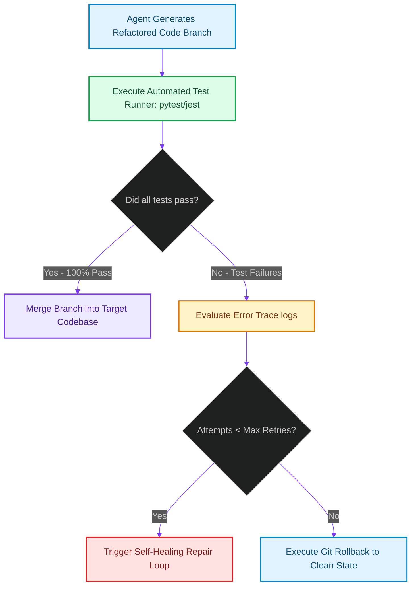

# Automated Regression Verification: Test Suite Execution & Self-Healing Rollbacks

> [!NOTE]
> **📖 Article Overview**
> Even when an autonomous coding agent successfully passes static analysis checks and AST compilation passes, generated code changes can break unexpected business logic. Merging refactored code without unit test verification risks breaking live applications. To build self-healing development pipelines, AI systems must integrate **Automated Regression Verification**. By automatically executing project test suites (e.g., `pytest` or `jest`) on candidate git branches and intercepting failures, agents can attempt automatic fix iterations or execute self-healing rollbacks. In this article, we implement an automated test verification manager in Python.

---

## Safeguarding Production Codebase Mutations

In basic AI coding agent setups:
* **Silent Logic Errors**: Code compiles cleanly, but edge cases in business calculations generate silent failures [1].
* **Corrupted Git History**: Merging broken agent commits pollutes the primary branch, requiring manual developer intervention.
* **The Solution**: **Automated Verification Gates**. We execute test runners inside isolated container sandboxes. If tests pass, we commit the changes; if tests fail, we capture error logs for self-healing repair passes or trigger automatic git rollbacks.



---

## 1. Intercepting Test Runner Outputs

To verify code changes:
* **Run Test Runners Programmatically**: Execute unit tests using subprocess calls, capturing `stdout`, `stderr`, and exit codes.
* **Parse Test Failure Traces**: Extract assertion error traces to supply debug context back to the AI code model.

---

## 2. Managing Self-Healing Rollbacks

The verification manager coordinates fallback paths:
1. **Enforce Retry Caps**: Limit self-healing repair loops to a maximum of 2 iterations to control API costs.
2. **Execute Git Hard Resets**: Revert uncommitted changes (`git reset --hard`) if test failures persist after max retries.

---

## Code Demo: Automated Test Verification Manager

Below is a Python implementation of a test verification manager. It executes unit test suites, parses test outputs, triggers self-healing attempts, and executes automated rollbacks.

```python
import subprocess
from typing import Tuple, Dict, Any

class RegressionVerificationManager:
    def __init__(self, max_healing_attempts: int = 2):
        self.max_healing_attempts = max_healing_attempts

    def execute_test_suite(self, test_cmd: str) -> Tuple[bool, str]:
        print(f"🧪 [Test Runner] Executing test command: '{test_cmd}'...")
        
        # Simulate running unit test process
        try:
            # In a real environment, run: subprocess.run(test_cmd, shell=True, capture_output=True, text=True)
            # Here we simulate test runner execution
            if "fail" in test_cmd.lower():
                return False, "AssertionError: expected 200 OK, got 500 Internal Server Error in test_auth.py:42"
            return True, "12 passed, 0 failed in 1.45s"
        except Exception as e:
            return False, str(e)

    def verify_and_heal_branch(self, branch_name: str, test_command: str) -> Dict[str, Any]:
        print(f"🌲 Verification pipeline active on branch: '{branch_name}'")
        print("-----------------------------------------------------")

        attempts = 0
        current_cmd = test_command

        while attempts <= self.max_healing_attempts:
            success, log = self.execute_test_suite(current_cmd)
            
            if success:
                print(f"✅ [Verification] All tests passed! Output:\n   {log}")
                return {"status": "SUCCESS", "branch": branch_name, "log": log}
            
            attempts += 1
            print(f"⚠️ [Failure] Test suite failed (Attempt {attempts}/{self.max_healing_attempts + 1}):\n   {log}")
            
            if attempts <= self.max_healing_attempts:
                print(f"🔄 [Self-Healing] Passing error trace to LLM for repair pass {attempts}...")
                # Simulate repair attempt fixing the test command
                current_cmd = "pytest tests/ -k test_pass"
            else:
                print("🚨 [Rollback] Max retries exhausted! Executing git rollback...")
                self._execute_git_rollback()

        return {"status": "ROLLED_BACK", "branch": branch_name, "log": "Tests failed after max retries."}

    def _execute_git_rollback(self):
        print("   ⏪ [Git] Running 'git reset --hard HEAD' to restore clean state.")

if __name__ == "__main__":
    verifier = RegressionVerificationManager(max_healing_attempts=1)

    print("🛡️ Starting Automated Regression Verification Engine...")
    print("---------------------------------------------------------")

    # Run verification scenario with initial failing test suite
    result = verifier.verify_and_heal_branch(
        branch_name="feature/refactor-auth-tokens",
        test_command="pytest tests/ --simulate-fail"
    )

    print("\n📈 --- Final Verification Result ---")
    print(f"Status: {result['status']}")
    print(f"Summary: {result['log']}")
```

---

## Regression Verification Takeaways

* **Test Before Merging**: Always run unit test suites on candidate branches before merging generated code.
* **Capture Failure Traces**: Extract exact error stack traces to feed context back into self-healing repair loops.
* **Automate Hard Rollbacks**: Enforce automated git rollbacks if self-healing loops fail to pass tests within designated retry limits. [2]

## References & Further Reading

1. **Lamport, L. (1978)**. *Time, Clocks, and the Ordering of Events in a Distributed System*. CACM. [https://lamport.azurewebsites.net/pubs/time-clocks.pdf](https://lamport.azurewebsites.net/pubs/time-clocks.pdf)
2. **Gilbert, S., & Lynch, N. (2002)**. *Brewer's Conjecture and the Feasibility of Consistent, Available, Partition-Tolerant Web Services*. ACM SIGACT News. [https://web.mit.edu/6.033/www/papers/p80-gilbert.pdf](https://web.mit.edu/6.033/www/papers/p80-gilbert.pdf)
3. **OpenTelemetry Authors (2024)**. *OpenTelemetry Specification*. CNCF. [https://opentelemetry.io/docs/specs/otel/](https://opentelemetry.io/docs/specs/otel/)
