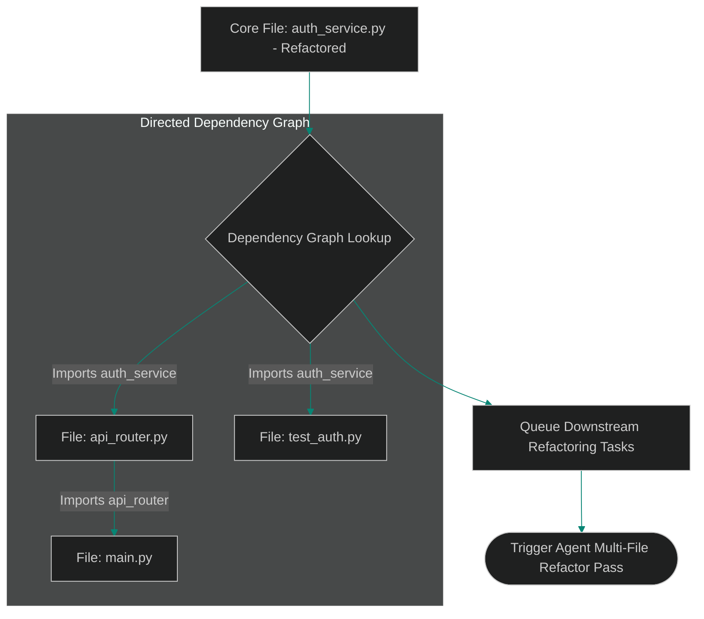

# Cross-Module Dependency Graphs: Resolving Multi-File Symbol References

> [!NOTE]
> **📖 Article Overview**
> In large software repositories, source files rarely exist in isolation. When an autonomous coding agent refactors a core interface or updates a data model parameter, the changes impact downstream modules across the entire project structure. Modifying a function in one file without updating its import call sites in dependent modules introduces broken imports and runtime errors. To execute multi-file refactorings safely, AI agents rely on **Cross-Module Dependency Graphs**. By mapping file import relationships into directed dependency graphs, agents isolate the exact set of files affected by a change. In this article, we implement a dependency graph parser in Python.

---

## The Danger of Isolated File Edits

In single-file AI editing configurations:
* **The Import Disconnect**: Modifying a utility function's return type breaks caller functions in separate package subdirectories.
* **Incomplete Refactoring**: The agent updates the core module but overlooks test suites and API handlers that import the modified symbol.
* **The Solution**: **Dependency Graph Analysis**. We parse import statements across all project modules, building a directed graph where nodes represent files and edges represent import dependencies.



---

## 1. Building the Module Import Graph

To map cross-file dependencies:
* **Extract Import Statements**: Scan Python source files for `import` and `from ... import` statements.
* **Construct Graph Adjacency Lists**: Maintain directed edges mapping imported modules to target caller files.

---

## 2. Resolving Downstream Affected Files

The dependency graph parser identifies impacted modules:
1. **Locate Target Node**: Select the file being refactored (e.g. `auth_service.py`).
2. **Traverse Dependents**: Perform a Breadth-First Search (BFS) to retrieve all upstream files that depend on the target symbol.

---

## Code Demo: Dependency Graph Compiler

Below is a Python implementation of a cross-module dependency graph parser. It extracts import statements, constructs dependency trees, and identifies downstream files affected by code changes.

```python
import ast
import os
from typing import Dict, Set, List

class ModuleDependencyGraph:
    def __init__(self):
        # Maps file path to set of imported module paths
        self.dependencies: Dict[str, Set[str]] = {}
        # Maps module path to set of dependent files (reverse lookup)
        self.reverse_dependents: Dict[str, Set[str]] = {}

    def parse_file_imports(self, file_path: str, source_code: str):
        self.dependencies[file_path] = set()
        tree = ast.parse(source_code)

        for node in ast.walk(tree):
            if isinstance(node, ast.Import):
                for alias in node.names:
                    self._add_dependency(file_path, alias.name)
            elif isinstance(node, ast.ImportFrom):
                if node.module:
                    self._add_dependency(file_path, node.module)

    def _add_dependency(self, caller_file: str, imported_module: str):
        self.dependencies[caller_file].add(imported_module)
        if imported_module not in self.reverse_dependents:
            self.reverse_dependents[imported_module] = set()
        self.reverse_dependents[imported_module].add(caller_file)

    def get_affected_files(self, target_module: str) -> List[str]:
        affected = set()
        queue = [target_module]

        print(f"🌲 [Graph Search] Tracing downstream dependents for module: '{target_module}'")
        
        while queue:
            current = queue.pop(0)
            dependents = self.reverse_dependents.get(current, set())
            for dep in dependents:
                if dep not in affected:
                    affected.add(dep)
                    queue.append(dep)

        return list(affected)

if __name__ == "__main__":
    graph = ModuleDependencyGraph()

    # Mock codebase files and their import statements
    files_mock = {
        "services/auth.py": "import utils.crypto\nimport models.user",
        "api/routes.py": "import services.auth\nimport utils.logger",
        "tests/test_auth.py": "import services.auth",
        "main.py": "import api.routes"
    }

    print("🛡️ Building Cross-Module Dependency Graph...")
    print("---------------------------------------------")

    for path, code in files_mock.items():
        graph.parse_file_imports(path, code)

    # Resolve files affected if 'services.auth' is refactored
    target = "services.auth"
    impacted = graph.get_affected_files(target)

    print(f"\n📈 --- Downstream Impact Analysis for '{target}' ---")
    print(f"Total Affected Files: {len(impacted)}")
    for f in impacted:
        print(f"   ⚠️ File requires inspection/refactoring: {f}")
```

---

## Dependency Graph Takeaways

* **Map Imports Before Editing**: Parse project import statements into a directed graph before performing codebase modifications.
* **Use BFS Traversal**: Execute Breadth-First Search traversals to capture multi-level downstream dependencies.
* **Audit Import Signatures**: Verify that call sites in caller files match updated module function signatures.
