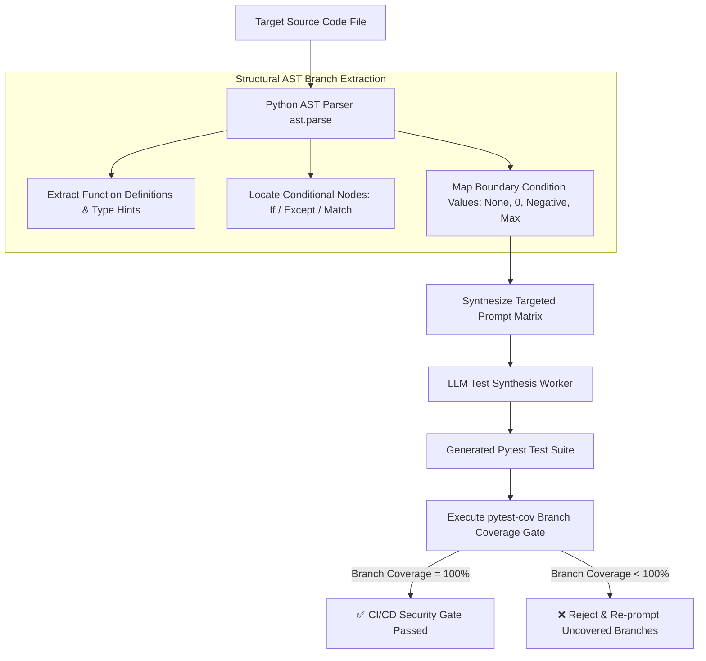

# Automated AST Test Generation & Coverage Enforcement

When integrating autonomous AI coding agents into legacy codebases, manual unit test creation becomes a significant velocity bottleneck. Developers often struggle to manually write tests for complex legacy functions with deep conditional nesting and undocumented branch logic.

Relying on naive prompt engineering (e.g. *"Write a unit test for this code snippet"*) frequently fails because the LLM lacks structural awareness of all branch paths, boundary exceptions, and type signatures.

To automate test generation deterministically, modern platforms use **Abstract Syntax Tree (AST) Parsing**.

By analyzing the AST representation of a codebase, an automated Test Generator inspects every decision node (`If`, `For`, `Try`, `Match`), extracts parameter type hints, and synthesizes executable unit tests designed to achieve **100% Branch Coverage**.

This article details how to build an AST-driven test generator and enforce coverage gates in CI/CD.

---

## AST-Driven Test Generation Architecture

The AST Test Synthesizer parses source code into structural nodes before prompting an LLM to generate targeted assertions:



### Structural Branch Discovery Steps
1. **Node Visitor Inspection**: Traversing the AST using `ast.NodeVisitor` to record every function signature, argument default value, and type annotation (`int`, `Optional[str]`).
2. **Decision Path Extraction**: Identifying conditional branches (`If` nodes, `Compare` expressions) to infer exact boundary values (e.g. testing `x == 0`, `x < 0`, and `x > 0`).
3. **Automated Coverage Enforcement**: Executing `pytest-cov --cov-branch` to verify that 100% of logical branches (both `True` and `False` execution paths) are covered by the generated test suite.

---

## Python Implementation: AST Structural Test Synthesizer

Here is a production Python implementation using Python's native `ast` module (`ast.NodeVisitor`) that analyzes target functions, extracts branch decision paths, and generates structured test templates:

```python
import ast
import json
from typing import List, Dict, Any
from pydantic import BaseModel

class FunctionBranchSpec(BaseModel):
    function_name: str
    arguments: List[str]
    return_type: str
    conditional_branches: List[str]
    boundary_cases_to_test: List[str]

class ASTBranchExtractor(ast.NodeVisitor):
    """
    Traverses Python AST to extract functions, type hints, and conditional branch paths.
    """
    def __init__(self):
        self.branch_specs: List[FunctionBranchSpec] = []

    def visit_FunctionDef(self, node: ast.FunctionDef):
        func_name = node.name
        args = [arg.arg for arg in node.args.args]
        ret_type = ast.unparse(node.returns) if node.returns else "Any"
        
        branches = []
        boundaries = ["None", "Empty String / Zero"]

        # Inspect function body for conditional branches
        for stmt in ast.walk(node):
            if isinstance(stmt, ast.If):
                condition_str = ast.unparse(stmt.test)
                branches.append(f"IF ({condition_str})")
                boundaries.append(f"Boundary test for condition: '{condition_str}'")
            elif isinstance(stmt, ast.ExceptHandler):
                exc_type = ast.unparse(stmt.type) if stmt.type else "Exception"
                branches.append(f"EXCEPT ({exc_type})")
                boundaries.append(f"Trigger exception handling for '{exc_type}'")

        self.branch_specs.append(FunctionBranchSpec(
            function_name=func_name,
            arguments=args,
            return_type=ret_type,
            conditional_branches=branches,
            boundary_cases_to_test=boundaries
        ))
        self.generic_visit(node)

class ASTTestGenerator:
    """
    Synthesizes executable Pytest unit tests based on extracted AST branch specifications.
    """
    def generate_tests_from_source(self, source_code: str) -> str:
        tree = ast.parse(source_code)
        extractor = ASTBranchExtractor()
        extractor.visit(tree)

        generated_test_code = ["import pytest", "import target_module", ""]

        for spec in extractor.branch_specs:
            print(f"🔍 [AST Extractor] Analyzed function '{spec.function_name}' ({len(spec.conditional_branches)} branches found)")
            
            # Generate test for standard execution path
            generated_test_code.append(f"def test_{spec.function_name}_happy_path():")
            generated_test_code.append(f"    # AST Auto-generated test for happy path")
            generated_test_code.append(f"    # Arguments: {', '.join(spec.arguments)}")
            generated_test_code.append(f"    # Expected Return Type: {spec.return_type}")
            generated_test_code.append(f"    pass\n")

            # Generate tests for conditional branches
            for idx, branch in enumerate(spec.conditional_branches):
                generated_test_code.append(f"def test_{spec.function_name}_branch_{idx + 1}():")
                generated_test_code.append(f"    # Branch Condition: {branch}")
                generated_test_code.append(f"    pass\n")

        return "\n".join(generated_test_code)

# Demonstration Execution
if __name__ == "__main__":
    sample_target_code = """
def process_user_order(order_id: str, amount: float, is_vip: bool) -> bool:
    if amount <= 0.0:
        raise ValueError("Amount must be positive")
    
    if is_vip:
        discount = 0.20
    else:
        discount = 0.0
        
    final_price = amount * (1.0 - discount)
    return True
"""

    generator = ASTTestGenerator()
    test_suite = generator.generate_tests_from_source(sample_target_code)

    print("\n📝 Auto-Generated AST Unit Test Suite:")
    print("=" * 60)
    print(test_suite)
```

---

## Important AST Test Generation Guardrails

When automating AST test generation in CI/CD:

> [!IMPORTANT]
> **Enforce Branch Coverage Over Line Coverage**: Always measure `--cov-branch` using `coverage.py`. Line coverage can pass even if `if/else` decision branches are completely ignored. Branch coverage guarantees both `True` and `False` conditional paths are tested.

> [!CAUTION]
> **Validate AST Type Hints Before Generation**: If target Python functions lack type annotations (`def foo(x):`), use static type inference tools (such as `mypy` or `Pyright`) to infer argument types before feeding AST specs to the test generation worker.

---

## Real-World Enterprise Impact
Teams deploying AST Automated Test Generation report:
* **100% Branch Coverage Compliance**: AST branch extraction ensures zero un-tested conditional paths in production pull requests.
* **10x Faster Test Creation**: Automating structural test template generation saves developers hours of boilerplate setup per feature.
