# Automated RAG Evals: Stress-Testing Pipelines with DeepEval and Synthetic Ground Truths

> [!NOTE]
> **📖 Article Overview**
> Prompt adjustments, database modifications, or embedding model switches can silently break your RAG application's response accuracy. To ship with confidence, we must transition from manual output verification to automated evaluation gates. This article details how to stress-test RAG pipelines using **DeepEval**, evaluating the core metrics—**Faithfulness**, **Answer Relevance**, and **Context Recall**—and provides a complete, runnable programmatic test suite in Python.

---

## The Silent Regression Problem in Generative AI

In traditional software engineering, we write unit tests with deterministic assertions: if input is $X$, verify output is $Y$. In RAG (Retrieval-Augmented Generation) applications, however, outputs are probabilistic. 

If you modify a system prompt template to improve formatting, you might silently trigger a regression: the model may start hallucinating facts, ignore the retrieved context, or fail to address the user's core question. Because these failures don't throw server errors, they often go unnoticed until users encounter them in production.

To solve this, we must build an **automated evaluation loop** inside our CI/CD pipelines. This loop runs our pipeline against a dataset of queries and validates the output using a programmatic test runner.

---

## The RAG Evaluation Lifecycle

A production-grade evaluation loop executes RAG queries, captures the inputs, retrieved context, and generated answers, and passes them to an LLM-as-a-judge model to compute score metrics.

```mermaid
%%{init: {'theme': 'dark', 'themeVariables': { 'primaryColor': '#0ea5e9', 'primaryTextColor': '#f3f4f6', 'primaryBorderColor': '#38bdf8', 'lineColor': '#0ea5e9', 'secondaryColor': '#111827', 'tertiaryColor': '#111827'}}}%%
graph TD
    A[Test Suite Triggered] --> B[Generate Synthetic Q&A Dataset]
    B --> C[Execute RAG Pipeline]
    
    C -->|Output| D[RAG Test Case]
    D -->|Input Query| E[DeepEval Test Runner]
    D -->|Retrieved Context| E
    D -->|Generated Output| E
    D -->|Reference Ground Truth| E
    
    E --> F{Evaluate Metrics}
    F -->|NLI Check| G[Faithfulness Metric]
    F -->|Semantic Alignment| H[Answer Relevance Metric]
    F -->|Overlap Indexing| I[Context Recall Metric]
    
    G --> J{Verify Thresholds}
    H --> J
    I --> J
    
    J -->|Score < 0.7| K[Fail: CI/CD Build Blocked]
    J -->|Score >= 0.7| L[Pass: Deploy to Production]

    style A fill:#1e293b,stroke:#0ea5e9,stroke-width:2px
    style C fill:#0f172a,stroke:#38bdf8,stroke-width:2px
    style E fill:#0ea5e9,stroke:#0f172a,stroke-width:2px,color:#0f172a
    style J fill:#1e293b,stroke:#a855f7,stroke-width:2px
    style K fill:#ef4444,stroke:#0f172a,stroke-width:2px
    style L fill:#10b981,stroke:#0f172a,stroke-width:2px
```



### Core Metrics to Measure
To isolate failure modes, we must score three distinct vectors (popularized by the RAG Triad):

1.  **Faithfulness (Groundedness)**: Checks if the generated answer is derived *strictly* from the retrieved context without hallucinating external data. (Score = $\frac{\text{Supported Claims}}{\text{Total Claims}}$).
2.  **Answer Relevance**: Evaluates how well the final output addresses the initial user query, penalizing redundant or off-topic tokens.
3.  **Context Recall (Retrieval Alignment)**: Measures whether the retriever successfully fetched all the necessary information required to answer the query, compared against a reference ground truth.

---

## What's Good & What's Not

| What's Good (Pros) | What's Not (Cons) |
| --- | --- |
| * Regression Security: Catches subtle changes in output formatting, hallucination, and recall. | * Token Cost Inflation: LLM-as-a-judge evaluation calls generate substantial API bills during test runs. |
| * Quantitative Verification: Replaces subjective review with concrete mathematical scores (0-1). | * Non-Deterministic Judges: Evaluators can output slightly different scores for identical runs. |
| * CI/CD Ingestion: Easily blocks deployments that fall below specified relevance thresholds. | * Test Maintenance Overhead: Requires generating and updating realistic reference ground truths. |

---

## Technical Implementation: RAG Testing with Pytest & DeepEval

Below is a complete, runnable test script (`test_rag_pipeline.py`) using **DeepEval** and **Pytest**. It simulates a RAG query run and evaluates it against our three core metrics, enforcing a strict passing threshold of $0.70$.

```python
import pytest
from deepeval import assert_test
from deepeval.test_case import LLMTestCase
from deepeval.metrics import FaithfulnessMetric, AnswerRelevanceMetric, ContextRecallMetric

# 1. Mocking a RAG Pipeline Output for Demonstration
# In a real test, you would import and run your indexing/retrieval code:
# retrieved_context, generated_output = run_rag_pipeline(query)
def mock_run_rag_pipeline(query: str):
    retrieved_context = [
        "The authentication service uses Redis token blacklists to manage session logouts. "
        "Tokens expire automatically after 24 hours, and blacklisted tokens are cached for 24 hours."
    ]
    generated_output = (
        "Session logouts are handled via a Redis token blacklist. "
        "The blacklisted tokens are cached and expire after 24 hours."
    )
    return retrieved_context, generated_output

def test_rag_accuracy():
    query = "How does the logout process handle token expiration and blacklisting?"
    ground_truth = (
        "The authentication service blacklists tokens in Redis during logout. "
        "These blacklisted tokens are retained in the cache for 24 hours until they expire."
    )
    
    # Run mock RAG query
    context, output = mock_run_rag_pipeline(query)
    
    # 2. Package Outputs into an LLM Test Case
    test_case = LLMTestCase(
        input=query,
        actual_output=output,
        retrieval_context=context,
        expected_output=ground_truth
    )

    # 3. Initialize Evaluator Metrics (Minimum passing threshold set to 0.7)
    threshold = 0.70
    
    # A. Faithfulness: checks if output matches retrieved context
    faithfulness_metric = FaithfulnessMetric(threshold=threshold, model="gpt-4o-mini")
    
    # B. Answer Relevance: checks if output addresses input query
    relevance_metric = AnswerRelevanceMetric(threshold=threshold, model="gpt-4o-mini")
    
    # C. Context Recall: checks if retrieved context aligns with ground truth
    recall_metric = ContextRecallMetric(threshold=threshold, model="gpt-4o-mini")

    # 4. Execute Assertions using DeepEval assert_test
    # This runs the LLM judges, calculates scores, and returns pytest status
    assert_test(test_case, [faithfulness_metric, relevance_metric, recall_metric])

# To execute this test case from the console:
# 1. Ensure keys are set: export OPENAI_API_KEY="your-key"
# 2. Run command: deepeval test run test_rag_pipeline.py
```

---

## Conclusion & Key Takeaways

Running evaluations is what separates toy AI projects from robust enterprise platforms. By writing automated test suites, you ensure your pipeline's search quality remains consistent as you scale.

*   **Establish Baseline Thresholds**: Start with a threshold of $0.70$ for Faithfulness and Relevance, and gradually raise it to $0.85$ as you tune your prompts and data chunks.
*   **Decouple Models**: Use a lightweight model (e.g., `gpt-4o-mini`) as your evaluator judge to keep test suite token costs manageable.

For a broader discussion on monitoring and benchmarking multi-agent architectures at scale, check out our baseline guide: [Evals at Scale: How to Benchmark and Stress-Test Multi-Agent Systems](file:///G:/ReplitProjects/akmalkhaniub.github.io/blog/multi-agent-evals-at-scale.html).

---

### Research References & Resources
*   **RAG Triad Framework**: TruLens evaluation methodologies — [TruLens Portal](https://www.trulens.org/)
*   **DeepEval Framework**: Programmatic unit testing docs — [Confident AI Portal](https://www.confident-ai.com/)
*   **LLM-as-a-Judge Evaluation**: *Judging LLM-as-a-Judge: A Study on Evaluation Consistency* — [arXiv:2306.05685](https://arxiv.org/abs/2306.05685)
