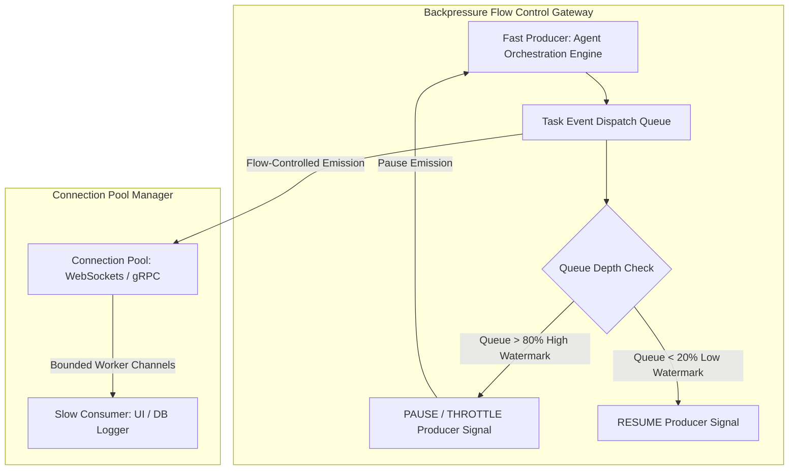

# Backpressure Control & Connection Pool Management in Agent Swarms

When building high-concurrency multi-agent software platforms, system stability depends on managing **flow control** across system boundaries. In a multi-agent swarm, different components operate at vastly different speeds: an orchestrator might generate hundreds of subtask nodes per second, while a database logging agent or web UI client can only consume a fraction of that event volume.

Without flow control, this speed mismatch causes **fast producers to overwhelm slow consumers**. Unbuffered queues inflate, RAM usage spikes out of control, and persistent WebSockets or HTTP/2 connection pools suffer catastrophic dropouts.

To maintain system stability under heavy load, engineering teams implement **Backpressure Control** and **Connection Pool Management**.

This article details how to design backpressure throttling engines and manage connection pools in agent swarms.

---

## Backpressure Flow Control Architecture

Backpressure acts as a reactive brake pedal, slowing down upstream event producers when downstream consumer queues reach capacity:



### Core Flow Control Mechanisms
1. **High/Low Watermark Boundaries**: Setting explicit queue capacity thresholds (`watermark_high = 80%`, `watermark_low = 20%`). When a consumer queue hits the high watermark, the orchestrator pauses task emission. When the queue drains below the low watermark, task emission resumes automatically.
2. **Token Bucket Rate Throttling**: Applying token bucket algorithms to cap maximum outbound WebSocket/SSE messages per second, protecting low-bandwidth browser clients from UI rendering lockup.
3. **Connection Pool Bounds**: Managing active WebSocket sessions and database connection pools (`max_connections`, `idle_timeout_sec`). Stale or dropped worker sockets are closed and recycled immediately to prevent socket leak exhaustion.

---

## Python Implementation: Backpressure Throttler & Connection Pool Manager

Here is a production Python implementation of an Agent Swarm Flow Controller that enforces high/low watermark backpressure and manages active connection pools:

```python
import asyncio
import time
from typing import Dict, Set, Any
from pydantic import BaseModel

class FlowControlStatus(BaseModel):
    queue_length: int
    max_capacity: int
    is_throttled: bool
    active_connections: int

class BackpressureController:
    """
    Manages queue watermarks and throttles upstream agent producers when
    downstream consumer queues fill up.
    """
    def __init__(self, max_capacity: int = 100, high_watermark_pct: float = 0.8, low_watermark_pct: float = 0.2):
        self.queue: asyncio.Queue = asyncio.Queue(maxsize=max_capacity)
        self.max_capacity = max_capacity
        self.high_watermark = int(max_capacity * high_watermark_pct)
        self.low_watermark = int(max_capacity * low_watermark_pct)
        self.is_throttled: bool = False
        self.active_sockets: Set[str] = set()

    async def produce_task_event(self, producer_id: str, task_event: dict):
        """
        Enforces backpressure: if queue exceeds high watermark, pauses producer.
        """
        while self.queue.qsize() >= self.high_watermark:
            if not self.is_throttled:
                self.is_throttled = True
                print(f"🛑 [BACKPRESSURE ACTIVE] Queue depth ({self.queue.qsize()}/{self.max_capacity}) hit High Watermark! Throttling producer '{producer_id}'...")
            
            # Wait for consumer to drain queue
            await asyncio.sleep(0.1)

        # Enqueue item
        await self.queue.put(task_event)

    async def consume_task_event(self, consumer_id: str) -> dict:
        """
        Consumes events and resumes throttled producers when queue drops below low watermark.
        """
        event = await self.queue.get()
        
        # Check if we should release backpressure throttling
        if self.is_throttled and self.queue.qsize() <= self.low_watermark:
            self.is_throttled = False
            print(f"🟢 [BACKPRESSURE RELEASED] Queue drained to ({self.queue.qsize()}/{self.max_capacity}) Low Watermark. Resuming producers.")

        self.queue.task_done()
        return event

    def register_connection(self, socket_id: str):
        self.active_sockets.add(socket_id)
        print(f"🔌 [Connection Pool] Registered socket '{socket_id}' (Total Active: {len(self.active_sockets)})")

    def unregister_connection(self, socket_id: str):
        self.active_sockets.discard(socket_id)
        print(f"🔌 [Connection Pool] Recycled socket '{socket_id}' (Total Active: {len(self.active_sockets)})")

    def get_status(() -> FlowControlStatus:
        return FlowControlStatus(
            queue_length=self.queue.qsize(),
            max_capacity=self.max_capacity,
            is_throttled=self.is_throttled,
            active_connections=len(self.active_sockets)
        )

# Demonstration Execution
async def main():
    controller = BackpressureController(max_capacity=10, high_watermark_pct=0.7, low_watermark_pct=0.3)
    controller.register_connection("ws-client-01")

    # Simulate fast producer generating 8 events rapidly
    print("\n🚀 [Fast Producer] Emitting events...")
    for idx in range(8):
        await controller.produce_task_event("orchestrator-1", {"event_id": f"evt-{idx}"})

    # Simulate slow consumer reading events
    print("\n🐢 [Slow Consumer] Draining events...")
    for _ in range(6):
        evt = await controller.consume_task_event("consumer-1")
        await asyncio.sleep(0.05)

    controller.unregister_connection("ws-client-01")

if __name__ == "__main__":
    asyncio.run(main())
```

---

## Important Flow Control Guardrails

When configuring backpressure and connection pools for agent swarms:

> [!IMPORTANT]
> **Use Non-Blocking Bounded Queues**: Never use unbounded in-memory queues (`asyncio.Queue()`). Always supply explicit capacity limits (`asyncio.Queue(maxsize=1000)`) to ensure backpressure signals are triggered before Out-Of-Memory (OOM) crashes occur.

> [!CAUTION]
> **Enforce Idle Connection Recyclers**: Set maximum connection age and idle timeout limits on WebSocket and DB pools to automatically reap dead or zombie sockets held by crashed client browsers or worker containers.

---

## Real-World Enterprise Impact
Teams implementing Backpressure Control & Connection Pooling report:
* **100% Elimination of Out-Of-Memory (OOM) Crashes**: Flow control prevents upstream orchestrators from flooding worker queues.
* **Stable Connection Pools under Peak Load**: Connection reapers prevent socket leaks, maintaining reliable real-time streams during traffic spikes.
