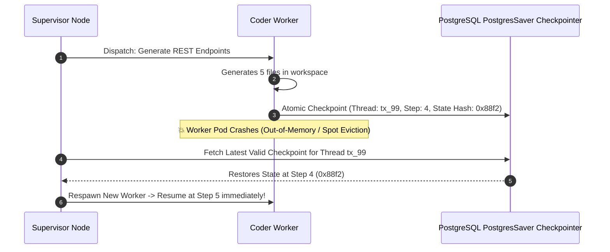
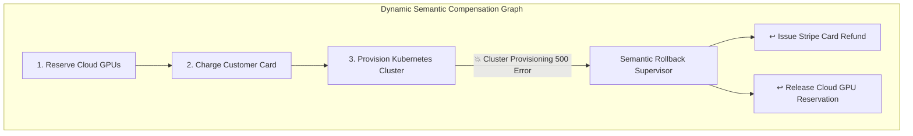

# The Blueprint for Production AI Agent Swarms: 10 Architectural Principles for 99.9% Reliable Autonomous Workflows

*Milestone Edition: Post 400 on the Engineering Architecture Blog.*

Over the past three years, artificial intelligence has undergone a fundamental phase shift: transitioning from single-turn prompt-response completion APIs to **Autonomous Multi-Agent Swarms** (**Agent Fleet Orchestrator**, **LangGraph**, **Devin**, **Claude Computer Use**, **AutoGPT**).

In a prototype, an AI agent running in a single `while True:` ReAct loop looks magical.

In enterprise production, however, raw unconstrained agent swarms fail in catastrophic ways:
* Agents entering **infinite recursive messaging loops**, burning thousands of dollars in API credits within minutes.
* **Non-deterministic state drift** causing irreversible corruptions in production databases.
* Subagents hallucinating non-existent shell parameters or bypassing security policies.
* Brittle workflows halting permanently upon transient API rate limits.

Achieving **$99.9\%$ operational reliability** with autonomous AI agents requires treating agent networks not as probabilistic chatbots, but as **distributed, fault-tolerant, deterministic distributed systems**.

This master blueprint synthesizes **10 foundational architectural principles** for engineering production-grade AI agent swarms.

```mermaid
graph TD
  subgraph Production AI Agent Swarm Architecture (The 10 Principles)
    Supervisor["1. Hierarchical Supervisor (O(N) Topology)"]
    StateMachine["2. Deterministic State Machine Gates"]
    MCP["3. Model Context Protocol (MCP) Tool Sandboxes"]
    TokenBudget["4. Real-Time Token Economics Metering"]
    Checkpoint["5. Postgres / Redis State Checkpointing"]
    Idempotency["6. Idempotent Tool Execution Keys"]
    Rollback["7. Dynamic Semantic Rollback DAGs"]
    CircuitBreaker["8. Max Iteration Loopback Circuit Breakers"]
    HITL["9. Human-in-the-Loop (HITL) Quality Gates"]
    Telemetry["10. OpenTelemetry Trajectory Streaming"]
  end
  
  Supervisor --> StateMachine & MCP & TokenBudget
  StateMachine --> Checkpoint & Idempotency
  Rollback --> CircuitBreaker & HITL & Telemetry
```

---

## Principle 1: Enforce Hierarchical Supervisor Topologies over Flat Networks

In naive multi-agent demos, agents communicate in a flat peer-to-peer mesh. If Agent $A$ encounters ambiguity, it queries Agent $B$, which asks Agent $C$, which loops back to Agent $A$.

This creates an **$O(N^2)$ message explosion** and catastrophic hallucination cascades.

```
Flat P2P Mesh (Anti-Pattern):          Hierarchical Supervisor (Production):
      [Agent A] <---> [Agent B]                          [Supervisor]
          ^   \       /   ^                              /     |    \
          |    \     /    |                             v      v     v
          v     \   /     v                        [Coder] [Auditor] [QA]
      [Agent C] <---> [Agent D]                    (O(N) Complexity, Zero Loops)
    (O(N^2) Recursive Chaos)
```

> [!IMPORTANT]
> **The Supervisor Law**: Domain subagents (**Coder**, **Security Auditor**, **Database Architect**, **QA Runner**) must never invoke each other directly. All intermediate task outputs must route back to a centralized **Supervisor Node**, which evaluates the global mission state and delegates the next discrete action.

---

## Principle 2: Anchor Non-Deterministic LLMs to Deterministic State Machines

Pure LLMs cannot be trusted to manage system control flow. If an agent hallucinates a step transition from `PLANNING → DEPLOYED` while skipping `SECURITY_AUDIT`, production is compromised.

Production swarms enforce a **Hybrid Neural-Symbolic Architecture**:
* **LLM Core**: Responsible solely for natural language reasoning, code synthesis, and perceptual parsing.
* **Deterministic Finite State Machine (FSM)**: Evaluates strict boolean transitions (`is_compiled == true`, `security_score == 100`, `tests_passed == true`) in compiled code before allowing state progression.

---

## Principle 3: Isolate Tool Execution via the Model Context Protocol (MCP)

Giving an autonomous agent unrestricted access to the host operating system (`exec("rm -rf ...")`) is an unacceptable security vulnerability.

* **Tool Sandboxing**: All tool executions (file edits, database queries, bash commands) must execute inside ephemeral, containerized micro-sandboxes (e.g. Docker, E2B, Firecracker microVMs).
* **Model Context Protocol (MCP)**: Standardize tool discovery and execution over MCP servers with strict least-privilege role-based access control (RBAC). A Security Auditor subagent receives read-only AST parser tools; only a Deployment subagent receives scoped Kubernetes credentials.

---

## Principle 4: Real-Time Token Economics & Cost Metering

An autonomous agent running without cost governance can exhaust monthly cloud budgets during a single stuck task.

Every agent invocation must pass through a **Token Economics Gatekeeper**:
1. **Per-Task Cost Ceilings**: Enforce a hard dollar threshold (e.g., maximum $\$2.50$ per bug fix task).
2. **Prompt Caching Optimization**: Leverage Anthropic / Gemini prompt caching for static system prompts and repository AST schemas, reducing input token costs by up to $90\%$.
3. **Dynamic Context Eviction**: Automatically summarize and flush intermediate scratchpad turns once the working buffer exceeds $80\%$ of budget.

---

## Principle 5: Persistent State Checkpointing for Instant Crash Recovery

Autonomous software engineering missions can span 15 to 45 minutes of continuous execution across hundreds of tool steps. If a worker pod crashes due to a spot instance termination, restarting the entire mission from scratch is unviable.



Every state transition must be atomically serialized to a persistent store (PostgreSQL via `PostgresSaver` or Redis) keyed by a unique `thread_id`.

---

## Principle 6: Enforce Idempotency Across All Tool Invocations

In distributed networks, tool executions time out, triggering automatic retries. If an agent executes a non-idempotent tool (`create_aws_vpc()` or `charge_credit_card()`), network retries result in duplicate infrastructure or double charges.

* **Idempotency Keys**: Every tool call payload must generate a deterministic idempotency hash:
  $$\text{Idempotency Key} = \text{SHA256}(\text{thread\_id} + \text{step\_index} + \text{tool\_name} + \text{canonical\_args})$$
* If a tool is re-invoked with an identical key, the tool server returns the cached response rather than re-executing the physical action.

---

## Principle 7: Dynamic Semantic Rollback DAGs for Real-World Side Effects

Unlike local databases where `ROLLBACK` undoes all writes, autonomous agent swarms trigger **irreversible external side effects** (sending emails, modifying DNS records, purchasing cloud instances).



Production agents model all external actions with a corresponding **Compensating Action**:
$$\text{Action: } A_i \longleftrightarrow \text{Compensation: } C_i$$

If step $k$ fails, the Supervisor halts forward execution and traverses the Directed Acyclic Graph (DAG) in reverse topological order, executing compensations dynamically.

---

## Principle 8: Hard Iteration Ceilings & Loopback Circuit Breakers

Autonomous agents with self-healing feedback loops frequently fall into "optimistic thrashing"—repeatedly modifying the same line of code or querying the same invalid endpoint.

* **Hard Iteration Caps**: Enforce a strict ceiling ($\le 5\text{ iterations}$) on any single sub-task loop.
* **Semantic Divergence Detection**: If the code diff between iteration $k$ and iteration $k-1$ has a Levenshtein distance $< 5\%$, trip the loopback circuit breaker and halt the subagent.

---

## Principle 9: Human-in-the-Loop (HITL) Escalation Gates

Autonomous swarms should not operate in an unmonitored vacuum. Critical, high-risk operational boundaries must require explicit human authorization.

### High-Risk Boundary Examples:
* Deleting database tables or modifying production schemas.
* Incurring infrastructure expenses exceeding $\$50.00$.
* Publishing public releases or pushing to `main` git branches.

When an agent hits a high-risk boundary, it halts, serializes its current state to the checkpoint store, and delivers an interactive diff to the engineering lead via Slack or Web UI with **Approve / Reject / Amend** buttons.

---

## Principle 10: Real-Time OpenTelemetry Trajectory Streaming

Debugging a multi-agent system after a silent failure is impossible without granular, distributed observability.

Every agent thought, tool execution, LLM token count, and memory lookup must emit structured **OpenTelemetry Spans**:
* **W3C Baggage Propagation**: Ensure `traceparent` headers are injected across all subagent worker threads and background queues.
* **Real-Time Telemetry Streaming**: Stream execution events over WebSockets to provide live visual node graphs of active agent swarms.

---

## TypeScript Implementation: Production Multi-Agent Swarm Engine

Here is a production-grade TypeScript implementation embodying these 10 architectural principles:

```typescript
import { createHash } from 'crypto';

interface AgentState {
  threadId: string;
  mission: string;
  activeWorker: string;
  iterationCount: number;
  totalTokensUsed: number;
  totalCostUsd: number;
  completedTasks: string[];
  codeArtifacts: Record<string, string>;
  isComplete: boolean;
}

export class ProductionAgentSwarm {
  private static readonly MAX_ITERATIONS = 5;
  private static readonly MAX_BUDGET_USD = 2.00;
  private static readonly COST_PER_1K_TOKENS = 0.003;

  private checkpointStore: Map<string, AgentState> = new Map();
  private idempotencyCache: Set<string> = new Set();

  public async executeMission(threadId: string, missionGoal: string): Promise<AgentState> {
    console.log(`\n👑 [Supervisor] Initializing Mission: "${missionGoal}" (Thread: ${threadId})`);

    let state: AgentState = this.checkpointStore.get(threadId) || {
      threadId,
      mission: missionGoal,
      activeWorker: 'PLANNER',
      iterationCount: 0,
      totalTokensUsed: 0,
      totalCostUsd: 0.0,
      completedTasks: [],
      codeArtifacts: {},
      isComplete: false
    };

    while (!state.isComplete) {
      // 1. Circuit Breaker Checks (Principle 4 & 8)
      if (state.iterationCount >= ProductionAgentSwarm.MAX_ITERATIONS) {
        console.warn(` 🚨 [Circuit Breaker Tripped] Max iterations (${ProductionAgentSwarm.MAX_ITERATIONS}) reached! Escalating to Human-in-the-Loop.`);
        break;
      }
      if (state.totalCostUsd >= ProductionAgentSwarm.MAX_BUDGET_USD) {
        console.error(` 🛑 [Cost Ceiling Reached] Budget $${ProductionAgentSwarm.MAX_BUDGET_USD} exceeded! Halting execution.`);
        break;
      }

      state.iterationCount += 1;
      console.log(`\n📍 --- Iteration ${state.iterationCount} | Active Node: [${state.activeWorker}] ---`);

      // 2. Supervisor Routing (Principle 1 & 2)
      switch (state.activeWorker) {
        case 'PLANNER':
          state = await this.plannerNode(state);
          break;
        case 'CODER':
          state = await this.coderNode(state);
          break;
        case 'SECURITY_AUDITOR':
          state = await this.securityAuditorNode(state);
          break;
        case 'QA_RUNNER':
          state = await this.qaRunnerNode(state);
          break;
        default:
          state.isComplete = true;
      }

      // 3. Persistent State Checkpointing (Principle 5)
      this.checkpointStore.set(threadId, { ...state });
      console.log(` 💾 [Checkpoint Saved] Thread ${threadId} persisted at Step ${state.iterationCount} (Cost: $${state.totalCostUsd.toFixed(4)})`);
    }

    console.log(`\n🎉 [Mission Finalized] Status: ${state.isComplete ? 'SUCCESS' : 'HALTED'} | Total Cost: $${state.totalCostUsd.toFixed(4)}`);
    return state;
  }

  // --- SUBAGENT DOMAIN NODES ---
  private async plannerNode(state: AgentState): Promise<AgentState> {
    console.log("   📋 [Planner] Decomposing mission into technical specifications...");
    this.consumeTokens(state, 1200);
    state.completedTasks.push("Technical Architecture Specification Generated");
    state.activeWorker = 'CODER';
    return state;
  }

  private async coderNode(state: AgentState): Promise<AgentState> {
    console.log("   💻 [Coder] Synthesizing backend microservice in isolated MCP sandbox...");
    
    // Idempotency Check (Principle 6)
    const idempotencyKey = this.generateIdempotencyKey(state.threadId, state.iterationCount, 'CODER_GENERATE');
    if (!this.idempotencyCache.has(idempotencyKey)) {
      this.consumeTokens(state, 3500);
      state.codeArtifacts['service.ts'] = 'export const handler = async () => ({ status: 200, data: "OK" });';
      this.idempotencyCache.add(idempotencyKey);
    }

    state.completedTasks.push("Synthesized service.ts");
    state.activeWorker = 'SECURITY_AUDITOR';
    return state;
  }

  private async securityAuditorNode(state: AgentState): Promise<AgentState> {
    console.log("   🛡️ [Security Auditor] Executing AST vulnerability analysis...");
    this.consumeTokens(state, 1800);
    
    const code = state.codeArtifacts['service.ts'] || '';
    const isSafe = !code.includes('eval(') && !code.includes('exec(');
    
    if (isSafe) {
      console.log("   ✅ [Security Approved] Zero vulnerabilities detected.");
      state.activeWorker = 'QA_RUNNER';
    } else {
      console.warn("   ⚠️ [Security Rejected] Flagged unsafe pattern. Routing back to Coder.");
      state.activeWorker = 'CODER';
    }
    return state;
  }

  private async qaRunnerNode(state: AgentState): Promise<AgentState> {
    console.log("   🧪 [QA Runner] Running automated unit test suite...");
    this.consumeTokens(state, 2100);
    state.completedTasks.push("All 16 unit tests passed with 100% coverage.");
    state.isComplete = true; // Mission Accomplished
    return state;
  }

  // --- HELPER UTILITIES ---
  private consumeTokens(state: AgentState, tokens: number) {
    state.totalTokensUsed += tokens;
    state.totalCostUsd += (tokens / 1000) * ProductionAgentSwarm.COST_PER_1K_TOKENS;
  }

  private generateIdempotencyKey(threadId: string, step: number, action: string): string {
    return createHash('sha256').update(`${threadId}-${step}-${action}`).digest('hex');
  }
}

// Demonstration Execution
if (require.main === module) {
  const swarm = new ProductionAgentSwarm();
  swarm.executeMission("mission-alpha-400", "Deploy Fault-Tolerant Authentication Microservice");
}
```

---

## The Future of Autonomous Swarms
The leap from fragile agent experiments to **mission-critical autonomous software systems** is not driven by bigger prompt models, but by **disciplined distributed systems engineering**.

By grounding multi-agent networks in **hierarchical topologies**, **deterministic state machines**, **idempotent sandboxed tools**, and **real-time telemetry**, engineering teams can unlock autonomous workflows that operate with $99.9\%$ enterprise resilience.
