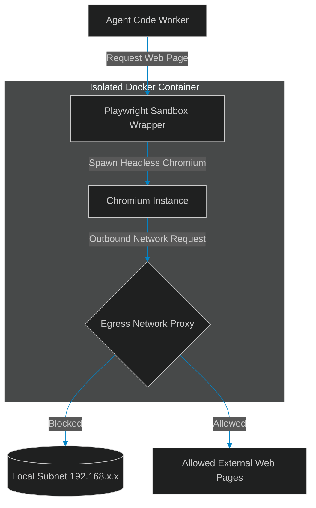

# Playwright Execution: Safe Browser Control inside Sandbox Containers

> [!NOTE]
> **📖 Article Overview**
> As autonomous agent swarms grow in capability, they are increasingly tasked with navigating live websites (e.g. executing UI testing pipelines, scraping dashboard metrics, or performing web research). However, giving an LLM-guided agent direct control over a web browser exposes host systems to significant security risks—including cross-site scripting (XSS) leaks and local network scanning. To run browser tasks safely, architects must isolate executions. In this article, we design a sandboxed browser automation pipeline and implement a Playwright container execution wrapper in Python.

---

## The Danger of Unbounded Browser Control

Web browsers are powerful runtime environments:
* **The Local Network Threat**: If an agent visits a malicious website, that site can run scripts within the headless browser to scan the container's local subnet or access internal APIs.
* **Cookie and Session Theft**: Agents handling multiple sessions can have corporate auth cookies exfiltrated if they visit untrusted, user-submitted URLs.
* **The Solution**: **Browser Sandboxing**. We execute headless Chromium instances inside isolated, network-restricted containers, proxying only required API targets and blocking local network queries.



---

## 1. Setting up Isolated Browser Containers

To secure browser automation:
* **Headless Isolation**: Run Playwright inside a dedicated, non-privileged Docker container. Never run Chromium on the host machine.
* **Network Segmenting**: Disable bridge network access to internal subnets, blocking the sandboxed browser from scanning port setups or internal services.

---

## 2. Dynamic Selector Scopes

To improve scraper resilience, wrap selectors in safety boundaries:
1. **Enforce Timeouts**: Limit click and type actions to a maximum timeout of 5 seconds to prevent browser hangs.
2. **Restrict JavaScript Execution**: Disable dynamic `page.evaluate()` operations unless explicitly whitelisted, preventing untrusted scripts from running inside the container.

---

## Code Demo: Sandboxed Playwright Controller

Below is a Python implementation of a browser controller wrapper. It configures browser launch options, enforces navigation safety timeouts, and blocks local loopback requests.

```python
import asyncio
from typing import Dict, Any, Tuple

class SandboxedPlaywrightController:
    def __init__(self, request_timeout_ms: int = 5000):
        self.request_timeout_ms = request_timeout_ms
        # Simulated whitelist of allowed domains
        self.allowed_domains = ["replit.com", "github.com", "pypi.org"]

    def _is_safe_url(self, url: str) -> bool:
        # Prevent accessing localhost or local subnet IP segments
        if "localhost" in url or "127.0.0.1" in url or "192.168" in url:
            return False
        
        # Check against allowed domain list
        return any(domain in url for domain in self.allowed_domains)

    async def execute_browser_navigation(self, url: str, selector: str) -> Tuple[bool, str]:
        print(f"🌐 [Browser] Processing request for URL: {url}")

        # 1. Enforce url safety gate checks
        if not self._is_safe_url(url):
            return False, "Security Block: Access to target URL is prohibited (local subnet or unwhitelisted domain)."

        # 2. Simulate launching sandboxed headless Chromium
        print("   🐳 Launching Chromium inside Docker container...")
        await asyncio.sleep(0.5) # Simulate launch delay

        # 3. Simulate page load and selector extraction
        print(f"   ⏱️ Navigating to page (Timeout limit: {self.request_timeout_ms}ms)...")
        await asyncio.sleep(0.3) # Simulate network load
        
        extracted_text = f"Simulated content matching selector '{selector}' on {url}"
        return True, f"Success: {extracted_text}"

if __name__ == "__main__":
    controller = SandboxedPlaywrightController(request_timeout_ms=3000)

    async def run_scenarios():
        print("🔒 Initiating Sandboxed Playwright Controller Scenarios...")
        print("-------------------------------------------------------------")

        # Scenario 1: Safe request to whitelisted external site
        success_1, result_1 = await controller.execute_browser_navigation(
            url="https://github.com/akmalkhaniub",
            selector="#repository-list"
        )
        print(f"[Scenario 1] Status: {success_1} | Output: {result_1}\n")

        # Scenario 2: Blocked request to local database endpoint
        success_2, result_2 = await controller.execute_browser_navigation(
            url="http://192.168.1.50:5432/admin",
            selector="body"
        )
        print(f"[Scenario 2] Status: {success_2} | Output: {result_2}\n")

    asyncio.run(run_scenarios())
```

---

## Architectural Guidelines

* **Default to Containment**: Always run browser automation containers with user namespaces enabled and root privileges disabled.
* **Filter DNS Outbound**: Enforce DNS resolution limits on the browser container to prevent exfiltration tunnels.
* **Apply Strict Timeouts**: Configure default navigation and action timeouts to under 10 seconds to protect CPU resources.
