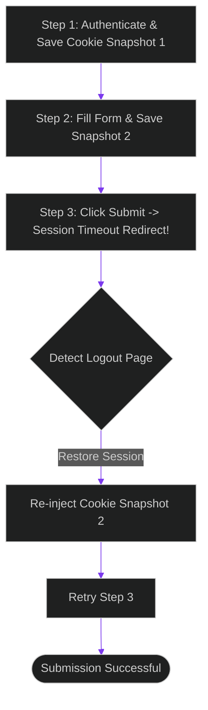

# Session Replay Recovery: Auto-Fixing Web Navigation Loops and Logout Gates

> [!NOTE]
> **📖 Article Overview**
> Real-world web automation is filled with unexpected failures. When an autonomous agent attempts to fill out a complex multi-page form, it can be abruptly redirected to a login page (session timeout) or get trapped in a redirect loop. Without state tracking, the agent either crashes or wastes tokens re-submitting the same form endlessly. To build resilient web scrapers, architects must implement **Session Replay Recovery**. By capturing cookie snapshots and tracking step histories, we allow agents to recover sessions automatically when blocked. In this article, we design a session recovery state machine in Python.

---

## The Danger of Stateless Web Automation

In simple web agent designs:
* **The Auth Loop Failure**: If the browser session expires mid-task, the agent repeatedly attempts to click a restricted button, unaware that it must re-authenticate.
* **Wasted Task Execution**: The agent restarts the entire multi-step navigation flow from scratch on every error, leading to high token overheads.
* **The Solution**: **Session Replay Recovery**. We save serializable cookie snapshots at each successful step. If the agent detects a logout redirect or a navigation loop, it restores the last working session state and resumes.



---

## 1. Structuring Serializable Session Snapshots

To support session state recovery:
* **Capture Cookies and LocalStorage**: Regularly dump browser cookies and local storage tokens into a serializable JSON metadata block after completing steps.
* **Track Visited URL Signatures**: Log the MD5 signatures of visited page structures to detect when the agent is trapped in a redirect loop.

---

## 2. Setting up the Recovery Loop

The recovery state machine coordinates the restore path:
1. **Detect Redirect**: Intercept changes that route the browser back to login or error pages.
2. **Re-Inject Session**: Load the last successful cookie snapshot back into the browser context.
3. **Re-Execute Node**: Re-trigger the failed navigation step, avoiding the need to restart the entire session.

---

## Code Demo: Session Replay State Machine

Below is a Python implementation of a browser session recovery manager. It simulates form steps, saves cookie snapshots, intercepts redirects, and re-injects states to recover execution paths.

```python
import json
from typing import Dict, List, Any, Tuple

class BrowserSessionManager:
    def __init__(self):
        # Database containing serializable cookie snapshots per step
        self.session_snapshots: Dict[int, str] = {}
        self.current_cookies = "auth_cookie_valid_session_101"
        self.visited_urls: List[str] = []

    def save_snapshot(self, step_id: int):
        # Serialize and save active browser cookies
        self.session_snapshots[step_id] = self.current_cookies
        print(f"💾 [Session] Saved cookie snapshot for Step {step_id}: '{self.current_cookies}'")

    def restore_snapshot(self, step_id: int) -> bool:
        if step_id not in self.session_snapshots:
            return False
        
        # Re-inject the saved cookie snapshot into browser context
        self.current_cookies = self.session_snapshots[step_id]
        print(f"🔄 [Session] Restored cookie snapshot for Step {step_id}: '{self.current_cookies}'")
        return True

    def process_navigation_step(self, step_id: int, url: str) -> Tuple[bool, str]:
        print(f"\n🌐 Navigating to: {url} (Active Cookies: '{self.current_cookies}')")

        # Detect loop: if URL has been visited three times, flag loop error
        self.visited_urls.append(url)
        if self.visited_urls.count(url) >= 3:
            return False, "Redirect Loop Detected: Halted navigation."

        # Simulate dynamic session logout gate on target page
        if "login" in url or "auth_expired" in self.current_cookies:
            return False, "Session Expired: Redirected to login page."

        # Save success state
        self.save_snapshot(step_id)
        return True, "Success: Page processed."

if __name__ == "__main__":
    manager = BrowserSessionManager()

    print("🛡️ Starting Session Replay Recovery Simulator...")
    print("-------------------------------------------------")

    # Step 1: Authenticate and process dashboard
    status_1, log_1 = manager.process_navigation_step(1, "https://replit.com/dashboard")
    
    # Step 2: Navigate to editor (Session expires mid-transaction)
    status_2, log_2 = manager.process_navigation_step(2, "https://replit.com/editor")

    # Simulate cookie corruption / logout event
    manager.current_cookies = "auth_expired"

    # Step 3: Attempt to write file (fails and redirects to login)
    status_3, log_3 = manager.process_navigation_step(3, "https://replit.com/editor/write")
    print(f"⚠️ Step 3 Failed: {log_3}")

    # Recovery Loop: Restore Step 2 cookie snapshot and retry
    print("\n🔄 Initiating Session Recovery...")
    restored = manager.restore_snapshot(2)
    
    if restored:
        # Retry step 3 with restored session cookies
        status_retry, log_retry = manager.process_navigation_step(3, "https://replit.com/editor/write")
        print(f"🎉 Retry Outcome: {log_retry}")
```

---

## Session Recovery Takeaways

* **Save Snapshots Regularly**: Capture browser cookies and local storage state after completing successful steps.
* **Track Redirect Loops**: Monitor visited URLs and abort navigation if the same pattern repeats.
* **Re-Inject Session Cookies**: Restore working sessions when redirect gates are encountered to avoid restarting tasks.
