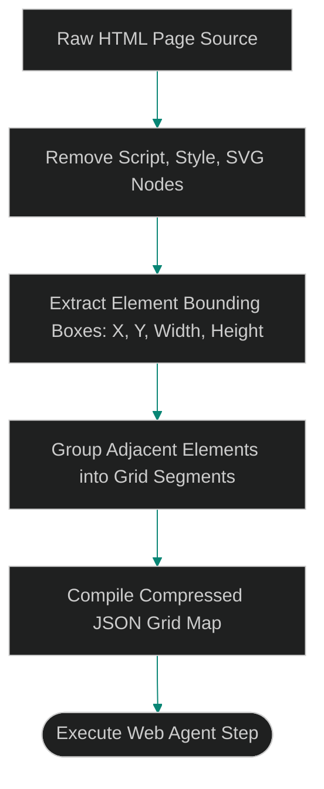

# Visual DOM Segmentation: Compressing HTML Inputs with Grid Layouts

> [!NOTE]
> **📖 Article Overview**
> Autonomous web agents navigate websites by reading the page's structure. However, sending raw, uncompressed HTML source code directly to the agent's context window is extremely inefficient. A single complex webpage can easily exceed 100,000 lines of HTML code, consuming substantial token budgets and slowing response times. To solve this, developers use **Visual DOM Segmentation**. By partitioning the Document Object Model (DOM) tree into a visual grid coordinate matrix, we remove duplicate markup and export a highly compressed layout map. In this article, we implement a DOM grid compressor in Python.

---

## The Overhead of Monolithic DOM Ingestion

In basic web agent setups:
* **The Noise Factor**: Raw HTML is filled with redundant styling tags, script nodes, and SVG descriptors that do not help the agent navigate the page.
* **Instruction Overload**: Stuffing 100k tokens of raw page source code makes it difficult for the model to find specific navigation buttons (e.g. the "Add to Cart" button).
* **The Solution**: **Visual DOM Segmentation**. We parse the page layout using element bounding boxes, group adjacent nodes into visual coordinate segments, and export a simplified JSON grid map.



---

## 1. Extracting Visual Coordinates

To compile the page layout:
* **Remove Non-Visual Elements**: Discard `<script>`, `<style>`, `<path>`, and metadata tags before processing the page.
* **Map Bounding Boxes**: Capture the visual footprint (width, height, top, left offsets) of interactive nodes (buttons, input fields, links).

---

## 2. Compressing to a JSON Grid

The layout compiler structures the page representation:
1. **Sort by Coordinates**: Sort interactive elements from top-to-bottom and left-to-right.
2. **Assign Grid Keys**: Group close nodes into rows, assigning each element a unique visual coordinate key (e.g., `row_1_col_2`).

---

## Code Demo: DOM Grid Compressor

Below is a Python implementation of a DOM layout compressor. It strips redundant tags, parses element properties, groups adjacent items, and outputs a highly compressed JSON grid mapping.

```python
import json
from typing import List, Dict, Any

class VisualDOMCompressor:
    def __init__(self):
        # Whitelisted interactive tag list
        self.interactive_tags = ["button", "input", "a", "textarea"]

    def compress_dom_tree(self, raw_elements: List[Dict[str, Any]]) -> str:
        compressed_grid: Dict[str, List[Dict[str, Any]]] = {}

        # 1. Filter out non-interactive elements
        filtered_elements = [el for el in raw_elements if el["tag"] in self.interactive_tags]

        # 2. Sort elements by vertical offset (top coordinate)
        filtered_elements.sort(key=lambda x: x["top"])

        # 3. Group elements into row segments based on vertical proximity
        current_row_idx = 1
        current_row_top = -1
        row_threshold_pixels = 20 # Group elements on the same baseline

        for el in filtered_elements:
            if current_row_top == -1 or (el["top"] - current_row_top) > row_threshold_pixels:
                current_row_top = el["top"]
                if current_row_top != el["top"]:
                    current_row_idx += 1
            
            row_key = f"row_{current_row_idx}"
            if row_key not in compressed_grid:
                compressed_grid[row_key] = []

            # Store only essential attributes for navigation
            compressed_grid[row_key].append({
                "tag": el["tag"],
                "text": el.get("text", ""),
                "id": el.get("id", ""),
                "x_coord": el["left"],
                "y_coord": el["top"]
            })

        return json.dumps(compressed_grid, indent=2)

if __name__ == "__main__":
    compressor = VisualDOMCompressor()

    # Raw elements mock representing a webpage menu header
    raw_web_dom = [
        {"tag": "div", "top": 10, "left": 10, "text": "Header Container"},
        {"tag": "a", "top": 12, "left": 150, "text": "Home Link", "id": "nav_home"},
        {"tag": "a", "top": 12, "left": 250, "text": "About Link", "id": "nav_about"},
        {"tag": "button", "top": 15, "left": 800, "text": "Login Button", "id": "btn_login"},
        {"tag": "input", "top": 100, "left": 150, "text": "Search Input", "id": "inp_search"}
    ]

    print("🌲 Compressing Webpage DOM Tree...")
    print("-----------------------------------")

    compressed_json = compressor.compress_dom_tree(raw_web_dom)
    print("\n--- Compressed Visual JSON Grid ---")
    print(compressed_json)
```

---

## DOM Optimization Takeaways

* **Filter Non-Visual Nodes**: Remove all script, style, and SVG tags before processing webpage structures.
* **Isolate Interactive Nodes**: Focus DOM parsing exclusively on interactive tags (buttons, links, inputs) to limit token usage.
* **Enforce Row Baselines**: Group adjacent nodes sharing similar vertical offsets to simplify layout trees.
