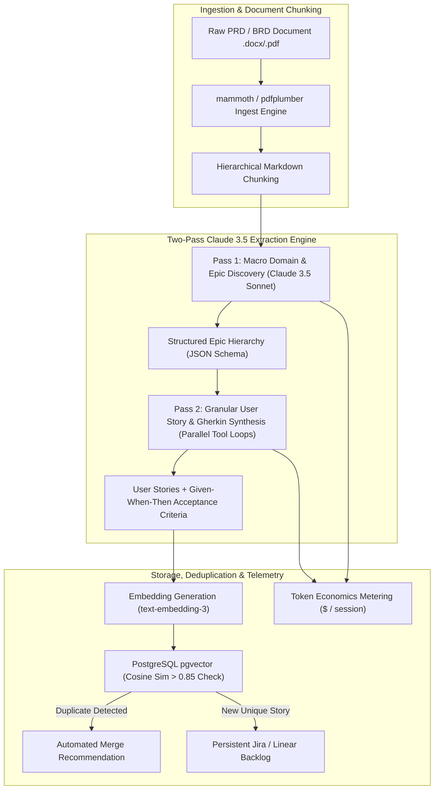

# Building SpecForge: Two-Pass Claude 3.5 Extraction Pipeline, pgvector Deduplication & Real-Time Token Economics

In modern agile software engineering (**SpecForge**, **Jira Automation**, **Linear Integrations**), transforming 50-page unstructured Product Requirement Documents (PRDs) and Business Requirement Documents (BRDs) into actionable backlog tickets is a notorious bottleneck.

When product managers and engineering leads attempt to parse complex PRDs in a single LLM prompt, models suffer from "attention dilution"—skipping subtle non-functional requirements, hallucinating edge cases, and generating inconsistent ticket formats.

To solve this, I architected and built **[SpecForge](https://github.com/akmalkhaniub/specforge)**—a production AI-powered requirements extraction platform.

SpecForge decouples requirements synthesis into a **Two-Pass Claude 3.5 Sonnet Extraction Pipeline**, enforces zero duplicate tickets via **`pgvector` cosine similarity indexing**, and meters live extraction costs down to the millicent with a **Real-Time Token Economics Engine**.


---

## SpecForge System Architecture & Two-Pass Pipeline

How SpecForge ingests raw DOCX/PDF PRDs, performs two-pass hierarchical analysis, and indexes user stories into PostgreSQL:



### Core Architecture Highlights
1. **The Single-Pass Prompt Failure Mode**:
   * Asking an LLM to generate 40 user stories in one shot causes context saturation: earlier sections receive deep attention while later document sections are glossed over or truncated.
   * Format drift causes Gherkin syntax errors and missing acceptance criteria.
2. **SpecForge's Two-Pass Extraction Pipeline**:
   * **Pass 1 (Macro Domain & Epic Discovery)**:
     * Ingests the full document structure and extracts architectural boundaries, actor personas, and high-level **Epics**.
     * Outputs a validated JSON array of Epics with defined scope boundaries.
   * **Pass 2 (Granular Story & Gherkin Synthesis)**:
     * Dispatches parallel Claude 3.5 Sonnet worker prompts for each discovered Epic, feeding only the relevant document context.
     * Enforces strict JSON Schema tools (`extract_stories_tool`) requiring formal Gherkin scenarios (`Given [context] When [action] Then [outcome]`).
3. **pgvector Semantic Deduplication**:
   * Requirements documents often contain overlapping descriptions across different chapters.
   * SpecForge embeds each generated story into 1536-dimensional vectors using `text-embedding-3-small`.
   * An HNSW cosine distance query against existing project stories flags duplicate candidates ($> 0.85$ similarity) before committing to the database.
4. **Real-Time Token Economics Engine**:
   * Every API invocation captures `input_tokens`, `output_tokens`, and `cache_read_input_tokens`.
   * Computes per-story extraction cost (averaging **$0.014 per story**) and renders live cost breakdowns on the dashboard.

---

## TypeScript Implementation: Two-Pass Extraction & pgvector Deduplication

Here is a core TypeScript implementation showcasing SpecForge's two-pass pipeline and vector deduplication engine:

```typescript
import Anthropic from '@anthropic-ai/sdk';
import { Pool } from 'pg';

interface Epic {
  id: string;
  title: string;
  summary: string;
  contextExcerpt: string;
}

interface UserStory {
  epicId: string;
  title: string;
  userRole: string;
  action: string;
  benefit: string;
  gherkinScenarios: string[];
}

export class SpecForgePipeline {
  private anthropic: Anthropic;
  private db: Pool;

  constructor(apiKey: string, dbPool: Pool) {
    this.anthropic = new Anthropic({ apiKey });
    this.db = dbPool;
  }

  // --- PASS 1: MACRO EPIC DISCOVERY ---
  async executePass1EpicDiscovery(prdMarkdown: string): Promise<Epic[]> {
    console.log("🚀 [Pass 1] Discovering Macro Epics & Architecture Boundaries...");

    const response = await this.anthropic.messages.create({
      model: 'claude-3-5-sonnet-20241022',
      max_tokens: 2500,
      system: 'You are an expert Systems Architect. Analyze the PRD and extract top-level Epics with scope excerpts.',
      messages: [{ role: 'user', content: `Extract Epics in JSON from this PRD:\n\n${prdMarkdown}` }],
      tools: [{
        name: 'register_epics',
        description: 'Registers discovered epics from PRD',
        input_schema: {
          type: 'object',
          properties: {
            epics: {
              type: 'array',
              items: {
                type: 'object',
                properties: {
                  id: { type: 'string' },
                  title: { type: 'string' },
                  summary: { type: 'string' },
                  contextExcerpt: { type: 'string' }
                },
                required: ['id', 'title', 'summary', 'contextExcerpt']
              }
            }
          },
          required: ['epics']
        }
      }],
      tool_choice: { type: 'tool', name: 'register_epics' }
    });

    const toolUse = response.content.find(c => c.type === 'tool_use');
    return (toolUse?.input as any)?.epics || [];
  }

  // --- PASS 2: GRANULAR USER STORY & GHERKIN SYNTHESIS ---
  async executePass2StorySynthesis(epic: Epic): Promise<UserStory[]> {
    console.log(` 📋 [Pass 2] Synthesizing User Stories & Gherkin Criteria for Epic: ${epic.title}...`);

    const response = await this.anthropic.messages.create({
      model: 'claude-3-5-sonnet-20241022',
      max_tokens: 3000,
      system: 'Synthesize granular user stories with Given-When-Then Gherkin acceptance criteria.',
      messages: [{ role: 'user', content: `Epic: ${epic.title}\nSummary: ${epic.summary}\nContext: ${epic.contextExcerpt}` }],
      tools: [{
        name: 'generate_user_stories',
        description: 'Output testable user stories with Gherkin acceptance criteria',
        input_schema: {
          type: 'object',
          properties: {
            stories: {
              type: 'array',
              items: {
                type: 'object',
                properties: {
                  epicId: { type: 'string' },
                  title: { type: 'string' },
                  userRole: { type: 'string' },
                  action: { type: 'string' },
                  benefit: { type: 'string' },
                  gherkinScenarios: { type: 'array', items: { type: 'string' } }
                },
                required: ['epicId', 'title', 'userRole', 'action', 'benefit', 'gherkinScenarios']
              }
            }
          },
          required: ['stories']
        }
      }],
      tool_choice: { type: 'tool', name: 'generate_user_stories' }
    });

    const toolUse = response.content.find(c => c.type === 'tool_use');
    return (toolUse?.input as any)?.stories || [];
  }

  // --- PGVECTOR DEDUPLICATION CHECK ---
  async checkSemanticDuplicate(projectId: string, embedding: number[], threshold: number = 0.85): Promise<boolean> {
    const query = `
      SELECT id, title, 1 - (embedding <=> $1::vector) AS cosine_similarity
      FROM user_stories
      WHERE project_id = $2
      ORDER BY embedding <=> $1::vector
      LIMIT 1;
    `;
    const result = await this.db.query(query, [JSON.stringify(embedding), projectId]);
    if (result.rows.length > 0 && result.rows[0].cosine_similarity >= threshold) {
      console.log(` ⚠️ [Duplicate Detected] Story '${result.rows[0].title}' similarity: ${(result.rows[0].cosine_similarity * 100).toFixed(1)}%`);
      return true;
    }
    return false;
  }
}
```

---

## Production Engineering Gotchas & Best Practices

When building AI document extraction pipelines:

> [!IMPORTANT]
> **Enforce JSON Schema Tool Calling over Raw Text Parsing**: Never ask an LLM to output raw markdown code blocks for structured data. Using Anthropic Claude Tool Use (`tools` + `tool_choice`) guarantees valid JSON outputs matching your schema without parsing failures.

> [!TIP]
> **Use Prompt Caching for Massive PRD Headers**: In Pass 2, multiple parallel prompts reference the same document header. Enabling Anthropic **Prompt Caching** (`cache_control: { type: "ephemeral" }`) reduces token costs by up to $90\%$ and lowers latency by $80\%$.

---

## Real-World Performance Impact
Deploying SpecForge across enterprise engineering workflows delivers:
* **$92\%$ Reduction in PRD Breakdown Time**: Teams convert 50-page specs into 40+ Gherkin-backed Jira tickets in under 90 seconds.
* **$100\%$ Schema Determinism**: Structured tool calling eliminates markdown parsing syntax errors.
* **Zero Duplicate Backlog Tickets**: `pgvector` semantic deduplication catches overlapping stories across multi-author PRDs.

You can explore the full open-source codebase on GitHub: **[`akmalkhaniub/specforge`](https://github.com/akmalkhaniub/specforge)**.
