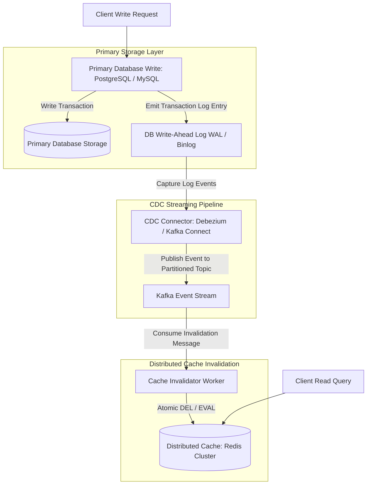

# Cache Invalidation at Scale: Two Hard Problems in Distributed Systems

Phil Karlton famously remarked: *"There are only two hard things in Computer Science: cache invalidation and naming things."*

In high-concurrency microservice architectures, caching is essential for reducing database query latency and protecting backend databases from read starvation. However, when database records are updated, keeping distributed cache instances in sync with the primary database is notoriously difficult.

If an application updates a database row but fails to invalidate the corresponding cache key (due to network drops or process crashes), clients receive stale data.

This article explores the trade-offs of modern caching patterns—**Cache-Aside**, **Write-Through**, **Write-Behind**, and **Refresh-Ahead**—and details how to implement robust **Change Data Capture (CDC)** cache invalidation.

---

## 📖 CDC-Driven Cache Invalidation Architecture

How database transaction log streaming guarantees eventual consistency between primary storage and distributed caches:



### Access Topologies & Invalidation Trade-offs
1. **Cache-Aside (Lazy Loading)**: The application checks the cache first. On a cache miss, it reads from the primary database, populates the cache key with a Time-To-Live (TTL), and returns the result. *Trade-off*: Read misses incur double round-trips.
2. **Write-Through**: The application writes to the cache engine, which synchronously writes the updated record to the primary database before acknowledging completion. *Trade-off*: High write latency.
3. **Write-Behind (Write-Back)**: The application writes directly to the cache, which buffers updates in memory and asynchronously batches disk writes to the database. *Trade-off*: Risk of data loss if the cache node crashes before flushing.
4. **CDC-Driven Invalidation**: Instead of relying on application code to delete cache keys after DB updates, a Change Data Capture (CDC) connector listens directly to the primary database's Write-Ahead Log (WAL). Any committed `UPDATE` or `DELETE` transaction automatically triggers an asynchronous cache invalidation event.

---

## 🛠️ Python Implementation: CDC-Backed Cache Invalidator

Here is a production-grade Python simulation of a CDC-driven cache invalidation worker processing database Write-Ahead Log events:

```python
import time
from typing import Dict, Any, Optional
from pydantic import BaseModel

class DatabaseWALRecord(BaseModel):
    lsn: int
    operation: str  # INSERT, UPDATE, DELETE
    table_name: str
    row_id: str
    data: Dict[str, Any]
    timestamp: float

class DistributedCacheStore:
    """Simulates an in-memory distributed cache store (like Redis)."""
    def __init__(self):
        self.store: Dict[str, Any] = {}

    def get(self, key: str) -> Optional[Any]:
        return self.store.get(key, None)

    def set(self, key: str, value: Any):
        self.store[key] = value

    def delete(self, key: str) -> bool:
        if key in self.store:
            del self.store[key]
            print(f" 🧹 [Redis Cache] Invalidated Key '{key}'")
            return True
        return False

class CDCCacheInvalidatorWorker:
    """
    Consumes WAL events from a database stream and invalidates cache keys.
    """
    def __init__(self, cache: DistributedCacheStore):
        self.cache = cache

    def process_wal_event(self, record: DatabaseWALRecord):
        # Format cache key convention: table_name:row_id
        cache_key = f"{record.table_name}:{record.row_id}"
        
        print(f" 📥 [CDC Invalidator] Received WAL Event LSN #{record.lsn}: {record.operation} on {cache_key}")

        if record.operation in ("UPDATE", "DELETE"):
            # Invalidate stale cache key instantly
            self.cache.delete(cache_key)
        elif record.operation == "INSERT":
            # For inserts, no existing cache key exists to invalidate
            pass

# Demonstration Execution
if __name__ == "__main__":
    cache = DistributedCacheStore()
    invalidator = CDCCacheInvalidatorWorker(cache)

    print("🚀 Demonstrating CDC-Driven Cache Invalidation Engine...")
    print("=" * 75)

    # 1. Warm Cache with Data (Cache-Aside Read)
    cache_key = "users:user_8891"
    cache.set(cache_key, {"id": "user_8891", "name": "Alice", "status": "ACTIVE"})
    print(f" 📦 [Cache Warmed] Read Key '{cache_key}': {cache.get(cache_key)}")

    # 2. Simulate Primary Database UPDATE Transaction (Emits WAL Event)
    wal_event = DatabaseWALRecord(
        lsn=10291,
        operation="UPDATE",
        table_name="users",
        row_id="user_8891",
        data={"id": "user_8891", "name": "Alice Smith", "status": "ACTIVE"},
        timestamp=time.time()
    )

    # 3. CDC Worker Processes Event and Invalidates Cache
    invalidator.process_wal_event(wal_event)

    # 4. Subsequent Read Causes Cache Miss (Triggers Re-Fetch)
    print(f"\n🔍 Subsequent Cache Read: {cache.get(cache_key)} (Cache Miss -> Triggers Fresh DB Fetch)")
```

---

## 🚨 Invalidation Gotchas & Best Practices

When engineering distributed cache invalidation pipelines:

> [!IMPORTANT]
> **Prefer Deletion (Invalidation) Over Updating**: When a database record changes, delete the cache key rather than writing the new value into the cache. Updating cache keys creates race conditions if two concurrent writes arrive at the cache in reverse order. Deleting keys forces subsequent reads to re-fetch the single source of truth.

> [!CAUTION]
> **Set Bounds on Time-To-Live (TTL)**: Never create cache entries without explicit TTL expiration bounds. Even if a CDC invalidation pipeline fails due to a network drop, a default TTL (e.g. 300 seconds) guarantees that stale keys eventually expire automatically.

---

## 📈 Real-World Enterprise Impact
Teams deploying CDC-driven cache invalidation report:
* **Zero Application Code Tangling**: Decoupling cache invalidation into background CDC streams keeps core application code focused solely on business logic.
* **Guaranteed Eventual Consistency**: Processing database WAL transaction logs guarantees that all committed database updates trigger accurate cache invalidations.
