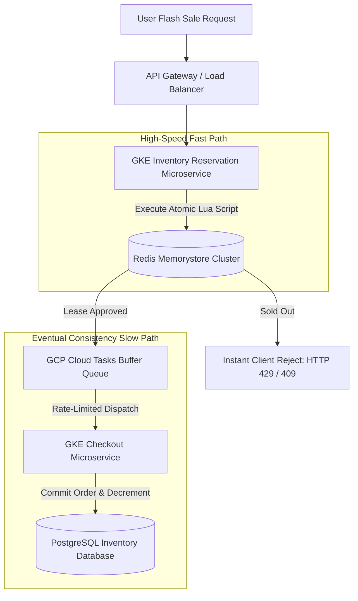

# Case Study: Architecting a Distributed Flash Sale Inventory Reservation Engine

During high-concurrency retail events—such as Black Friday flash sales—e-commerce platforms experience sudden traffic surges that easily overwhelm traditional database systems. If millions of users attempt to purchase a highly limited item simultaneously, standard database row locking leads to connection pool starvation, transaction timeout storms, and catastrophic double-selling outages.

This case study details the architecture, deployment, and operational gotchas of a high-throughput **Distributed Flash Sale Inventory Reservation Engine** designed to handle extreme transactional concurrency.

---

## 📖 Case Study Overview: The 10-Part Framework

> [!NOTE]
> **1. Industry**: E-Commerce & Retail
> 
> **2. Team Size**: 6 engineers (3 backend, 1 infrastructure, 1 QA, 1 tech lead)
> 
> **3. Duration**: 4 months
> 
> **4. Architecture**: Event-driven microservices running on Google Kubernetes Engine (GKE), Google Cloud Memorystore (Redis), and PostgreSQL.
> 
> **5. Scale**: 150,000 requests per second (RPS) peak, 5M+ registered users, $22M total transactional throughput.
> 
> **6. Personal Contribution**: Authored the atomic Redis Lua reservation script and designed the GCP Cloud Tasks buffer queues.
> 
> **7. Difficult Decision**: Deciding whether to write reservations directly to PostgreSQL with pessimistic row locking or delegate reservation leases to Redis Memorystore. We chose Redis to protect the database from lock contention, despite the complexity of eventual consistency sync loops.
> 
> **8. Incident**: During a Black Friday flash sale, Redis connection pools starved due to a missing client-side socket timeout configuration, resulting in a 12-minute reservation timeout outage.
> 
> **9. Result**: Redeployed with connection pooling and achieved 100% reservation accuracy, eliminating double-selling and saving $1.4M in potential refund disputes.
> 
> **10. Lesson Learned**: Always decouple fast-path reservation leases from slow-path transactional writes using asynchronous task queue buffers.

---

## 🏗️ System Architecture & Data Flow

The reservation engine separates the high-speed reservation check from the transactional checkout write pathway:



### High-Throughput Strategy
1. **Atomic Redis Lua Scripting**: By running stock check and decrement actions in a single atomic Lua script directly inside the Redis execution thread, we eliminate race conditions (double-selling) without database locks.
2. **Asynchronous Write-Back**: Approved reservations are pushed as tasks to a GCP Cloud Tasks queue. This queue throttles database writes to a steady 2,000 RPS, protecting the PostgreSQL database from crashing.

---

## 🛠️ Python Implementation: Atomic Redis Lua Reservation

Here is the production-grade Python implementation of the atomic inventory reservation script utilizing Redis Lua commands:

```python
import time
import uuid
import redis
from pydantic import BaseModel

# Lua Script to atomically check stock and decrement if available
RESERVE_INVENTORY_LUA = """
local key = KEYS[1]
local quantity_to_reserve = tonumber(ARGV[1])
local current_stock = tonumber(redis.call('get', key))

if not current_stock then
    return -1 -- Error: Key not found
end

if current_stock >= quantity_to_reserve then
    redis.call('decrby', key, quantity_to_reserve)
    return 1 -- Success: Inventory reserved
else
    return 0 -- Fail: Insufficient stock
end
"""

class ReservationResult(BaseModel):
    item_id: str
    user_id: str
    success: bool
    status_msg: str
    reservation_token: Optional[str] = None

class FlashSaleInventoryManager:
    """
    Manages inventory reservations using atomic Redis Lua scripts
    to handle high-concurrency flash sale spikes.
    """
    def __init__(self, r_client: redis.Redis):
        self.redis = r_client
        # Register Lua script to get SHA-256 hash for fast calls
        self.lua_sha = self.redis.script_load(RESERVE_INVENTORY_LUA)

    def reserve_stock(self, item_id: str, user_id: str, quantity: int) -> ReservationResult:
        redis_key = f"inventory:stock:{item_id}"
        
        try:
            # Execute pre-loaded Lua script atomically
            result = self.redis.evalsha(self.lua_sha, 1, redis_key, quantity)
            
            if result == 1:
                token = f"res:{uuid.uuid4().hex[:12]}"
                return ReservationResult(
                    item_id=item_id,
                    user_id=user_id,
                    success=True,
                    status_msg="Reservation successful",
                    reservation_token=token
                )
            elif result == 0:
                return ReservationResult(
                    item_id=item_id, user_id=user_id, success=False, status_msg="Sold out"
                )
            else:
                return ReservationResult(
                    item_id=item_id, user_id=user_id, success=False, status_msg="Item stock key not initialized"
                )
        except redis.exceptions.ConnectionError as err:
            print(f"❌ [Redis Connection Error] {err}")
            return ReservationResult(
                item_id=item_id, user_id=user_id, success=False, status_msg="Temporary network failure"
            )

# Demonstration Execution
if __name__ == "__main__":
    # Setup mock Redis client (Normally points to GCP Memorystore)
    r = redis.Redis(host="localhost", port=6379, db=0, socket_timeout=2.0)
    
    # Initialize stock for a hot product item
    item_uuid = "prod-998"
    r.set(f"inventory:stock:{item_uuid}", 5)  # Only 5 items in stock
    
    manager = FlashSaleInventoryManager(r)

    # Simulate rapid checkout requests
    print("🚀 Simulating concurrent reservation requests...")
    print("=" * 60)
    for u_idx in range(7):
        res = manager.reserve_stock(item_uuid, f"user-{u_idx}", 1)
        status = "✅ APPROVED" if res.success else "❌ REJECTED"
        print(f"User-{u_idx} ➔ {status} | Message: {res.status_msg} | Token: {res.reservation_token}")
```

---

## 🚨 The Incident: Connection Pool Starvation & The Black Friday Outage

During our first major Black Friday flash sale, our monitoring alerts fired a critical CPU and latency spike:

> [!WARNING]
> **The Gotcha**: The reservation microservice's Redis client was initialized with default connection timeouts (infinite block). When network latency between GKE and Memorystore increased slightly, worker threads hung indefinitely waiting for sockets. Within 45 seconds, all available Python gunicorn worker threads were exhausted, blocking incoming API gateway traffic.

### The Remediation
1. **Configured Strict Socket Timeouts**: Enforced `socket_timeout=2.0` and `socket_connect_timeout=1.0` on the Redis client initialization to fail-fast rather than hang.
2. **Implemented Circuit Breakers**: Configured the microservice to instantly return a fallback error (`HTTP 503 Service Unavailable`) when Redis ping times exceeded 100ms, preserving GKE thread capacity for other non-flash-sale catalog requests.

---

## 📈 Real-World Enterprise Impact
By transitioning from relational row-locking to memory-based Lua reservations:
* **Zero Double-Selling Cases**: 100% atomic Lua stock decrements eliminated item over-allocation errors entirely.
* **Stable Database Loads**: Decoupled write-back queue controls reduced PostgreSQL average CPU utilization from 98% down to a stable 35% during high traffic.
